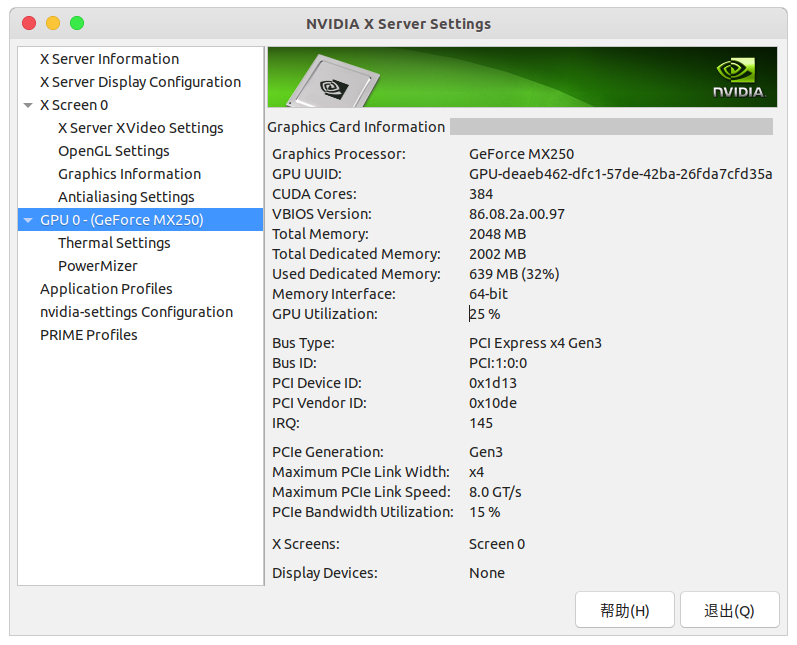
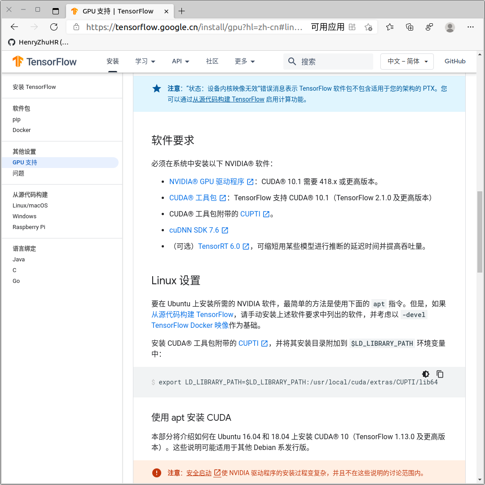
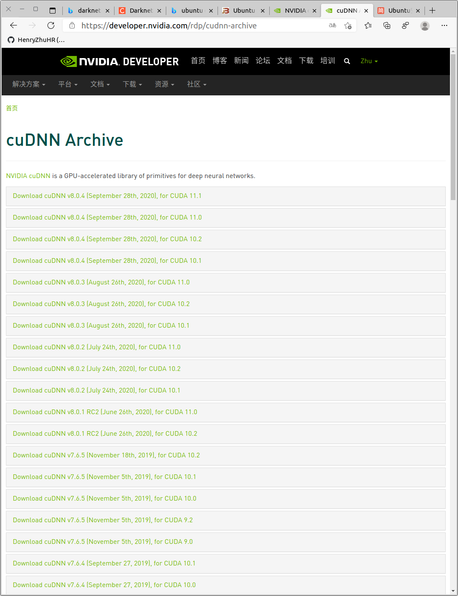
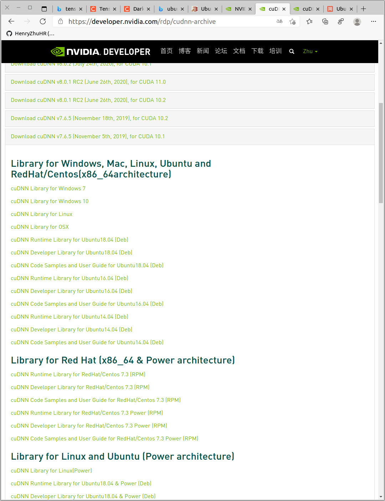

# Usage of Darknet
- [Usage of Darknet](#usage-of-darknet)
- [工程结构](#工程结构)
- [编译](#编译)
  - [Requirements](#requirements)
  - [编译 CPU 版本](#编译-cpu-版本)
  - [编译 GPU 版本](#编译-gpu-版本)
    - [安装 Nvidia 驱动](#安装-nvidia-驱动)
    - [安装 CUDA](#安装-cuda)
    - [安装 cuDNN](#安装-cudnn)
    - [CMake 编译](#cmake-编译)
    - [makefile 编译](#makefile-编译)
- [训练](#训练)

# 工程结构
```bash
tree -d
.
├── 3rdparty
│   ├── pthreads
│   │   ├── bin
│   │   ├── include
│   │   └── lib
│   └── stb
│       └── include
├── build
│   └── darknet
│       └── x64
│           ├── backup
│           ├── cfg
│           ├── data
│           │   ├── labels
│           │   └── voc
│           └── results
├── cfg
│   └── yolov1
├── cmake
│   └── Modules
├── data
│   └── labels
├── include
├── results
├── scripts
│   ├── log_parser
│   └── windows
└── src
```

```bash
tree -d
.
├── 3rdparty    # 
├── build       # 
├── cfg         # 模型结构文件
├── cmake
├── data        # 数据集文件
├── include     # 头文件
├── results     # 训练结果
├── scripts     
└── src
```


# 编译
## Requirements
- **CMake** >= 3.12
- **CUDA** >= 10.0
- **OpenCV** >= 2.4
- **cuDNN** >= 7.0
- **GPU** with CC >= 3.0: https://en.wikipedia.org/wiki/CUDA#GPUs_supported
- **GCC** or **Clang** on Linux

## 编译 CPU 版本
在当前目录下
```bash
make
```

编译完成后，直接运行
```bash
$ ./darknet
usage: ./darknet <function>
```

## 编译 GPU 版本
### 安装 Nvidia 驱动
检查自己的电脑是否有 Nvidia 的独立显卡，可以在 `NVIDA X Server Settings` 中看到自己的显卡信息
```bash
nvidia-settings
```




以及英伟达系统管理接口（NVIDIA System Management Interface, 简称 nvidia-smi）。这是是基于NVIDIA Management Library (NVML) 的命令行管理组件,旨在(intened to )帮助管理和监控NVIDIA GPU设备。  
在训练的时候可以看到信息
```bash
$ nvidia-smi 
Sun Dec 27 16:07:04 2020       
+-----------------------------------------------------------------------------+
| NVIDIA-SMI 455.38       Driver Version: 455.38       CUDA Version: 11.1     |
|-------------------------------+----------------------+----------------------+
| GPU  Name        Persistence-M| Bus-Id        Disp.A | Volatile Uncorr. ECC |
| Fan  Temp  Perf  Pwr:Usage/Cap|         Memory-Usage | GPU-Util  Compute M. |
|                               |                      |               MIG M. |
|===============================+======================+======================|
|   0  GeForce MX250       Off  | 00000000:01:00.0 Off |                  N/A |
| N/A   55C    P0    N/A /  N/A |    644MiB /  2002MiB |      0%      Default |
|                               |                      |                  N/A |
+-------------------------------+----------------------+----------------------+
                                                                               
+-----------------------------------------------------------------------------+
| Processes:                                                                  |
|  GPU   GI   CI        PID   Type   Process name                  GPU Memory |
|        ID   ID                                                   Usage      |
|=============================================================================|
|    0   N/A  N/A       917      G   /usr/lib/xorg/Xorg                 61MiB |
|    0   N/A  N/A      1484      G   /usr/lib/xorg/Xorg                150MiB |
|    0   N/A  N/A      1660      G   /usr/bin/gnome-shell              257MiB |
|    0   N/A  N/A      2072      G   ...gAAAAAAAAA --shared-files       42MiB |
|    0   N/A  N/A   1971566      G   ...AAAAAAAAA= --shared-files      111MiB |
+-----------------------------------------------------------------------------+
```
我们可以看到我们显卡的型号 `GeForce MX250`，显存大小及使用情况 `644MiB /  2002MiB`，驱动版本及CUDA版本

查看 GPU 和推荐的驱动版本
```bash
ubuntu-drivers devices
```

然后进行自动安装
```bash
sudo ubuntu-drivers autoinstall
```


### 安装 CUDA

对 gcc 和 g++ 降级
```bash
sudo apt install -y gcc-8
sudo mv /usr/bin/gcc /usr/bin/gcc.bak
sudo rm /usr/bin/gcc
sudo ln -s /usr/bin/gcc-8 /usr/bin/gcc
ls -l /usr/bin/gcc*

sudo apt install -y g++-8
sudo mv /usr/bin/g++ /usr/bin/g++.bak
sudo rm /usr/bin/g++
sudo ln -s /usr/bin/g++-8 /usr/bin/g++
ls -l /usr/bin/g++*
```


安装`CUDA10.1`，配置用户环境变量
```bash
vim ~/.bashrc
```
添加以下内容
```bash
# ------ CUDA 10.1 ------
export LD_LIBRARY_PATH=$LD_LIBRARY_PATH:/usr/local/cuda-10.1/lib64
export PATH=$PATH:/usr/local/cuda-10.1/bin
export CUDA_HOME=$CUDA_HOME:/usr/local/cuda-10.1
```
执行命令使其生效
```bash
source ~/.bashrc
```
验证是否安装成功
```bash
$ nvcc -V
nvcc: NVIDIA (R) Cuda compiler driver
Copyright (c) 2005-2019 NVIDIA Corporation
Built on Sun_Jul_28_19:07:16_PDT_2019
Cuda compilation tools, release 10.1, V10.1.243
```


### 安装 cuDNN
下载 [cuDNN](https://developer.nvidia.com/zh-cn/cudnn)（需要登录）

选择好自己需要的版本
- tensorflow 有版本要求，可以查看 Tensorflow 的 [GPU 支持](https://tensorflow.google.cn/install/gpu?hl=zh-cn#linux_setup) 和 [GPU 版本对应](https://tensorflow.google.cn/install/source?hl=zh-cn#gpu)
  
- CUDA 10.1 和 cuDNN 7.6






下载解压之后
```bash
tree
.
└── cuda
    ├── include
    │   └── cudnn.h
    ├── lib64
    │   ├── libcudnn.so -> libcudnn.so.7
    │   ├── libcudnn.so.7 -> libcudnn.so.7.6.5
    │   ├── libcudnn.so.7.6.5
    │   └── libcudnn_static.a
    └── NVIDIA_SLA_cuDNN_Support.txt

3 directories, 6 files
```

将解压目录中的 `cuda/include/cudnn.h` 文件复制到 `/usr/local/cuda-10.1/include` 文件夹， `cuda/lib64/` 下所有文件复制到 `/usr/local/cuda-10.1/lib64` 文件夹中
```bash
sudo cp cuda/include/cudnn.h /usr/local/cuda-10.1/include
sudo cp cuda/lib64/* /usr/local/cuda-10.1/lib64
```

并添加读取权限
```bash
sudo chmod a+r /usr/local/cuda-10.1/include/cudnn.h
sudo chmod a+r /usr/local/cuda-10.1/lib64/libcudnn*
```

### CMake 编译

Darknet 要求 CMake>= 3.12，可以从官网[下载](https://cmake.org/download/)后进行源码编译，也可以用 `apt` 进行安装
```bash
sudo apt install -y cmake
```
运行脚本进行编译
```bash
bash ./build.sh
```
编译完成后，测试程序
```bash
$ ./build_release/darknet
usage: ./darknet <function>
```

### makefile 编译

在 [Makefile](./Makefile) 文件中（大约 1～9 行）
将下列变量的值改为 `1`
```makefile
GPU=1     # 编译 GPU 版本
CUDNN=1   # 与 CUDA 联合
OPENCV=1  # 与 OpenCV 联合编译
LIBSO=1   # 编译动态链接库 .so
```

- nvcc 路径

在 [Makefile](./Makefile) 文件中（大约 7 行）
```bash
NVCC=nvcc
# 改成
NVCC=/usr/local/cuda-10.1/bin/nvcc
```

在 [Makefile](./Makefile) 文件中（大约 117 行）
```bash
COMMON+= -DGPU -I/usr/local/cuda/include/
# 改成
COMMON+= -DGPU -I/usr/local/cuda-10.1/include/
```


在 [Makefile](./Makefile) 文件中（大约 120 行）
```bash
LDFLAGS+= -L/usr/local/cuda/lib -lcuda -lcudart -lcublas -lcurand
# 改成
LDFLAGS+= -L/usr/local/cuda-10.1/lib -lcuda -lcudart -lcublas -lcurand
```


在 [Makefile](./Makefile) 文件中（大约 122 行）
```bash
LDFLAGS+= -L/usr/local/cuda/lib64 -lcuda -lcudart -lcublas -lcurand
# 改成
LDFLAGS+= -L/usr/local/cuda-10.1/lib64 -lcuda -lcudart -lcublas -lcurand
```


在 [Makefile](./Makefile) 文件中（大约 129~130 行）
```bash
CFLAGS+= -DCUDNN -I/usr/local/cuda/include
LDFLAGS+= -L/usr/local/cuda/lib -lcudnn
# 改成
CFLAGS+= -DCUDNN -I/usr/local/cuda-10.1/include
LDFLAGS+= -L/usr/local/cuda-10.1/lib -lcudnn
```

修改完 Makefile之后，在当前目录下进行编译
```bash
make
```

编译完成后，测试程序
```bash
$ ./darknet
usage: ./darknet <function>
```


# 训练
https://blog.csdn.net/u010122972/article/details/83541978
 
为了提高训练速度，请使用 GPU 版本

- 预训练权值文件

下载预训练权值文件 : [yolov4.conv.137](https://github.com/AlexeyAB/darknet/releases/download/darknet_yolo_v3_optimal/yolov4.conv.137) (162 MB) ,或在[Google drive 镜像](https://drive.google.com/open?id=1JKF-bdIklxOOVy-2Cr5qdvjgGpmGfcbp)下载

- 修改训练配置文件

创建文件 `yolo-obj.cfg` 其内容和 `yolov4-custom.cfg` 一样 (或者复制 `yolov4-custom.cfg` 为 `yolo-obj.cfg`) 
```bash
cp cfg/yolov4-custom.cfg cfg/yolov4-obj.cfg
```


```bash
[net]
# Testing
#batch=1
#subdivisions=1
# Training
batch=64
subdivisions=16
width=608
height=608
channels=3
momentum=0.949
decay=0.0005
angle=0
saturation = 1.5
exposure = 1.5
hue=.1

learning_rate=0.001
burn_in=1000
max_batches = 500500
policy=steps
steps=400000,450000
scales=.1,.1

#cutmix=1
mosaic=1

#:104x104 54:52x52 85:26x26 104:13x13 for 416
```

- 修改 filter 参数

change [filters=255] to filters=(classes + 5)x3 in the 3 [convolutional] before each [yolo] layer, keep in mind that it only has to be the last [convolutional] before each of the [yolo] layers.