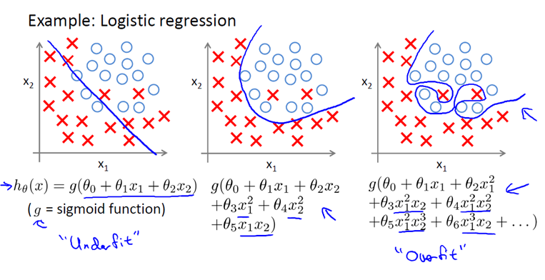
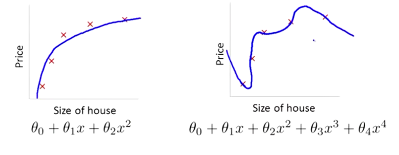

正则化是一种为了减小测试误差的行为(有时候会增加训练误差)。当我们用较为复杂的模型拟合数据时，容易出现过拟合现象，导致模型的泛化能力下降，这时我们就需要使用正则化，降低模型的复杂度。

# 目录
- [目录](#目录)
- [拟合](#拟合)
- [正则化](#正则化)
  - [Cost Function](#cost-function)
- [LP 范数](#lp-范数)

# 拟合
https://www.zhihu.com/question/20924039

https://www.cnblogs.com/jianxinzhou/p/4083921.html

评价模型的泛化能力
- 欠拟合(underfitting)，或者叫作叫做高偏差(bias)。

# 正则化
正则化中我们将保留所有的特征变量，但是会减小特征变量的数量级（参数数值的大小θ(j)）。

这个方法非常有效，当我们有很多特征变量时，其中每一个变量都能对预测产生一点影响。正如我们在房价预测的例子中看到的那样，我们可以有很多特征变量，其中每一个变量都是有用的，因此我们不希望把它们删掉，这就导致了正则化概念的发生。

接下来我们会讨论怎样应用正则化和什么叫做正则化均值，然后将开始讨论怎样使用正则化来使学习算法正常工作，并避免过拟合。

## Cost Function

对于该模型，如果用一个二次函数来拟合这些数据，那么它给了我们一个对数据很好的拟合。然而，如果我们用一个更高次的多项式去拟合，最终我们可能会得到一个曲线，它能很好地拟合训练集，但却并不是一个好的结果，因为它过度拟合了数据，因此，一般性并不是很好。

让我们考虑下面的假设，我们想要加上惩罚项，从而使参数 $\theta_3$ 和 $\theta_4$ 足够的小。

$$\begin{aligned}
    min_\theta \frac{1}{2m} \sum_{i=1}^{m} (h_\theta(x_{(i)})-y^{(i)})^2
\end{aligned}$$

# LP 范数
**范数**简单可以理解为用来表征向量空间中的距离，而距离的定义很抽象，只要满足非负、自反、三角不等式就可以称之为距离。

LP范数不是一个范数，而是一组范数，其定义如下：
$$\begin{aligned}
    ||x||_p=(\sum_{i=1}^n x_i^p)^{\frac{1}{p}}
\end{aligned}$$