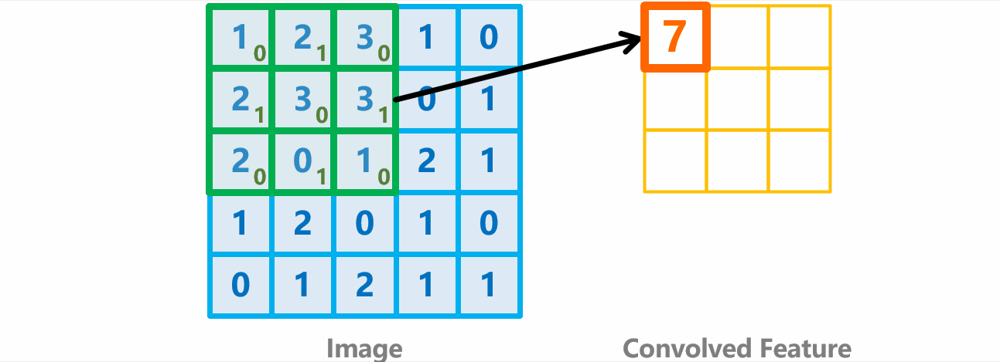
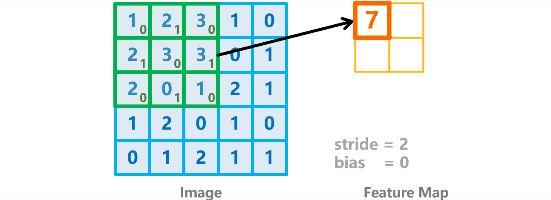
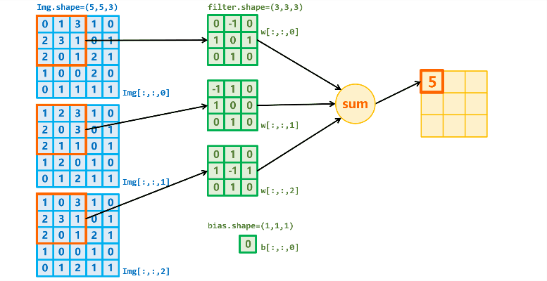
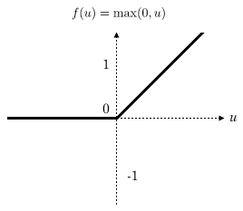
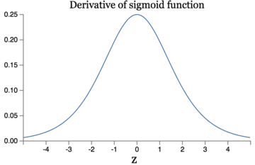
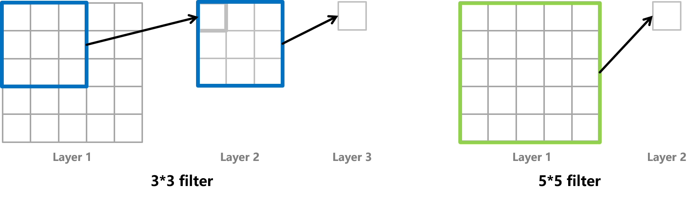
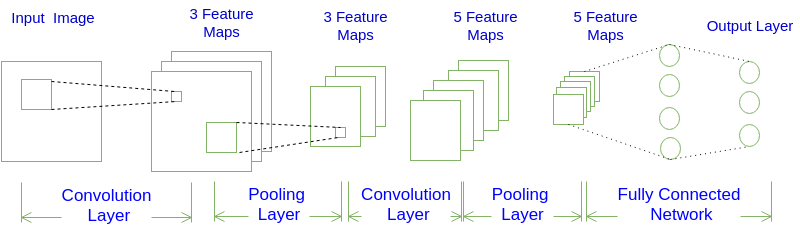

# 目录
- [目录](#目录)
- [卷积计算过程](#卷积计算过程)
  - [2D 卷积过程](#2d-卷积过程)
  - [3D 卷积过程](#3d-卷积过程)
  - [tensorflow 描述卷积计算层](#tensorflow-描述卷积计算层)
- [Relu 函数](#relu-函数)
- [感受野](#感受野)
- [全零填充 (Padding)](#全零填充-padding)
- [批标准化 (Batch Normalization, BN)](#批标准化-batch-normalization-bn)
- [池化 (Pooling)](#池化-pooling)
- [舍弃 (Dropout)](#舍弃-dropout)
- [CNN 网络架构](#cnn-网络架构)
  - [卷积层](#卷积层)


<!-- https://www.zybuluo.com/hanbingtao/note/485480 -->

全连接神经网络是一种很重要的神经网络，但是对于图像识别并不是很友好。用全连接网络处理图像有明显的缺点：
- **待训练参数量太多**。 当我们输入的是一张 $100 \times 100$ 的图像时，其输入参数为 $100 \times 100  \times 3_{channels}=30000$，实在是太多了，如果扩展到 $1920 \times 1080$ 的 $1080p$ 图像时，输出参数就有 $2073600$ 个，仅灰度图像就有 $200$ 多万个参数，训练难度可想而知。并且待优化参数过多容易导致模型过拟合。
- **没有使用像素的位置信息，破坏了图像的空间信息**。 如果使用全连接网络的话，输入值就是按照离散的像素点进行输入，相邻像素点直接的关联性就被破坏了。
- **网络层数不可能太多**。 参数太多，就导致了网络的层数不可能太深

图像特征的提取需要采用卷积的方法，因此，**卷积神经网络** (CNN, Convolutional Neural Network) 就出现了。
- **局部连接**。 这个是最容易想到的，每个神经元不再和上一层的所有神经元相连，而只和一小部分神经元相连。这样就减少了很多参数。
- **权值共享**。 一组连接可以共享同一个权重，而不是每个连接有一个不同的权重，这样又减少了很多参数。
- **下采样**。 可以使用Pooling来减少每层的样本数，进一步减少参数数量，同时还可以提升模型的鲁棒性。 

卷积神经网络更加适用于**图像**、**语言**识别的任务。为了理解 CNN ，我们先要做一些概念的提前理解，包括 [卷积计算过程](#卷积计算过程)、[Relu 函数](#relu-函数)、[感受野](#感受野)、[全零填充 (Padding)](#全零填充-padding)、[批标准化 (Batch Normalization, BN)](#批标准化-batch-normalization-bn)、[池化 (Pooling)](#池化-pooling)、[舍弃 (Dropout)](#舍弃-dropout)。

在有了这些概念之后，我们再开始进入[CNN 网络架构](#cnn-网络架构)的学习。

# 卷积计算过程
## 2D 卷积过程
一个 $5 \times 5$ 的图像和一个 $3 \times 3$ 的 **2D卷积核** (**kernel**) 进行**步长** (**stride**) 为1的卷积计算可以得到一个 $3 \times 3$ 的**特性图** (**Feature Maps**)，卷积计算过程如下



图像 $x_{i,j}$ 和 kernel $\omega_{m,n}$ 进行卷积，$\omega_b$表示 kernel 的偏置项 

$$\begin{aligned}
  a_{p,q}=f(\sum_{m=0}^{2} \sum_{n=0}^{2} w_{m,n} x_{(m+1\times p),(n+1\times q)}+\omega_b)
\end{aligned}$$
$$\begin{aligned}
  \quad 0 \leq p,q \leq 2 ,
  \quad 0 \leq m,n \leq 2 ,
\end{aligned}$$

例如，计算 $a_{0,1}$ （这里不考虑激活函数的作用）
$$\begin{aligned}
  a_{0,1} &= \sum_{m=0}^{2} \sum_{n=0}^{2} w_{m,n} x_{(m+1\times 0),(n+1\times 1)}+\omega_b \\
          &= \sum_{m=0}^{2} \sum_{n=0}^{2} w_{m,n} x_{(m),(n+1)}+0 \\
          &= (2\times 0+3\times 1+1\times 0+
              3\times 1+3\times 0+0\times 1+
              0\times 0+1\times 1+2\times 0)+0 \\
          &= 7
\end{aligned}$$

上面的卷积过程是步长为 1 的卷积过程，当步长为 2 的时候，卷积过程如下



$$\begin{aligned}
  a_{p,q}=f(\sum_{m=0}^{2} \sum_{n=0}^{2} w_{m,n} x_{(m+2\times p),(n+2\times q)}+\omega_b)
\end{aligned}$$

## 3D 卷积过程



## tensorflow 描述卷积计算层

# Relu 函数
在全连接神经网络中，我们使用了 `Sigmoid`函数 作为激活函数来解决阶跃函数 `sgn` 不连续的特点。

但是 `Sigmoid`函数 包含了指数运算 $e^{-x}$ ，计算复杂度就比较大了。

在全连接网络的反向传播的过程中，每经过一层 `Sigmoid`激活层，就会乘上一个`Sigmoid`的导数，其导数最大值为$0.25$，这就导致在`Sigmoid`函数作为激活函数的**深度**神经网络中，会产生梯度消失的问题。

因此几年来，新的激活函数 `Relu` 使用得越来越多了。

**Relu** 函数的定义是
$$\begin{aligned}
    f(X)=max(0,x)
\end{aligned}$$


Relu函数的有如下优势
- **计算速度快**
- **减轻梯度消失**，
  


- **稀疏性**，通过对大脑的研究发现，大脑在工作的时候只有大约5%的神经元是激活的，而采用sigmoid激活函数的人工神经网络，其激活率大约是50%。有论文声称人工神经网络在15%-30%的激活率时是比较理想的。因为relu函数在输入小于0时是完全不激活的，因此可以获得一个更低的激活率。


# 感受野
**感受野（Receptive Field）** 定义是卷积神经网络每一层输出的特征图（feature map）上的像素点在输入图片上映射的区域大小。即，特征图上的一个点对应输入图上的区域的尺寸。

**神经元的感受野越大，表示它提取特征的范围也就越大**，也就是可以提取到**更加全局的特征**。相反,**感受野越小,表示提取特征的范围越小**，表示包含的特征更加趋于表示**局部和细节的特征**。因此感受野的值可以用来大致判断每一层的抽象层次



> 假定图片的长、宽均为 $m$ ，卷积计算步长为 $1$

对于两个计算过程都可以得到一个 $1\times 1$ 的特征图,其感受野都是 **5**, 虽然是结果两个不同过程.
- 左边过程中,第一次卷积,每个像素点可以"看到"上一层的 $3\times 3$ ,全部像素点可以"看到"的是 $5\times 5$ 的范围. 第二次卷积之后,得到的特征图是 $1\times 1$ ,它可以"看到"上层的特征图的 $3\times 3$ 的范围,而 $3\times 3$ 总共9个像素点又可以"看到" $5\times 5$ 的像素点, 所以其感受野是 **5**
- 右边过程的 filter 是 $5\times 5$ ，因此其感受野是 **5**。


我们来计算一下两种情况下的计算量
- $3 \times 3$ 卷积核的参数量：$3 \times 3 + 3 \times 3=18$（两次卷积过程，各有一个$3 \times 3$卷积核），计算量：$9(m-2)^2+9(m-4)^2=m^2-108m+180$
- $5 \times 5$ 卷积核的参数量：$5 \times 5=25$，计算量：$25(m-4)^2=25m^2-200ml+400$

得出一个结论是当 $m>10$ 时，两层 $3 \times 3$ 卷积核的计算性能优于 一层 $5 \times 5$ 卷积核

<!-- https://www.bilibili.com/video/BV1B7411L7Qt?p=27 -->


# 全零填充 (Padding)
输出图片边长
- 全零填充: $\frac{输入图片边长}{步长}$
- 非全零填充: $\frac{输入图片边长-核边长+1}{步长}$

tensorflow 描述全零填充
```python
padding = 'SAME'    # 全零填充
padding = 'VALID'   # 非全零填充
```
# 批标准化 (Batch Normalization, BN)
# 池化 (Pooling)
**池化层**的作用主要是进行**下采样**，以减少参数量。

池化的方式一般有
- Max Pooling : 
- Mean Pooling : 


# 舍弃 (Dropout)

# CNN 网络架构


CNN 网络架构 (Architecture) 包括:
- **输入层**。
- **卷积层** (Convolution Layer)，输入层是需要激活的，通常使用 `Relu` 函数进行激活。
- **池化层** (Polling Layer)。
- **全连接层** (Fully Connected Layer)。


## 卷积层

<!-- 1. 滤波器的作用或者说是卷积的作用。卷积层的参数是有一些可学习的滤波器集合构成的。每个滤波器在空间上（宽度和高度）都比较小，但是深度和输入数据一致（这一点很重要，后面会具体介绍）。直观地来说，网络会让滤波器学习到当它看到某些类型的视觉特征时就激活，具体的视觉特征可能是某些方位上的边界，或者在第一层上某些颜色的斑点，甚至可以是网络更高层上的蜂巢状或者车轮状图案。

2. 可以被看做是神经元的一个输出。神经元只观察输入数据中的一小部分，并且和空间上左右两边的所有神经元共享参数（因为这些数字都是使用同一个滤波器得到的结果）。

3. 降低参数的数量。这个由于卷积具有“权值共享”这样的特性，可以降低参数数量，达到降低计算开销，防止由于参数过多而造成过拟合。 -->