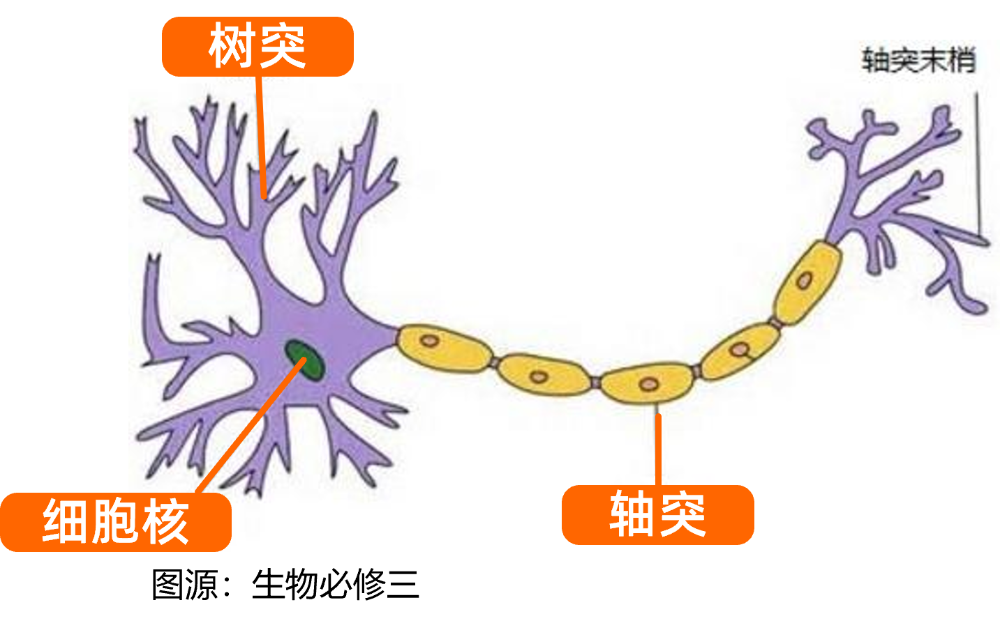

# MLP
- [MLP](#mlp)
- [感知器](#感知器)
  - [从生物的神经元到感知器](#从生物的神经元到感知器)
  - [感知器数学模型](#感知器数学模型)
  - [感知器的pytorch实现](#感知器的pytorch实现)
- [MLP](#mlp-1)

# 感知器
## 从生物的神经元到感知器
> 该部分是介绍，如果不感兴趣或者想直接上手，可以跳过该部分继续阅读[感知器数学模型](#感知器数学模型)

**人脑能完成许多复杂功能，是一个极其复杂的系统**

人脑由神经元、神经胶质细胞、神经干细胞和血管组成。其中，神经元（Neuron），也叫神经细胞（Nerve Cell），是携带和传输信息的细胞，是人脑神经系统中最基本的单元。
人脑神经系统是一个非常复杂的组织，包含近860亿个神经元 ，每个神经元有上千个突触和其他神经元相连接。

神经元一般有两种状态：**兴奋**和**抑制**
- 神经元的状态取决于从其它的神经细胞收到的输入信号量，及突触的强度（抑制或加强）
- 当信号量总和超过了某个阈值时，细胞体就会兴奋，产生电脉冲
- 电脉冲沿着轴突并通过突触传递到其他神经元

当我们从仿生学和系统的角度来看待一个神经元，我们就可以用数学模型模拟一下神经元的工作原理：
- **树突**：用于接收其他神经元发送的信号
- **细胞核**：信号处理的单元
- **轴突**：将信号传递给其他神经元

## 感知器数学模型
1943 年，心理学家 Warren **M**cCulloch 和数学家 Walter **P**itts 最早提出并给出了人工神经网络的概念及人工神神经元的数学模型，这种神经元模型称为**M-P模型**，至此开启了人工神经网络研究的序幕。

> 随着研究发展，M-P模型也叫**感知器**(Perceptron)或**神经元**(neuron)。      
> 为了使得建模更加简单，以便于进行形式化表达，研究人员忽略时间整合作用、不应期等复杂因素，并把神经元的突触时延和强度当成常数。

一个感知器（神经元）包括了如下的组成部分

- **输入权值** $x_i$
- 神经元参数：**权重**(weight) $\omega_i$ 和**偏置**(bias)项 $\theta$
- **激活函数** $f$
- **输出权值** $y$

**神经元的工作过程**如下：

$x_i$ 是来自第 $i$ 个神经元的输入，每个神经元会接收到 $n$ 个神经元的输入。每个输入值会占据一定的权重 $\omega_i x_i$ 所有输入 ($n$ 个输入) 加权后进行累加
$$
x_s=\sum_{i=1}^{n}\omega_i x_i=\omega_1 x_1+ \omega_2 x_2+ ...+ \omega_n x_n
$$
> 注意：为了简化表达，将$\sum_{i=1}^{n}\omega_i x_i$用$x_s$取代，s for sum

当该累加值超过一定的阈值 $\theta$ 之后，该神经元就会被“**激活**”
> 生物学上，神经元兴奋（激活）的时候，会向其他神经元传递信息，会有输出；如果神经元处于抑制（未激活），则不会传递信息，对应的输出就是0
$$
\begin{aligned}
  if &   \quad x_s\geq\theta,  \quad then\quad y=x_s \\
  else & \quad x_s<\theta,     \quad then\quad y=0
\end{aligned}
$$

不妨在表达式上做个小处理，将阈值项$\theta$移到不等式左边
$$
\begin{aligned}
  if &   \quad x_s-\theta\geq 0,  \quad then\quad y=x_s \\
  else & \quad x_s-\theta<0,      \quad then\quad y=0
\end{aligned}
$$
上述两组表达式是

> $\theta$是阈值的意思，从上面可以看出，这个$\theta$可以将$x_s$“拉回/偏移”到0处进行判定，所以也会叫偏置(bias)，也会有用$b$表述的：$\theta=b=bias$

但是，`if-else`是计算机的表达形式，而在数学上，可以用分段函数表达`if-else`。同时，观察到移项后的表达式在形式上就和《信号与系统》等课程里学过的[阶跃函数](https://baike.baidu.com/item/%E9%98%B6%E8%B7%83%E5%87%BD%E6%95%B0/7639820?fr=aladdin)非常像了
$$
u(t)=
\begin{cases}
    1,\quad t\geq 0\\
    0,\quad t< 0
\end{cases}
$$
所以这时候借助阶跃函数$u(t)$继续简化表达式，并取$t=x_s-\theta$
$$
y=u(x_s-\theta)=
\begin{cases}
    x_s,    & x_s-\theta\geq 0\\
    0,      & x_s-\theta< 0
\end{cases}
$$

上述的推导之后，我们就可以得到**神经元数学模型的通用表达式**
$$
y=f(\sum_{i=1}^{n}\omega_i x_i-\theta)
$$

**总结一下**：
1. 每个神经元，会收到来自其他神经元的信号$x_i$，每个连接都会有一个权重$\omega_i$来表示该信号对于当前神经元的影响程度
2. 全部信号在加权$\omega_i x_i$后，进行求和$\sum_{i=1}^{n}\omega_i x_i$得到当前神经元的输入总和
3. 输入和会与一个阈值$\theta$进行比较，来决定神经元的状态是兴奋（激活）还是抑制（未激活）
4. 该神经元“激活”之后，就会向其他神经元发送信息，也就是产生输出$\sum_{i=1}^{n}\omega_i x_i - \theta$；否则就抑制，输出为$0$

## 感知器的pytorch实现

# MLP