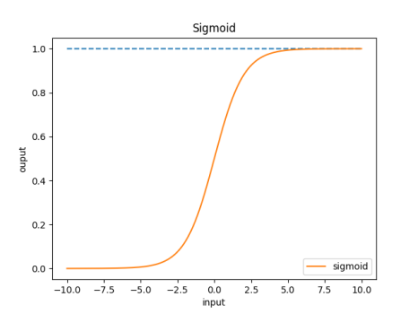
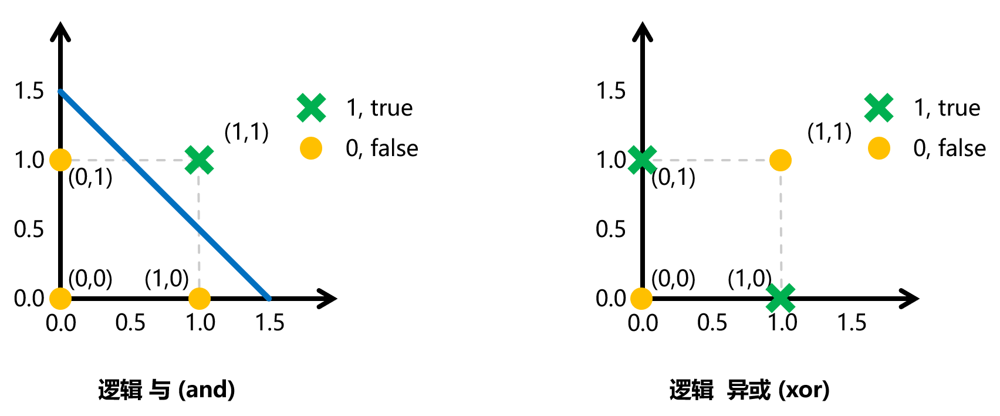
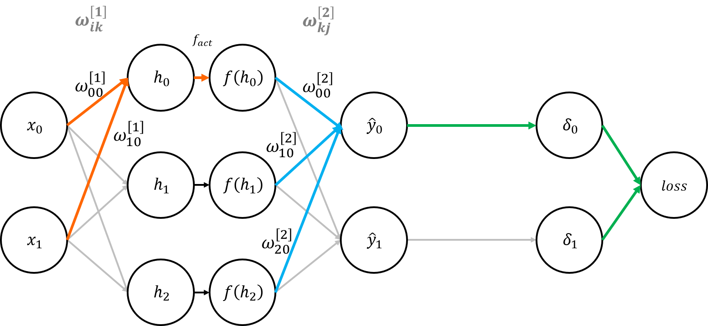
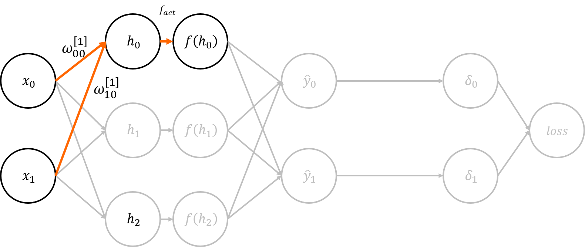
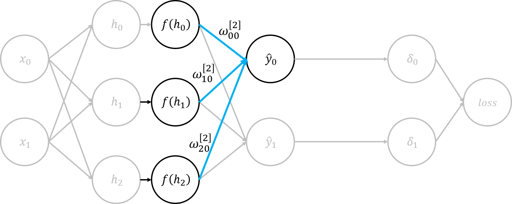
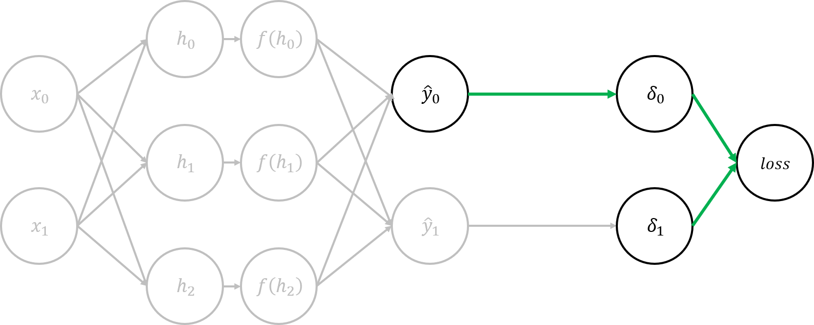
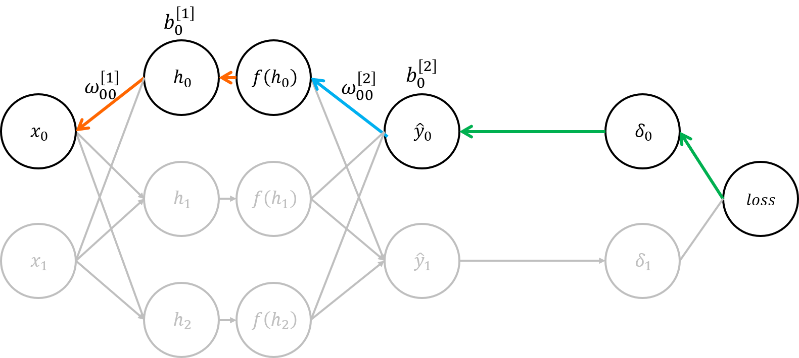
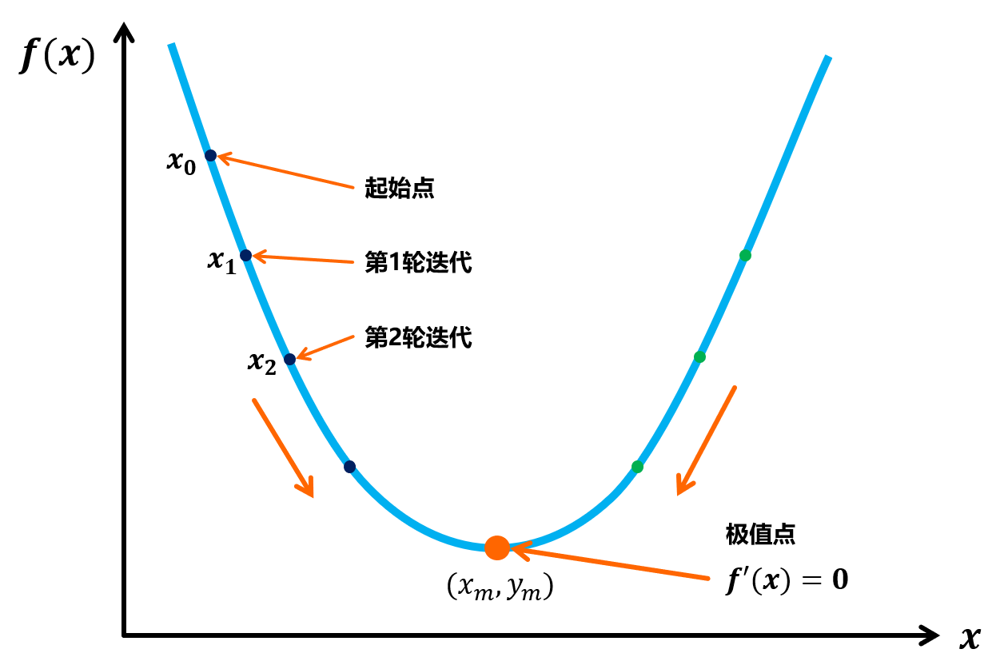

# 深度学习基础 目录
- [深度学习基础 目录](#深度学习基础-目录)
- [感知器（神经元）](#感知器神经元)
  - [M-P 神经元模型](#m-p-神经元模型)
    - [激活函数](#激活函数)
    - [感知器的简单应用：解决布尔运算](#感知器的简单应用解决布尔运算)
    - [感知器的训练](#感知器的训练)
  - [感知机与多层网络](#感知机与多层网络)
- [神经网络](#神经网络)
  - [构建神经网络](#构建神经网络)
- [BP神经网络原理](#bp神经网络原理)
  - [推导思路和过程](#推导思路和过程)
    - [网络的前向传播过程的推导](#网络的前向传播过程的推导)
    - [网络的反向传播过程的推导](#网络的反向传播过程的推导)
- [神经网络的应用例子：实现 XOR](#神经网络的应用例子实现-xor)
  - [python tensorflow实现](#python-tensorflow实现)


阅读建议：建议多次**反复**阅读反向传播过程，并且请一定要**拿笔推导**公式


<!--
老
202.114.107.171
202.114.107.186
202.114.107.123
新
202.114.107.210

-->


# 感知器（神经元）
**感知器**，也叫**神经元**，是神经网络的组成单元
## M-P 神经元模型
基本神经元模型中，神经元接收到来自$n$个其他神经元传递过来的输入信号，这些输入信号通过带权重的连接(connection)进行传递  
神经元接收到的总输入值将与神经元的阈值进行比较，然后通过 **激活函数（activation function）** 处理以产生神经元的输出

- 神经元模型如下

<!-- <div align="center"></div> -->

包括了如下的组成部分

- **输入权值** $x_i$ ，包括了其**权重** $\omega_i$ 和**偏置项** $\theta$
- **激活函数** $f$
- **输出权值** $y$


神经元的工作过程如下：

$x_i$ 是来自第 $i$ 个神经元的输入，每个神经元会接收到 $n$ 个神经元的输入。每个输入值会占据一定的权重 $\omega_i x_i$ 所有输入 ($n$ 个输入) 加权后进行累加
$$\begin{aligned}
  \sum_{i=1}^{n}\omega_i x_i=\omega_1 x_1+ \omega_2 x_2+ ...+ \omega_n x_n
\end{aligned}$$

当该累加值超过一定的阈值 $\theta$ 之后，该神经元就会被“激活”
$$\begin{aligned}
  f(\sum_{i=1}^{n}\omega_i x_i-\theta)
\end{aligned}$$

该神经元“激活”之后，就会向其他神经元发送信息，这个信息就是该神经元的输出 $y$
$$\begin{aligned}
  y=f(\sum_{i=1}^{n}\omega_i x_i-\theta)
\end{aligned}$$

- 为什么要加权 $\omega_i$？
> 每个输入信息对于结果会有不同的影响，而我们需要衡量每个输入对于结果产生的影响的程度就需要这样一个权重。  
> 
> 翻译成人话就是，你对象和你舍友都在你生日送礼物，但是你收到两个礼物之后的开心程度(应该？)是不一样的。

- **激活**是含义？
> 不好理解的是，为什么超过一定阈值之后，神经元会被激活  
> 
> 其实和和生物学上是类似的，神经元的电位超过一定**阈值**之后就会被激活。当神经网络中的神经元接收到的值超过**阈值**$\theta$ 时，才会将信息继续传递，或者说，才会产生输出。  
> 翻译成人话就是，你在生日收到足够多的礼物之后，才会开心。  
> 
> 因此，产生一个词叫**激活函数**，激活函数所做的事情就是去判定该**阈值**、衡量**多少礼物才叫足够多**这个问题。  

- 激活函数
> **理想**的**激活函数**是一个**阶跃函数**，如下  
> <div align="center"></div>   
> 
> 可以看到当输入的值大于0的时候，会输出1，这时候该神经元表现为**激活状态**，输出的1是对下一个神经元有贡献的，也就是说该神经元的输出是可以传递给下一个神经元； 
>  
> 当输入的值小于0的时候，会输出0，0对于下一个神经元没有贡献，这时候的神经元是**未激活**的。 
>  
> 这里的**贡献**是指，下一个神经元接收到的 $x_i=0$ ，那也就不会对下一个神经元产生任何影响；下一个神经元接收到的 $x_i\neq 0$时，那么会对下一个神经元产生影响   
> 
> 减去阈值 $\theta$ 再激活，也就是把判断是否**激活**的条件统一成 $x\geq0$ (便于计算)，如下
> 
> $$\begin{aligned}
  sgn(x)=
  \begin{cases}
    1,& x \geq \theta \\
    0,& x< \theta
  \end{cases}
  \quad \Rightarrow \quad
  sgn(x-\theta)=
  \begin{cases}
    1,& x\geq 0 \\
    0,& x<0
  \end{cases}
\end{aligned}$$


### 激活函数
- 理想激活函数

理想激活函数是一个阶跃函数

<div align="center"></div>   

$$\begin{aligned}
  sgn(x)=
  \begin{cases}
    1,& x\geq0 \\
    0,& x<0
  \end{cases}
\end{aligned}$$

```python
def sgn(x):
    return 1 if (x>=0) else 0
```

阶跃函数具有不连续、不光滑等缺点，因此常使用`Sigmoid`函数作为激活函数

- `Sigmoid` 函数

<div align="center"></div>   

$$\begin{aligned}
    sigmoid(x)  &= \frac{1}{1+e^{-x}}
\end{aligned}$$

Sigmoid 还有一个很有趣也很重要的特点，就是它的导数可以用自身表示，这在计算中是比较方便的
$$\begin{aligned}
    y &= sigmoid(x)= \frac{1}{1+e^{-x}} \\
    y'&= y(1-y)
\end{aligned}$$
```python
def sigmoid(x):
    return 1./(1.+np.exp(-x))
```

### 感知器的简单应用：解决布尔运算

看完上面的内容可能会很懵
:astonished:

那我们举个例子，也是比较经典的例子：用感知器实现逻辑 `and` 的操作。(其余数字逻辑/布尔运算也类似)
$$\begin{aligned}
    Y=X_1 X_2
\end{aligned}$$
真值表如下：
| $x_1$ | $x_2$ |  $y$  |
| :---: | :---: | :---: |
|   0   |   0   |   0   |
|   0   |   1   |   0   |
|   1   |   0   |   0   |
|   1   |   1   |   1   |

> 在编程语言中
> ```c
> 0 = false
> 1 = true
> ```

这时候我们构造用于逻辑 `与` 运算的神经网络如下：


假定网络参数为 $w_1=0.5, w_2=0.5, b=-0.8$ ，激活函数选择理想的阶跃函数
$$\begin{aligned}
  f(x)=sgn(x)=
  \begin{cases}
    1,& x\geq0 \\
    0,& x<0
  \end{cases}
\end{aligned}$$

根据输出公式，我们计算当输入为 $x_1=0, x_2=1$ 的输出：
$$\begin{aligned}
  y &=f(W \cdot X+b) \\
    &=f(\omega_1 x_1+\omega_2 x_2 +b) \\
    &=f(0.5 \times 0+0.5 \times 1 -0.8) \\
    &=f(-0.3) \\
    &=0
\end{aligned}$$

| $\omega_1 x_1$ | $\omega_2 x_2$ |  $b$  | $\omega_1 x_1+\omega_2 x_2 +b$ | $f(\omega_1 x_1+\omega_2 x_2 +b)$ |
| :------------: | :------------: | :---: | :----------------------------: | :-------------------------------: |
|       0        |       0        | -0.8  |              -0.8              |                 0                 |
|       0        |      0.5       | -0.8  |              -0.3              |                 0                 |
|      0.5       |       0        | -0.8  |              -0.3              |                 0                 |
|      0.5       |      0.5       | -0.8  |              0.2               |                 1                 |

通过这个简单的例子，我们可以看出，感知器是可以解决**布尔运算**这个**二分类**问题的。这也是感知器最简单的应用之一了。



左图是可以看出，`and` 运算是可以用一条直线将 `0` 和 `1` 分开的，因为逻辑与是线性运算。但是 `xor` 运算是无法用一条直线进行分类的，因为 `xor` 运算不是线性

**感知器可以拟合任何线性函数，任何线性分类或线性回归问题都可以用感知器来解决**

### 感知器的训练
上面简单的例子可以让我们知道感知器的应用。但是在上面的例子中，我们是假定了网络参数 $w_1=0.5, w_2=0.5, b=-0.8$，这是怎么来的呢？针对不同的神经网络，这些参数应该是不一样的。

这里我们暂时不讨论感知器的训练，因为实际上神经网络的训练才是更加实际的，我们将这部分内容放到后面 [神经网络的训练](#推导思路和过程)


## 感知机与多层网络
感知机 (Perceptron) 由两层神经元组成


# 神经网络
在人工智能领域中，有一个很重要的方法叫机器学习，而在机器学习中有一种更加重要的算法，叫深度学习。

## 构建神经网络
简单的神经网络结构如下

<div align="center"></div>   

简单的神经网络包括了**输入层**、（至少一个）**隐藏层**、**输出层**，并且各个层之间通过各个**参数**（**权重** `weight` 和**偏置** `bias`）连接 

---

理论上，两层神经网络可以拟合任意函数，因此我们以两层神经网络为例进行理解

<div align="center"></div>   

上面的神经网络中，有两个输出、四个输出和一个有20个结点的隐藏层

$$\begin{aligned}
    隐藏层矩阵 \qquad & H_{(1,20)} = X_{(1,2)} W_{1 (2,20)}+ b_{1 (1,20)} \\
    输出层矩阵 \qquad & Y_{(1,4)} = H_{(1,20)} W_{2 (20,4)}+ b_{2 (1,4)} \\
\end{aligned}$$
> 括号内写的是矩阵的维度

上面的方程是线性方程，联立方程组如下
$$\begin{aligned}
    Y_{(1,4)} &= H_{(1,20)} W_{2 (20,4)}+ b_{2 (1,4)} \\
              &= (X_{(1,2)} W_{1 (2,20)}+ b_{1 (1,20)}) W_{2 (20,4)}+ b_{2 (1,4)} \\
              &= X_{(1,2)}  W_{1 (2,20)} W_{2 (20,4)} + b_{1 (1,20)} W_{2 (20,4)} + b_{2 (1,4)} \\
              &= X_{(1,2)}  [W_{1 (2,20)} W_{2 (20,4)}] + [b_{1 (1,20)} W_{2 (20,4)} + b_{2 (1,4)}] \\
              &= X_{(1,2)}  W_{new} + b_{new} \\
\end{aligned}$$
你瞧，通过线性方程的可加性，输出 $Y$ 与输入 $X$ 之间rr

我们将上述计算过程用矩阵的形式表示一次（矩阵对于神经网络的表示是十分重要的，这在编写代码的时候是十分方便的）

输入和输出都是列向量
$$\begin{aligned}
  \vec{x} =
  \begin{bmatrix}
    x_1 \\
    x_2
  \end{bmatrix}
  \qquad

  \vec{y} =
  \begin{bmatrix}
    y_1 \\
    y_2 \\
    y_3 \\
    y_4
  \end{bmatrix}
\end{aligned}$$

对于第一层隐藏层的每一个结点，都有一个权重的行向量
$$\begin{aligned}
  \vec{w}_{1(1)} &= \begin{bmatrix}
                    w_{1_{11}},w_{1_{12}}
                  \end{bmatrix} \\
  \vec{w}_{1(2)} &= \begin{bmatrix}
                    w_{1_{21}},w_{1_{22}}
                  \end{bmatrix} \\
  & ...... \\
  \vec{w}_{1(20)} &=\begin{bmatrix}
                    w_{1_{20,1}},w_{1_{20,2}}
                  \end{bmatrix} \\
\end{aligned}$$

第一层隐藏层的权重矩阵，是由全部结点的行向量组成的
$$\begin{aligned}
  \vec{W}_1 = \begin{bmatrix}
              \vec{w}_{1(1)} \\ \vec{w}_{1(2)} \\ ... \\ \vec{w}_{1(20)}
            \end{bmatrix}
            = \begin{bmatrix}
               w_{1_{11}} , w_{1_{12}} \\
               w_{1_{21}} , w_{1_{22}} \\
               ... \\
               w_{1_{20,1}} , w_{1_{20,2}} \\
            \end{bmatrix}
\end{aligned}$$

第二层网络的矩阵 $\vec{W}_2$ 就不写出来了

综上，有
$$\begin{aligned}
  \vec{h} &= f(\vec{W}_1 \cdot \vec{x}+\vec{b}_1) \\
  \vec{y} &= \vec{W}_2 \cdot \vec{h}+\vec{b}_2 =\vec{W}_2 \cdot f(\vec{W}_1 \cdot \vec{x}+\vec{b}_1)+\vec{b}_2
\end{aligned}$$


通过上述线性方程的计算，我们就能得到最终的输出 $\vec{y}$ 了，线性代数告诉我们：**一系列线性方程的运算最终都可以用一个线性方程表示**。也就是说，上述两个式子联立后可以用一个线性方程表达。   

对于两次神经网络是这样，100层神经网络也依然是这样。这样的线性可叠加性就是的神经网络增加层数的操作就失去了意义。

所以这里要对网络注入灵魂：**激活层**。

<div align="center"></div>  

<!-- <div align="center"></div>    -->

激活层的存在

# BP神经网络原理

<!-- ## 传递函数


## 激活函数
**BP神经网络**采用非线性变换函数 `Sigmoid` 作为激活函数
$$\begin{aligned}
    f(x)=\frac{1}{1+e^{-x}}
\end{aligned}$$
## 前向传播 -->

## 推导思路和过程

### 网络的前向传播过程的推导 
> 网络前向传播的过程也叫**推理** (inference)

这里我们做最简单的网络模型


<div align="center"></div>  

- 其中，输入层有 $n$ 个神经元结点 $x_i,\quad i=0,1,...,n$
- 其中，隐藏层有 $t$ 个神经元结点 $h_k,\quad k=0,1,...,t$
- 其中，输出层有 $m$ 个神经元结点 $\hat{y_j},\quad j=0,1,...,m$


先推理第一层网络

<div align="center"></div>   

第一层网络的传播过程可以总结为以下公式
$$\begin{aligned}
    h_k=\sum_{i=0}^{n-1} \omega_{ik}^{[1]} x_i + b
\end{aligned}$$
算上激活之后就是这一层网络的最终输出
> 这里神经元应该只画一个就好，但是为了便于理解和后面反向传播的过程，我这里画两个圆⚪
$$\begin{aligned}
    f(h_k)=f_{act}(\sum_{i=0}^{n-1} \omega_{ik}^{[1]} x_i + b_0^{[1]})
\end{aligned}$$

其中，有 $n$ 个输入 $x_i, i=0,...,n-1$
> 这里是为了迎合计算机编程数组下标从 $0$ 开始的习惯

下面两个参数都是训练神经网络的时候**最重要的参数**，也是需要训练的参数，神经网络的训练也就是为了调整下面两个参数，使得网络的推理性能达到最佳
> - 参数 $\omega_{ik}^{[l]}$ ，表示在第 $l$ 层网络中，第 $i$ 个输入和第 $k$ 个隐藏层神经元连接的权重  
> - 参数 $b_k^{[l]}$ ($bias$) ，表示第 $l$ 层网络、第 $k$ 个结点的偏置项

$f_{act}(x)$ 是激活函数 (activation) 

那么对于隐藏层的第一个结点 $f(h_0)$
$$\begin{aligned}
    h_0 & =\sum_{i=0}^{1} \omega_{i0}^{[1]} x_i + b_0^{[1]}\\
        & =\omega_{00}^{[1]} x_i + \omega_{10}^{[1]} x_i + b_0^{[1]}
\end{aligned}$$
激活
$$\begin{aligned}
    f(h_0) & = f_{act}(\sum_{i=0}^{1} \omega_{i0}^{[1]} x_i + b_0^{[1]})  \\
        & = f_{act}(\omega_{00}^{[1]} x_i + \omega_{10}^{[1]} x_i + b_0^{[1]})
\end{aligned}$$

> 这里的激活函数选择哪一个函数对对最后得出的结论没有影响，并且会使得推理过程比较混乱，暂不实例化该函数  
> 如果选择 `Sigmoid` 函数作为激活函数，那么输出如下：
> $$\begin{aligned}
    f(h_0) & = f_{act}(\sum_{i=0}^{1} \omega_{i0}^{[1]} x_i + b_0^{[1]})  \\
        & = f_{act}(\omega_{00}^{[1]} x_i + \omega_{10}^{[1]} x_i + b_0^{[1]})  \\
        & = \frac{1}{1+e^{-(\omega_{00}^{[1]} x_i + \omega_{10}^{[1]} x_i + b_0^{[1]})}}
\end{aligned}$$

----------------------------------------------------------------------------

<div align="center"></div> 

第二层网络，也就是输出层网络的传播过程可以总结为以下公式
$$\begin{aligned}
    \hat{y}_j=\sum_{k=0}^{m-1} \omega_{kj}^{[2]} h_k + b_0^{[2]} \qquad k=0,...,t
\end{aligned}$$

其中，有 $t$ 个隐藏层输入 $h_k$，这里输出值 $\hat{y}_j$ 也是预测值

对于输出层的第0个输出结点，有
$$\begin{aligned}
    \hat{y}_0=\sum_{k=0}^{m-1} \omega_{k0}^{[2]} h_k + b_0^{[2]}
\end{aligned}$$

**至此，推理过程全部结束** :sunglasses:

推理是指在网络的单向传播过程，为的是得到网络的输出，这个输出就是我们需要的，我们可以根据这个输出进行判断

但是，为了进行参数调整，我们必须计算损失函数

----------------------------------------------------------------------------
### 网络的反向传播过程的推导 

我们得到了网络的输出，也就是一个网络给出的预测值，我们就可以用这个预测值来判断结果了，那这个预测值和实际值是不是一致的呢？这是我们不知道的。

> 比如我们一个模型的功能是用来识别一张图片中是不是一个人，那么我们向网络送入一张图片的时候，网络就会推理得到一个预测值，这个预测值实际上是一个概率，理想情况下，我们给一个人的照片，输出概率为1，但是实际上这个概率不大可能是1的，但是我们希望做到这个概率尽可能解决1以使得网络的识别性能达到最优。

为了使得输出概率最大，我们调参的时候就需要修正网络中的不同参数。

但是问题来了，当我们不只有一个输出的时候（如下图），我们如何去界定每一个输出达到最优呢？调整参数的时候也会对各个输出有影响的。
> 比如在二输出网络中，有 $\hat{y}_0$ 和 $\hat{y}_1$。当我们好不容易调整好网络参数使得每次输出的 $\hat{y}_0$ 都可以达到最优（最优是指，预测值和实际值的误差尽可能小），但是 $\hat{y}_1$ 却很大了，这就破坏了网络。

因此，我们想到一个思路，就是计算每个输出的误差，然后对误差进行累加，只要总误差最小，那也就是使得各个误差`尽可能`达到最小，那么这个网络也会最优。

因此需要引入一个**误差函数**来**量化**预测值和输出值的差异

> 管你听没听懂，看就完事了 :smirk:

<div align="center"></div> 

得到了输出的预测值 $\hat{y_0}$ ，和我们真实值之间的误差为 $|\hat{y_0}-y_0|$
为了消除绝对值的影响、便于计算，我们用我们小学二年级就学过的 **MSE（均方方差）**，这也是常用的误差函数
$$\begin{aligned}
    MSE=\frac{1}{n}\sum_{i=0}^{n-1}(y_i-\hat{y}_i)^2
\end{aligned}$$

> 当然，根据不同的需求选择不同的损失函数，损失函数可以大致分为两类：分类损失（Classification Loss）和回归损失（Regression Loss）。

不过在这里我们还是用 $\delta_j=Loss(\hat{y}_j,y_j)$ 来表示损失函数，也是便于计算而已。

得到了 $\delta_j$ 之后，我们就可以计算总误差
$$\begin{aligned}
    loss=\sum_{j=0}^{m-1}\delta_j=\sum_{j=0}^{m-1}Loss(\hat{y}_j,y_j)
\end{aligned}$$

得到了以上的通用公式之后，我们就可以计算出最后**总**损失函数了
$$\begin{aligned}
    loss  & =\sum_{j=0}^{m-1}\delta_j=\sum_{j=0}^{1}Loss(\hat{y}_j,y_j) \\
          & =Loss(\hat{y}_0,y_0)+Loss(\hat{y}_1,y_1)
\end{aligned}$$

在上面的全部计算中，我们只计算了一条线，是经过 $x_0$、$h_0$、$f(h_0)$、$\hat{y}_0$、$\delta_0$、$loss$，但是该网络还有其他的参数$\omega_{ik}^{[l]}$、$b_k^{[l]}$，为每一层的权重和偏置。  

$loss$ 是仅与权重`weight`和偏置`bias`有关，而与各个神经元的输出无关的函数，实际上是这样的，所以在之后对 $loss$ 求导的时候都是求偏导
$$\begin{aligned}
    loss = loss(\omega_{00}^{[1]},\omega_{01}^{[1]},...,\omega_{ik}^{[l]};b_0^{[1]},b_1^{[1]},...b_k^{[l]})
\end{aligned}$$

**损失函数有了，那我们现在开始正式的反向传播** :smiley:

<div align="center"></div> 

我们反向传播的目的是**通过损失函数去调整网络参数，从而使得此后的推理过程中，求得的损失函数最小，这时候得到的输出是最好的**



如图，我们需要找到损失函数的极小值，即 $f'(x)$ 对应的极值点 $(x_m,y_m)$ 。

我们每次迭代需要完成的任务就是向极小值方向逼近。

梯度 $\nabla f(x)$ 是一个**向量**，方向是函数上升最快的方向，那么如果加上一个负号 $-\nabla f(x)$，就可以指向函数下降最快的方向了。这时候我们就确定了逼近的方向。

从起始点 $x_0$ 开始，我们每次逼近都是需要移动一定的步长 $lr$ 。这时候我们就确定了每次逼近修改的数值。

上面的分析就可以得到深度学习中最重要的公式：**梯度下降**公式
$$\begin{aligned}
    param_{new}=param-lr \times \frac{\partial loss}{\partial param}
\end{aligned}$$

> $lr$ 是学习率，也就是每次逼近的步长   
> $param$ 是需要修正的参数

那我们开始以修正 $\omega_{00}^{[2]}$ 为例开始我们的公式推导，利用我们小学二年级就学过的**链式求导法则**
$$\begin{aligned}
    \frac{\partial loss}{\partial \omega_{00}^{[2]}}=
    \frac{\partial loss}{\partial \delta_0} \times 
    \frac{\partial \delta_0}{\partial \hat{y}_0} \times 
    \frac{\partial \hat{y}_0}{\partial \omega_{00}^{[2]}}
\end{aligned}$$

$$\begin{aligned}
    loss=\sum_{j=0}^{m-1}\delta_j=\delta_0+\delta_1 
    \qquad & \therefore
    \frac{\partial loss}{\partial \delta_0}=1 
    \\
    \delta_0=Loss(\hat{y}_0,y_0)
    \qquad & \therefore
    \frac{\partial Loss(\hat{y}_0,y_0)}{\partial \hat{y}_0} 
    \\
    \hat{y}_0=\sum_{k=0}^{m-1} \omega_{k0}^{[2]} h_k + b_0^{[2]}
    \qquad & \therefore
    \frac{\partial \hat{y}_0}{\partial \omega_{00}^{[2]}}=h_0
\end{aligned}$$

综上
$$\begin{aligned}
    \frac{\partial loss}{\partial \omega_{00}^{[2]}}=
    1 \times \frac{\partial Loss(\hat{y}_0,y_0)}{\partial \hat{y}_0}\times h_0
\end{aligned}$$

如果选损失函数为`均方误差`
$$\begin{aligned}
  MSE =\frac{1}{2}\sum_{i=0}^{1}(y_i-\hat{y}_i)^2
      = (y_0-\hat{y}_0)^2+(y_1-\hat{y}_1)^2
\end{aligned}$$
那么可以进一步
$$\begin{aligned}
    \frac{\partial loss}{\partial \omega_{00}^{[2]}}
    & = 1 \times \frac{\partial Loss(\hat{y}_0,y_0)}{\partial \hat{y}_0}\times h_0
    = 1 \times \frac{\partial MSE(\hat{y}_0,y_0)}{\partial \hat{y}_0}\times h_0 \\
    & = 1 \times (-2 \hat{y}_0) \times h_0 
    =-2 \hat{y}_0 h_0
\end{aligned}$$

> 所以其实损失函数选择哪一个对公式的推导是没有影响的，为了简化推导流程，我们在上面都不会计算具体的损失函数，激活函数也是如此的，因此推导过程都没有实例化激活函数和损失函数  
> 
> 奇怪的是，MSE如果定义成 $MSE =\frac{1}{n}\sum_{i=0}^{n-1}(\hat{y}_i-y_i)^2$ ，那么得到的结果就是 $2 \hat{y}_0h_0$ 那就和上面的结果不一样了？  
> 其实是一样的，梯度下降的过程是可以从左边趋向于极小值点，也可以从右边趋向于极小值点，这就是上面取正还是取负的区别，但最后都会逼近到极小值点。
>
> 这里为什么说是极小值点，而不是最小值点呢？  
> 因为在 $MSE$ 中极小值点就是最小值点，但是有其他的一些损失函数不一定只有一个极小值点，这里只是比较严谨一点。   
> 也可以看出，为了方便寻找损失函数的最小值，一般选择的损失函数只存在一个极小值点。这也是好的损失函数必须具备的。在自定义损失函数的时候就必须考虑到这一点。

那么修正后的新的参数
$$\begin{aligned}
    {\omega_{00}^{[2]}}_{new}
    & =\omega_{00}^{[2]}-lr \times \frac{\partial loss}{\partial \omega_{00}^{[2]}} \\
    & =\omega_{00}^{[2]}-lr \times (-2 \hat{y}_0 h_0)
\end{aligned}$$
下一次推理就用这个参数进行推理，得到的损失函数（理论上）就会更小

> 请自行推导 $\frac{\partial loss}{\partial \omega_{00}^{[1]}}$


# 神经网络的应用例子：实现 XOR
已知一个 2 层的BP神经网络可实现**逻辑异或**运算，输入节点数为**2**，隐层节点数为**3**，输出节点数为**1**。

编程实现该神经网络的网络结构并且训练该神经网络，其中学习率和初始权值需随机产生，激活函数为`Sigmoid`函数，即 $f(x)=\frac{1}{1+e^{-x}}$

要求程序能显示每次迭代的权值和神经网络输出结果，并显示整个训练的迭代次数和运行时间
## python tensorflow实现


<!-- Neural Networks -->