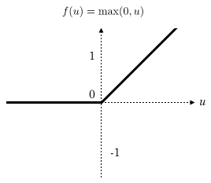

# 卷积神经网络
- [卷积神经网络](#卷积神经网络)
- [Relu 函数](#relu-函数)

<!-- https://www.zybuluo.com/hanbingtao/note/485480 -->

全连接神经网络是一种很重要的神经网络，但是对于图像识别并不是很友好。

- 参数数量太多。当我们输入的是一张 $100 \times 100$ 的图像时，其输入参数为 $100 \times 100  \times 3_{channels}=30000$，实在是太多了，如果扩展到 $1920 \times 1080$ 的 $1080p$ 图像时，输出参数就有 $2073600$ 个，仅灰度图像就有 $200$ 多万个参数，训练难度可想而知。
- 没有使用像素的位置信息。如果使用全连接网络的话，输入值就是按照离散的像素点进行输入，相邻像素点直接的关联性就被破坏了。
- 网络层数不可能太多。参数太多，就导致了网络的层数不可能太深

图像特征的提取需要采用卷积的方法，因此，**卷积神经网络** (CNN, Convolutional Neural Network) 就出现了。
<!-- 局部连接 这个是最容易想到的，每个神经元不再和上一层的所有神经元相连，而只和一小部分神经元相连。这样就减少了很多参数。
权值共享 一组连接可以共享同一个权重，而不是每个连接有一个不同的权重，这样又减少了很多参数。
下采样 可以使用Pooling来减少每层的样本数，进一步减少参数数量，同时还可以提升模型的鲁棒性。 -->

卷积神经网络更加适用于**图像**、**语言**识别的任务

# Relu 函数
在全连接神经网络中，我们使用了 `Sigmoid`函数 作为激活函数来解决阶跃函数 `sgn` 不连续的特点。

但是 `Sigmoid`函数 包含了指数运算 $e^{-x}$ ，计算复杂度就比较大了。

在全连接网络的反向传播的过程中，每经过一层 `Sigmoid`激活层，就会乘上一个`Sigmoid`的导数，其导数最大值为$0.25$，这就导致在`Sigmoid`函数作为激活函数的**深度**神经网络中，会产生梯度消失的问题。

因此几年来，新的激活函数 `Relu` 使用得越来越多了。

**Relu** 函数的定义是
$$\begin{aligned}
    f(X)=max(0,x)
\end{aligned}$$

Relu函数的有如下优势
- **计算速度快**
- **减轻梯度消失**，
- **稀疏性**，通过对大脑的研究发现，大脑在工作的时候只有大约5%的神经元是激活的，而采用sigmoid激活函数的人工神经网络，其激活率大约是50%。有论文声称人工神经网络在15%-30%的激活率时是比较理想的。因为relu函数在输入小于0时是完全不激活的，因此可以获得一个更低的激活率。