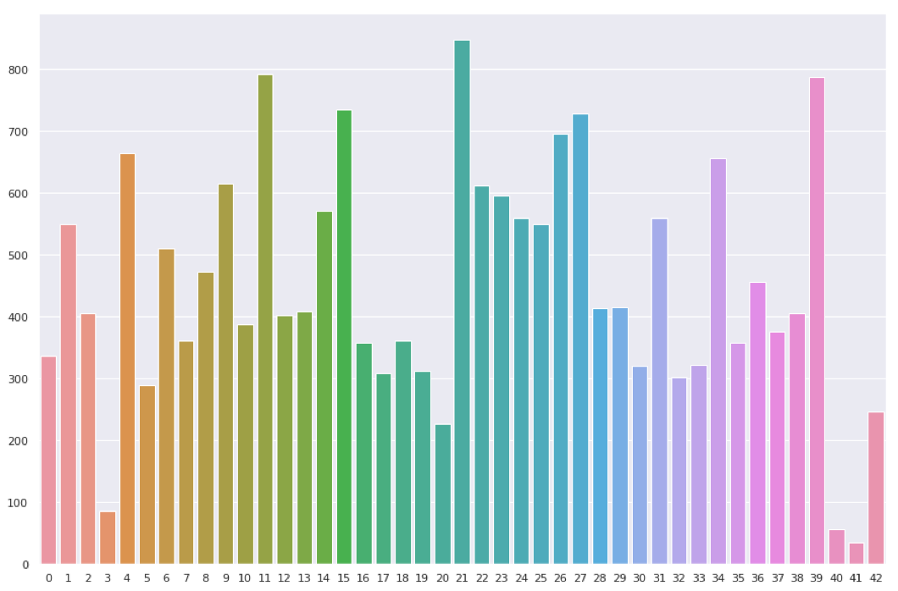
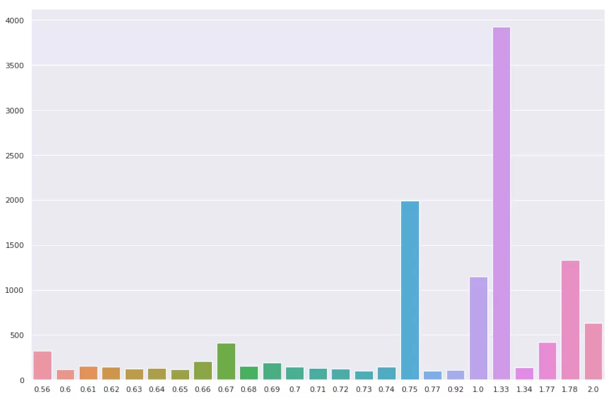
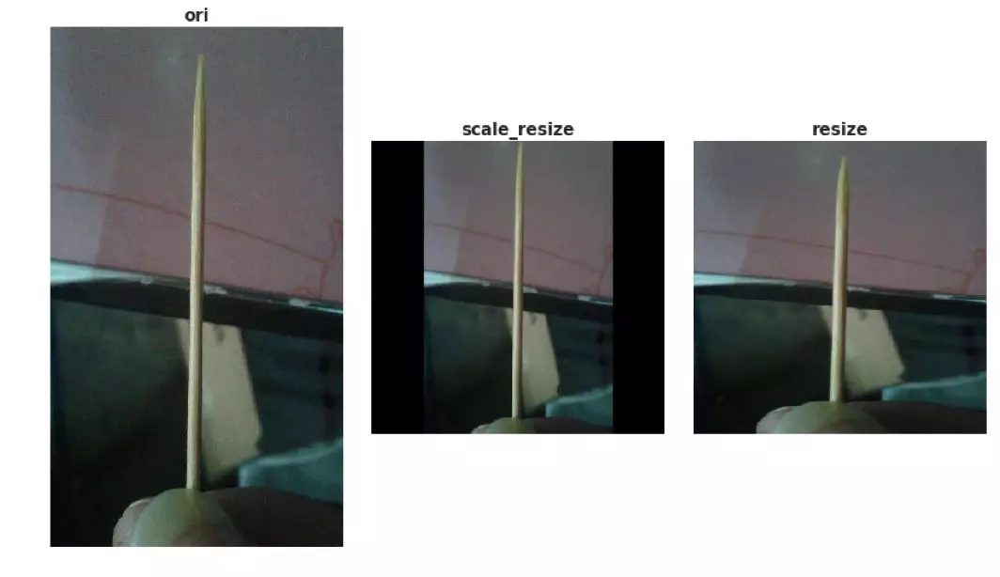
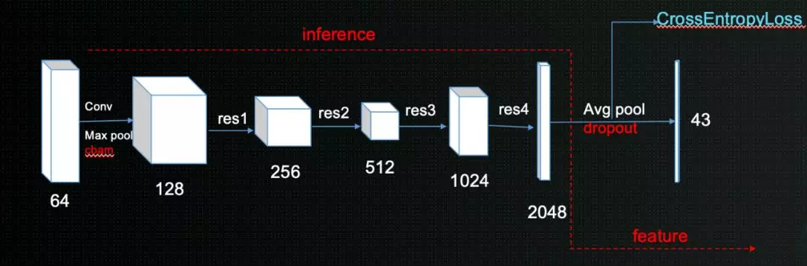
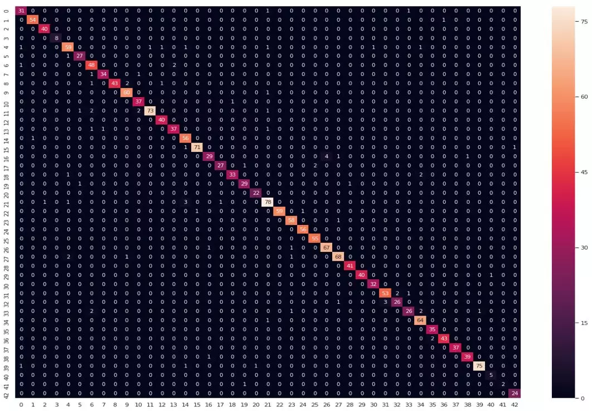

# 目录
- [目录](#目录)
- [导语](#导语)
- [解题思路](#解题思路)
- [数据分析（EDA)](#数据分析eda)
- [模型设计与训练](#模型设计与训练)
- [结果分析](#结果分析)
- [展望](#展望)
- [参考文献和资料](#参考文献和资料)


# 导语
结束比赛有几天了，这几天一直在处理前段时间堆积的工作，今天得空对自己的方案进行梳理总结。今年7月多结束魔镜杯后，将之前的内容整理了一下，刚好看到华为垃圾分类比赛，由于我的工作内容还是偏图像，所以就想玩玩，有幸拿了一个亚军。

这次比赛是基于华为云的modelArts平台，免费的gpu硬件环境，全新的结果提交验证方法。感谢组织方华为云，喜欢打比赛的小伙伴也可以多留意该平台，会不定期举办各种数据类竞赛。我们队共有三人：谢赋(老虎）、舒欣（up)和文瑞（一休)，大家交流分工合作，才能不断奋力前进。这次分享主要是针对决赛阶段，该阶段要求模型的推理时间不能大于100ms，不能使用融合和TTA。故关于模型融合和TTA技巧，本次不会涉及到，后面还会有图像分类的专题分享。

# 解题思路
1. 拿到数据后，我们首先做了数据分析。统计数据样本分布，尺寸分布，图片形态等，基于分析可以做一些针对性的数据预处理算法，对后期的模型训练会有很大的帮助。
2. 选择好的baseline。需要不断的尝试各种现有的网络结构，进行结果对比，挑选出适合该网络的模型结构，然后基于该模型进行不断的调参，调试出性能较好的参数。
3. 做结果验证，分析badcase。将上述模型在验证集上做结果验证，找出错误样本，分析出错原因，然后针对性的调整网络和数据。
4. 基于新数据和模型，再次进行模型调优

# 数据分析（EDA)
- 原始共有43个类别，共计19459张图片。图像类别数据不均衡，其中较少数据为类别3(牙签）、类别40（毛巾）和类别41（饮料盒）；数据较多的为类别11（菜叶根)和类别21（插头电线）。



- 图片长宽比有一定的差异性，下图是h/w比例数据分布图（只显示该类数量大于100的比例），长宽比大多数集中于1，后来模型输入尺寸设为1：1



基于分析对图像进行简单的数据增强操作，包括图像的等比填充缩放裁剪，水平翻转、高斯噪声等。其中第一项目，对结果影响较大。这里是先将原始图像以最大边为基准做等比缩放，不足的地方填充0，这里缩放后的边是最终输入边长的256/224倍，然后在进行剪切，这里输入模型的尺寸为288*288。下图是对比图，如果不进行等比缩放，最终的结果是最右边的图片，最后的输出就极易识别为筷子。


等比缩放的代码如下：
```python
class Resize(object):
    def __init__(self, size, interpolation=Image.BILINEAR) -> None:
        super().__init__(self)
        self.size
        self.interpolation = interpolation

    def __call__(self, img):
        # padding
        ratio = self.size[0] / self.size[1]
        w, h = img.size
        if w / h < ratio:
            t = int(h * ratio)
            w_padding = (t - w) // 2
            img = img.crop((-w_padding, 0, w + w_padding, h))
        else:
            t = int(w / ratio)
            h_padding = (t - h) // 2
            img = img.crop((0, -h_padding, w, h + h_padding))
        img = img.resize(self.size, self.interpolation)
        return img
```


# 模型设计与训练
首先对原始的数据进行分组，9：1的比例分为训练集和测试集，基于此做线下验证。

| 模型结构 | baseline准确率 |
| -- | -- |
| seresnext5032x4d | 93.10 |
| seresnext10132x4d | 93.59 |
| Senet154 | 94.38 |
| resnext50_32*8d | 95.01 |
| resnext10132*16dwsl | 95.56 |
| resnext10132*32dwsl | 95.32 |
| Pnasnet5large | 94.38 |
| efficientnet-b7 | 95.20 |

基于上述结果验证，采用了resnext10132*16dwsl网络作为基本的baseline，进行结果调优，最后的网络结构如下图，红色的部分为调整的网络部分，模型最后全连接层添加dropout降低过拟合，首层卷积添加cbam注意力机制增强特征表征能力，关注重要特征抑制不必要特征。基于此网络，现在训练20个epoch就能收敛到最高分，训练时间大概5个小时左右。



在模型参数选择和调整方面，尝试了很多参数，针对损失函数分别尝试了CrossEntropyLoss和focal loss， 优化函数：adabound、Radam、adam、sgd和sgd + warm up， 其中adabound在起始收敛的速度较快，但是最终还是sgd的网络精度较高。学习率优化方面使用了ReduceLROnPlateau和定值优化两种方法，定值优化需要根据实验选择适合的降分点。并且也要针对不同的模型调整学习率，最终采用的参数如下：

- 使用预训练参数
- 优化函数: sgd
- 学习率：0.001
- 学习率优化：ReduceLROnPlateau
- 自己设置的网络层，初始学习率是预加载参数网络的5倍


# 结果分析
在验证集上做结果验证，得到下图所示的混淆矩阵。基于此分析各类别预测结果分布，分析badcase，采取措施进行数据扩充或数据增强工作。




# 展望

- 对网络结果中的全部残差块添加时间和空间注意力机制
- 对模型进行量化和剪枝，在保证精度的同时提高模型速度
- 转化为二分类问题，使用人脸的arcfaceloss + triplet loss + focal loss联合loss优化
- 在落地的场景中增加反馈机制，收集用户的反馈信息，对模型进行在线训练，不断增加训练数据优化模型。

# 参考文献和资料
- Robustness properties of Facebook’s ResNeXtWSL models
- FaceNet: A Unified Embedding for Face Recognition and Clustering
- Focal Loss for Dense Object Detection
- 垃圾分类数据集[百度云盘链接](https://pan.baidu.com/s/1HDCmcJFhdXQa_C7UKg7esw)
提取码：nhax
- 【华为云人工智能大赛·垃圾分类挑战杯】[决赛答辩视频&PPT](https://bbs.huaweicloud.com/videos/100676)