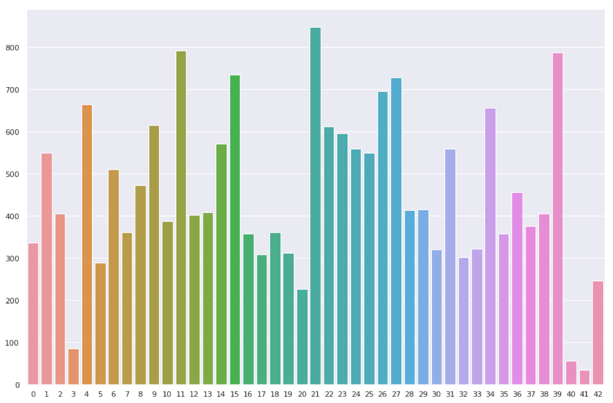
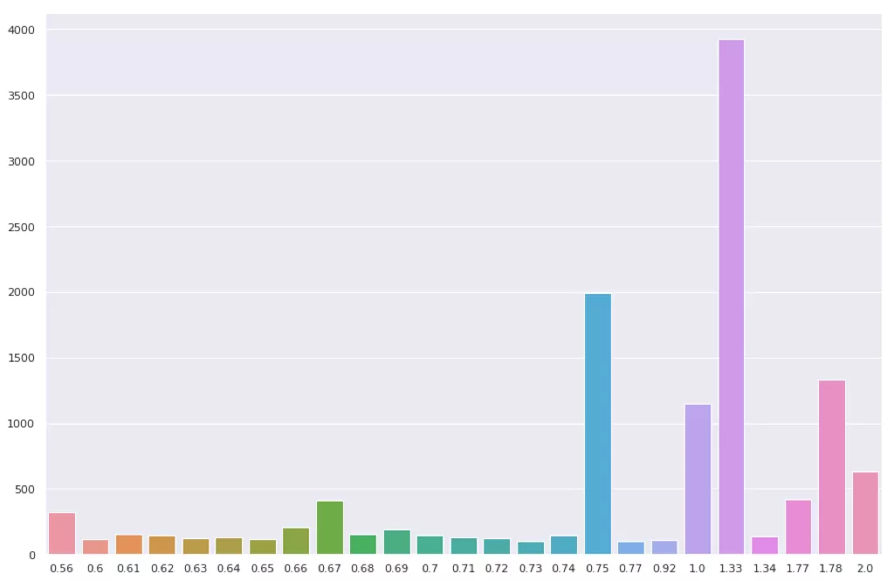
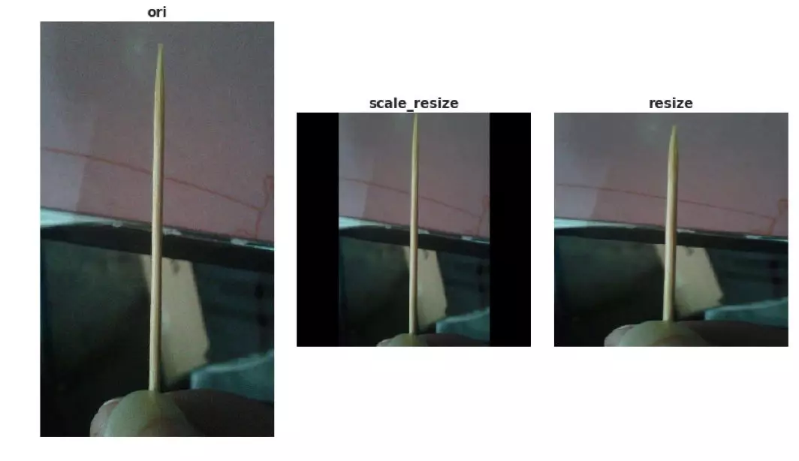

# 华为云人工智能大赛垃圾分类挑战杯决赛
- [华为云人工智能大赛垃圾分类挑战杯决赛](#华为云人工智能大赛垃圾分类挑战杯决赛)
- [金奥队（刘涛）](#金奥队刘涛)
  - [迁移训练](#迁移训练)
  - [数据处理](#数据处理)
  - [损失函数](#损失函数)
  - [超参调优](#超参调优)
  - [控制变量 优中选优](#控制变量-优中选优)
  - [模型设计](#模型设计)
  - [模型训练](#模型训练)
- [AI成长社](#ai成长社)
  - [解题思路](#解题思路)
  - [数据分析（EDA)](#数据分析eda)
  - [数据预处理](#数据预处理)
  - [模型设计](#模型设计-1)
  - [训练策略尝试](#训练策略尝试)
  - [结果分析](#结果分析)
  - [展望](#展望)
  - [参考文献和资料](#参考文献和资料)


# 金奥队（刘涛）
## 迁移训练
在已经有的模型上进行微调

ResNeXt-101 WSL

- Instagram + ImageNet

| Model              | parameter | FLOPS | Top-1 acc. | Top-5 acc. |
| ------------------ | :-------: | :---: | :--------: | :--------: |
| ResNeXt-101 32*8d  |   88 M    | 16 B  |    82.2    |    96.4    |
| ResNeXt-101 32*16d |   193 M   | 36 B  |    84.2    |    97.2    |
| ResNeXt-101 32*32d |   466 M   | 87 B  |    85.1    |    97.5    |
| ResNeXt-101 32*48d |   829 M   | 153 B |    85.4    |    97.6    |


## 数据处理
- 数据清洗  
  发现有问题的标注要进行修改（效果甚微）

- 数据扩充  
  爬虫

- 数据增强  
  随机反转、随机旋转、~~随机裁剪（效果不好，产生噪声，造成收敛慢）~~

## 损失函数
- Cross Entropy
$$\begin{aligned}
    H_{y^`}(y):=-\sum_i y_i^` \log(y_i)
\end{aligned}$$

- Focal Loss
$$\begin{aligned}
    L_{fl}=
    \begin{cases}
        -\alpha (1-y^`)^r \log y^` & y=1 \\
        -(1-\alpha) y^`{^r} \log (1-y^`) & y=0 \\
    \end{cases}
\end{aligned}$$

## 超参调优
- 输入图像大小
- 学习率
- Epochs
- 权重衰减

## 控制变量 优中选优

## 模型设计
- ResNeXt

```python
blocks=[3, 4, 23, 3], groups=32, width=16
```

## 模型训练
`pytorch`
- 数据加载  
  pytorch dataloader

- 数据预处理    
  直接resize操作收敛更快

- 动态学习率  
  连续几个epoch，都没有更好的结果，再调整学习率。断点续训
- 实时保存
  
- K-fold

# AI成长社
## 解题思路
1. 首先了解数据，分析数据，统计数据样本分布，尺寸分布， 针对性的选择数据预处理算法，对后续的模型训练有很大的帮助。
2. 尝试不同的模型，选择合适 的模型对较好的模型进行调参， 调试出性能较好的参数。
3. 分析验证集的分类结果数据， 对模型分类不好的类别，针对性 的对数据进行扩充。
4. 最后，根据新的数据再次 进行模型的调参，并对数据增 强算法做一些尝试，调试出性 能最好的模型。

## 数据分析（EDA)
- 原始共有43个类别，共计19459张图片。图像类别数据不均衡，其中较少数据为类别3(牙签）、类别40（毛巾）和类别41（饮料盒）；数据较多的为类别11（菜叶根)和类别21（插头电线）。



- 图片长宽比有一定的差异性，下图是h/w比例数据分布图（只显示该类数量大于100的比例），长宽比大多数集中于1，后来模型输入尺寸设为1：1



## 数据预处理
- 基于分析对图像进行简单的数据增强操作，包括图像的等比填充缩放裁剪，水平翻转、高斯噪声等。其中第一项目，对结果影响较大。
- 这里是先将原始图像以最大边为基准做等比缩放，不足的地方填充0，这里缩放后的边是最终输入边长的256/224倍，然后在进行剪切，这里输入模型的尺寸为288*288。
- 下图是对比图，如果不进行等比缩放，最终的结果是最右边的图片，最后的输出就极易识别为筷子。


等比缩放的代码如下：
```python
class Resize(object):
    def __init__(self, size, interpolation=Image.BILINEAR) -> None:
        super().__init__(self)
        self.size
        self.interpolation = interpolation

    def __call__(self, img):
        # padding
        ratio = self.size[0] / self.size[1]
        w, h = img.size
        if w / h < ratio:
            t = int(h * ratio)
            w_padding = (t - w) // 2
            img = img.crop((-w_padding, 0, w + w_padding, h))
        else:
            t = int(w / ratio)
            h_padding = (t - h) // 2
            img = img.crop((0, -h_padding, w, h + h_padding))
        img = img.resize(self.size, self.interpolation)
        return img
```

## 模型设计
首先对原始的数据进行分组，9：1的比例分为训练集和测试集，基于此做线下验证。

| 模型结构            | baseline准确率 |
| ------------------- | -------------- |
| seresnext5032x4d    | 93.10          |
| seresnext10132x4d   | 93.59          |
| Senet154            | 94.38          |
| resnext50_32*8d     | 95.01          |
| resnext10132*16dwsl | 95.56          |
| resnext10132*32dwsl | 95.32          |
| Pnasnet5large       | 94.38          |
| efficientnet-b7     | 95.20          |

基于上述结果验证，采用了resnext10132*16dwsl网络作为基本的baseline，进行结果调优，最后的网络结构如下图，红色的部分为调整的网络部分，模型最后全连接层添加dropout降低过拟合，首层卷积添加cbam注意力机制增强特征表征能力，关注重要特征抑制不必要特征。基于此网络，现在训练20个epoch就能收敛到最高分，训练时间大概5个小时左右。


## 训练策略尝试
在模型参数选择和调整方面，尝试了很多参数，针对损失函数分别尝试了CrossEntropyLoss和focal loss， 优化函数：adabound、Radam、adam、sgd和sgd + warm up， 其中adabound在起始收敛的速度较快，但是最终还是sgd的网络精度较高。学习率优化方面使用了ReduceLROnPlateau和定值优化两种方法，定值优化需要根据实验选择适合的降分点。并且也要针对不同的模型调整学习率。
|       损失函数       |  优化函数   |    学习率 |      学习率策略       | 验证集分数 |
| :------------------: | :---------: | :-------: | :-------------------: | :--------: |
|   CrossEntropyLoss   |  adabound   |     0.001 |   ReduceLROnPlateau   |   94.89    |
|   CrossEntropyLoss   |    Radam    |     0.001 |   ReduceLROnPlateau   |   94.94    |
|   CrossEntropyLoss   |    adam     |     0.001 |   ReduceLROnPlateau   |   95.34    |
| **CrossEntropyLoss** |   **sgd**   | **0.001** | **ReduceLROnPlateau** | **95.56**  |
|   CrossEntropyLoss   |     sgd     |     0.001 |       定值优化        |   95.34    |
|      focal loss      |     sgd     |     0.001 |   ReduceLROnPlateau   |    94.2    |
|   CrossEntropyLoss   |     sgd     |      0.01 |   ReduceLROnPlateau   |   95.32    |
|   CrossEntropyLoss   |     sgd     |    0.0001 |   ReduceLROnPlateau   |   95.44    |
|   CrossEntropyLoss   | sgd+warm up |     0.001 |   ReduceLROnPlateau   |   95.49    |


最终采用的参数如下：

- 使用预训练参数
- 优化函数: sgd
- 学习率：0.001
- 学习率优化：ReduceLROnPlateau
- 自己设置的网络层，初始学习率是预加载参数网络的5倍


## 结果分析
在验证集上做结果验证，得到下图所示的混淆矩阵。基于此分析各类别预测结果分布，分析badcase，采取措施进行数据扩充或数据增强工作。


## 展望

- 对网络结果中的全部残差块添加时间和空间注意力机制
- 对模型进行量化和剪枝，在保证精度的同时提高模型速度
- 转化为二分类问题，使用人脸的arcfaceloss + triplet loss + focal loss联合loss优化
- 在落地的场景中增加反馈机制，收集用户的反馈信息，对模型进行在线训练，不断增加训练数据优化模型。

## 参考文献和资料
- Robustness properties of Facebook’s ResNeXtWSL models
- FaceNet: A Unified Embedding for Face Recognition and Clustering
- Focal Loss for Dense Object Detection
- 垃圾分类数据集[百度云盘链接](https://pan.baidu.com/s/1HDCmcJFhdXQa_C7UKg7esw)
提取码：nhax
- 【华为云人工智能大赛·垃圾分类挑战杯】[决赛答辩视频&PPT](https://bbs.huaweicloud.com/videos/100676)