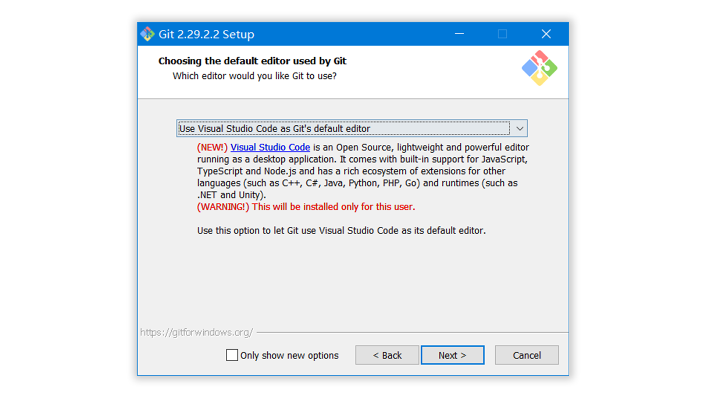

# Using GitHub in VSCode
## Content
- [x] [Install Git](#Install-Git)
  - [x] [Install Git for Windows](#Install-Git-for-Windows)
  - [x] [Install Git for Linux/Unix](#Install-Git-for-Linux/Unix)
  - [x] [Install Git for MacOS](#Install-Git-for-MacOS)
- [x] [Create a new repository](#Create-a-new-repository)
- [x] [Push an existing repository](#Push-an-existing-repository)


## Install Git
### Install Git for Windows
Git's [Download Link](https://git-scm.com/downloads)

- Choose VScode as dufault editor：`USe Visual Studio Code as Git's default editor`


查看Git版本号，检查git是否成功安装
```{shell}
$ git --version
git version 2.29.2.windows.2
```

### Install Git for Linux/Unix
#### Debian/Ubuntu
For the latest stable version for your release of Debian/Ubuntu
```{shell}
$ apt-get install git
```
For Ubuntu, this PPA provides the latest stable upstream Git version
```{shell}
$ add-apt-repository ppa:git-core/ppa # apt update; apt install git
```
#### 其他发行版本
其他Linux发行版本的安装方法按照链接进行操作：[https://git-scm.com/download/linux](https://git-scm.com/download/linux)

### Install Git for MacOS
[https://git-scm.com/download/mac](https://git-scm.com/download/mac)

>:) 本节完，点击[回到目录](#目录)


## Create a new repository
### set your account's default identity
```{shell}
$ git config --global user.email "you@example.com"
$ git config --global user.name "Your Name"
```
> you@example.com 替换为自己的邮箱
> Your Name 替换为自己的用户名

查看个人信息
```{shell}
$ git config user.name
Your Name
$ git config user.email
you@example.com
```

### 初始化仓库
```{shell}
$ git init
Initialized empty Git repository in C:/git-test/.git/
```
创建一个README.md文件
```{shell}
$ echo "# git_userGuide" >> README.md
```
添加README.md文件
```{shell}
$ git add README.md
```

### 暂存
```{shell}
$ git commit -m "first commit"
```

```{shell}
[master (root-commit) 462d678] first commit
 1 file changed, 0 insertions(+), 0 deletions(-)
 create mode 100644 README.md
```

### 链接
```{shell}
git remote add origin Your_repository_web_URL
```
Your_repository_web_URL在GitHub仓库中可得


### 提交
```{shell}
$ git push -u origin main
```
在vscode里会自动在浏览器端打开对应的登录操作，完成Github登录即可
输出如下结果表示完成：
```{shell}
info: please complete authentication in your browser...
Enumerating objects: 3, done.
Counting objects: 100% (3/3), done.
Writing objects: 100% (3/3), 245 bytes | 245.00 KiB/s, done.
Total 3 (delta 0), reused 0 (delta 0), pack-reused 0
To https://github.com/HenryZhuHR/git_userGuide.git
 * [new branch]      main -> main
Branch 'main' set up to track remote branch 'main' from 'origin'.
```

## Push an existing repository
follow by this command line
```{shell}
git remote add origin https://github.com/HenryZhuHR/git_userGuide.git
git branch -M main
git push -u origin main
```

