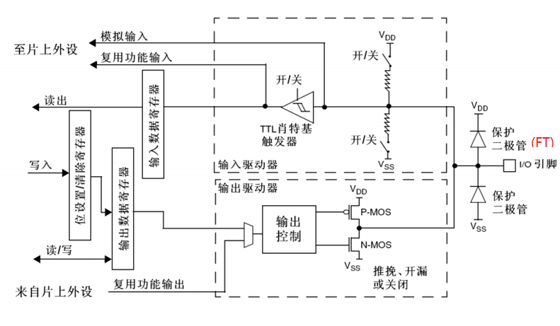

# 导航
- [导航](#导航)
- [GPIO 简介](#gpio-简介)
- [GPIO 基本结构](#gpio-基本结构)
- [GPIO 八种工作方式](#gpio-八种工作方式)
  - [浮空输入](#浮空输入)
  - [上拉输入](#上拉输入)
  - [下拉输入](#下拉输入)
  - [模拟输入](#模拟输入)
  - [开漏输出](#开漏输出)
  - [开漏复用输出](#开漏复用输出)
  - [推挽输出](#推挽输出)
  - [推挽复用输出](#推挽复用输出)

[CSDN 参考资料](https://blog.csdn.net/qq_38410730/article/details/79858906)

# GPIO 简介
- GPIO
- General-purpose input/output
- 通用输入/输出端口

GPIO是STM32可控制的引脚。GPIO的引脚与外部硬件设备连接，可实现与外部通讯、控制外部硬件或者采集外部硬件数据的功能。

包括7个通用目的的输入/输出口（GPIO）组，分别为GPIOA、GPIOB、GPIOC、GPIOD、GPIOE、GPIOF、GPIOG，同时每组GPIO口组有16个GPIO口。通常简略称为PAx、PBx、PCx、PDx、PEx、PFx、PGx，其中x为0-15。

STM32的大部分引脚除了当GPIO使用之外，还可以复用位外设功能引脚（比如串口）

# GPIO 基本结构
每个 GPIO 内部都有一个这样的电路结构

- **保护二极管**：**IO引脚上下两边两个二极管用于防止引脚外部过高或过低的电压输入**。当引脚电压高于VDD时，上方的二极管导通；当引脚电压低于VSS时，下方的二极管导通，防止不正常电压引入芯片导致芯片烧毁。但是尽管如此，还是不能直接外接大功率器件，须加大功率及隔离电路驱动，防止烧坏芯片或者外接器件无法正常工作。
- **P-MOS管和N-MOS管**：**由P-MOS管和N-MOS管组成的单元电路使得GPIO具有“推挽输出”和“开漏输出”的模式**。这里的电路会在下面很详细地分析到。
- **TTL肖特基触发器**：信号经过触发器后，模拟信号转化为0和1的数字信号。但是，**当GPIO引脚作为ADC采集电压的输入通道时**，**用其“模拟输入”功能**，**此时信号不再经过触发器进行TTL电平转换**。ADC外设要采集到的原始的模拟信号。

> 这里需要注意的是，在查看《STM32中文参考手册V10》中的GPIO的表格时，会看到有“FT”一列，这代表着这个GPIO口时兼容3.3V和5V的；如果没有标注“FT”，就代表着不兼容5V。

# GPIO 八种工作方式
GPIO 支持 4 种输入模式
- [ ] [浮空输入](#浮空输入)
- [ ] [上拉输入](#上拉输入)
- [ ] [下拉输入](#下拉输入)
- [ ] [模拟输入](#模拟输入)

4 种输出模式
- [ ] [开漏输出](#开漏输出)
- [ ] [开漏复用输出](#开漏复用输出)
- [ ] [推挽输出](#推挽输出)
- [ ] [推挽复用输出](#推挽复用输出)

同时，GPIO还支持三种最大翻转速度（2MHz、10MHz、50MHz）。

每个I/O口可以自由编程，但 I/O 口寄存器必须按 32 位字被访问。
- GPIO_Mode_AIN 模拟输入
- GPIO_Mode_IN_FLOATING 浮空输入
- GPIO_Mode_IPD 下拉输入
- GPIO_Mode_IPU 上拉输入
- GPIO_Mode_Out_OD 开漏输出
- GPIO_Mode_Out_PP 推挽输出
- GPIO_Mode_AF_OD 复用开漏输出
- GPIO_Mode_AF_PP 复用推挽输出

## 浮空输入

## 上拉输入

## 下拉输入

## 模拟输入

## 开漏输出

## 开漏复用输出

## 推挽输出

## 推挽复用输出

