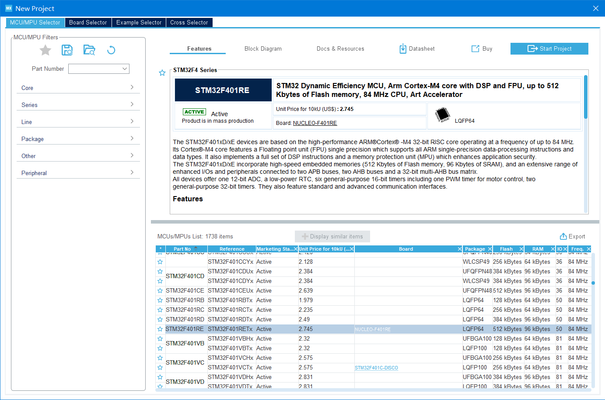

[CSDN配置教程](https://blog.csdn.net/qq_33559992/article/details/97548915)

# 导航
# 需要的软件和工具
- VS Code ：作为代码编辑器

- [LLVM](https://releases.llvm.org/download.html) ：代码补全，其实可以理解为 Clang。安装完成后，将路径添加到环境变量里。

- [Git for Windows](https://gitforwindows.org/): 提供 Git 支持和 MINGW64 指令终端。

- [arm-none-eabi-gcc](https://launchpad.net/gcc-arm-embedded/+download)：选择  [gcc-arm-none-eabi-5_4-2016q3-20160926-win32.exe (md5)](https://launchpadlibrarian.net/287101671/gcc-arm-none-eabi-5_4-2016q3-20160926-win32.exe)
<br>其他的新版的下载，[GNU Arm Embedded Toolchain](https://developer.arm.com/tools-and-software/open-source-software/developer-tools/gnu-toolchain/gnu-rm/downloads) 。
<br>正常安装后，记得需要将软件的安装目录下的bin文件夹设置进入环境变量PATH中。

- [OpenOCD for Windows](https://gnutoolchains.com/arm-eabi/openocd/) ：
一个开源的片上调试器(Open On-Chip Debugger)。
在Windows下自己编译可能有问题 。所以，我们选择编译好的。
下载后的文件不是安装包，把程序文件夹放入自己的软件安装目录下，将软件的bin文件夹路径加入用户环境变量PATH中。

- [STM32CubeMX](https://www.st.com/zh/development-tools/stm32cubemx.html)：用于生成带makefile的工程。
这样我们就可以不用自己写MakeFile了。套用他的模板，然后修改为自己的目录就可以。

## LLVM
## Git for Windows
## arm-none-eabi-gcc
## OpenOCD for Windows
## STM32CubeMX

# 搭建环境
## STM32CubeMX
STM32CubeMX是一个配置STM32代码的工具，它把很多东西封装的比较好，硬件抽象层、中间层、示例代码等。

现在ST公司升级和维护的库主要就是STM32CubeMX的HAL库和标准外设库，使用这两种库开发STM32各有各的好处，下面简单描述一下。

STM32CubeMX是一个图形化的工具，也是配置和初始化C代码生成器（STM32 configuration and initialization C code generation），也就是自动生成开发初期关于芯片相关的一些初始化代码。

从上图可以看得出，它包含了STM32所有系列的芯片，包含示例和样本（Examples and demos）、中间组件（Middleware Components）、硬件抽象层（Hardwaree abstraction layer）。


---
由于STM32CubeMX软件是基于JAVA环境运行的，所以需要安装JRE才能使用，目前（2016年10月31日）JRE最新版本是jre1.8.0_112。

TM32CubeMX要求JRE最低版本是1.7.0_45，如果你电脑已安装JRE版本大于1.7.0_45，则可以不用再下载安装。


### 创建工程
需要选择“help -> updater settings ->Connection Parameters"设置好网络后，才能下载固件包


下载就可以了


主页面
主页右边可以安装不同芯片的支持包，例如F1系列，F4系列


`new project` 新建项目
左上角File..可以新建项目。
新建项目以后，SYS里选择debug接口，这里选的是SWD，也可以选JTAG


选择好板子，这里也可以看到的开发板的特性 `features` 



开发文档和手册都可以下载


下一步

接口配置


时钟配置
先在RCC里选择高速外部时钟（HSE）和低速外部时钟源（LSE），这里选的都是晶振（因为板子上有这两个晶振）。
然后选择“时钟配置”，先在左边填好外部晶振的频率，然后在右边填上自己想要的主频，Cube会自动帮你配置锁相环。


项目管理
Toolchain/IDE选择生成makefile即可。前面的项目结构我选的basic，你也可以选Advanced，后面目录结构就不一样了，VSCode的配置要稍微改一下。
这里要选择 ``makefile`` 输出


工具下载


### 配置 vscode

导出后，vscode打开文件

.ioc文件和.mxproject文件是STM32Cube的工程文件，Driver里是STM32和ARM CMSIS的库，最好不要修改。Inc和Src是供用户修改的源码。


#### vscode 插件配置
- Chinese (Simplified)：VS Code的语言支持是以插件形式存在的，需要装个中文插件;、

- C/C++：提供代码补全、智能感知和debug功能；（注意，VSCode 可能会推荐你安装C/C++ Intellisense插件来做智能感知 ，但它依赖于GNU Global工具，我们的arm工具链里没有这个，所以不用装）；

- C/C++ Snippets：好用的代码模板小工具。比如说，装好以后，敲个for，就可以自动补全整个for循环代码；

- ARM：提供ARM汇编语言的代码高亮；

- Cortex-Debug：本教程的核心，有了它，才能把ARM工具链和OpenOCD等命令行工具组织到VSCode中，并进行图形化操作。

#### vscode 终端选择
文件--首选项--设置，搜索terminal，设置内置终端的Shell为git bash（之前的默认是power shell）。

点击“在settings.json中编辑"，修改为自己安装git bash的路径：
```json
"terminal.integrated.shell.windows": "C:/Program Files/Git/bin/bash.exe",
```
Ctrl+S保存后，按 Ctrl+` （波浪线那个键） 就可以打开终端，就可以看到Bash了：

【推荐】如果你只想在开发STM32的时候用bash，可以只在当前目录下新建一个.vscode文件夹，然后新建一个单独的 `settings.json` ，在里面写上：
```json
{
    "terminal.integrated.shell.windows": "C:/Program Files/Git/bin/bash.exe"
}
```


