# Windows 下配置 STM32 开发环境
本文档是在 Windows 下配置 STM32 开发环境

[Linux 下配置 STM32 开发环境]() 暂未完成 ...
# 文档导航
- [Windows 下配置 STM32 开发环境](#windows-下配置-stm32-开发环境)
- [文档导航](#文档导航)
- [环境配置](#环境配置)
  - [安装 VS code](#安装-vs-code)
  - [安装 LLVM](#安装-llvm)
  - [安装 Git for Windows](#安装-git-for-windows)
  - [安装 arm-none-eabi-gcc](#安装-arm-none-eabi-gcc)
  - [安装 OpenOCD for Windows](#安装-openocd-for-windows)
  - [安装 STM32CubeMX](#安装-stm32cubemx)
- [搭建环境](#搭建环境)
  - [STM32CubeMX](#stm32cubemx)
    - [创建工程](#创建工程)
  - [配置 vscode](#配置-vscode)
    - [vscode 插件配置](#vscode-插件配置)
    - [vscode 终端选择](#vscode-终端选择)
    - [vscode 任务配置](#vscode-任务配置)
    - [vscode 运行](#vscode-运行)
- [项目管理编译](#项目管理编译)
  - [编译工程](#编译工程)
    - [gcc 编译过程](#gcc-编译过程)
  - [配置openocd](#配置openocd)


# 环境配置
| 安装内容 | 功能 |
| :--: | :-- |
| [VS code](#安装-vs-code) | 作为代码编辑器 |
| [LLVM](#安装-llvm) | 代码补全 |
| [Git for Windows](#安装-git-for-windows) | 提供 Git 支持和 MINGW64 指令终端 |
| [arm-none-eabi-gcc](#安装-arm-none-eabi-gcc) | - |
| [OpenOCD for Windows](#安装-openocd-for-windows) | - |
| [STM32CubeMX](#安装-stm32cubemx) | - |


## 安装 VS code
点击下载 [VS code](https://code.visualstudio.com/)
也可以源码编译安装

## 安装 LLVM
**LLVM** (low level virtual machine)

点击下载 [LLVM](https://releases.llvm.org/download.html) ，然后安装
- 安装时添加到环境变量：选择 `Add LLVM to the system PATH for all users` 或 `Add LLVM to the system PATH for current user`
- 手动将安装目录里的 `bin` 目录添加到环境变量里
- `Create LLVM Desktop Icon` 选择是否在桌面创建图标
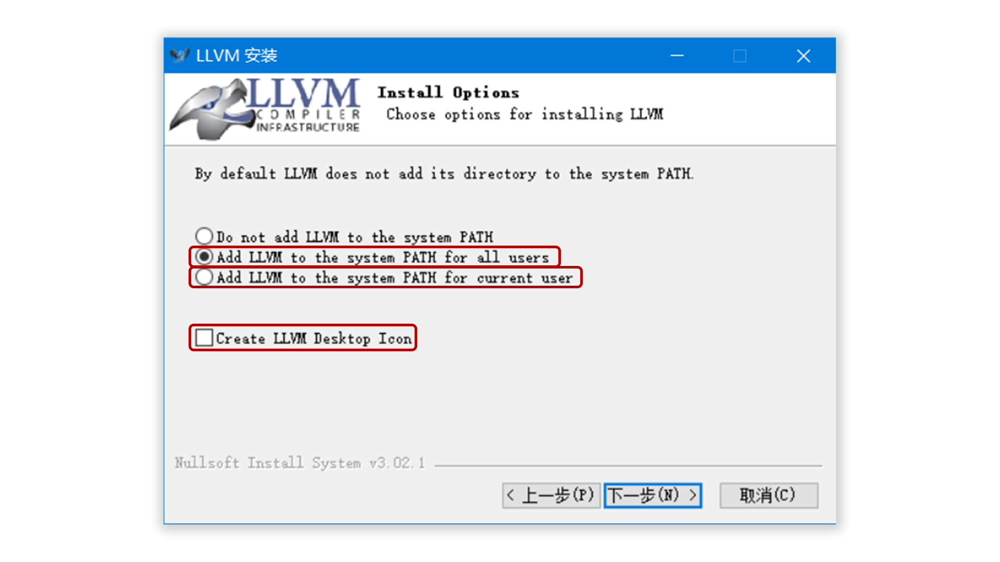

## 安装 Git for Windows
`Git for Windows` 提供 Git 支持和 MINGW64 指令终端。
下载 [Git for Windows](https://gitforwindows.org/) 

[MINGW](https://sourceforge.net/projects/mingw/files/latest/download?source=files)

## 安装 arm-none-eabi-gcc
[arm-none-eabi-gcc](https://launchpad.net/gcc-arm-embedded/+download)：选择  [gcc-arm-none-eabi-5_4-2016q3-20160926-win32.exe (md5)](https://launchpadlibrarian.net/287101671/gcc-arm-none-eabi-5_4-2016q3-20160926-win32.exe)

其他的新版的下载，[GNU Arm Embedded Toolchain](https://developer.arm.com/tools-and-software/open-source-software/developer-tools/gnu-toolchain/gnu-rm/downloads) 。

正常安装后，记得需要将软件的安装目录下的bin文件夹设置进入环境变量PATH中。
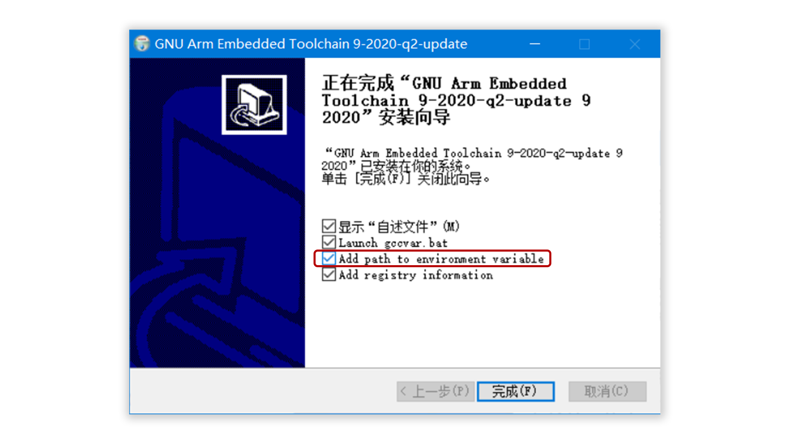

## 安装 OpenOCD for Windows
下载 [OpenOCD](https://gnutoolchains.com/arm-eabi/openocd/) ：
一个开源的片上调试器(Open On-Chip Debugger)。
在Windows下自己编译可能有问题 。所以，我们选择编译好的。
下载后的文件不是安装包，把程序文件夹放入自己的软件安装目录下，将软件的bin文件夹路径加入用户环境变量PATH中。

## 安装 STM32CubeMX
下载 [STM32CubeMX](https://www.st.com/zh/development-tools/stm32cubemx.html)：用于生成带makefile的工程。
这样我们就可以不用自己写MakeFile了。套用他的模板，然后修改为自己的目录就可以。

安装目录下 `/Keil_v5/ARM/STLink/USBDriver` 里的 `dpinst_amd64.exe` 和 `dpinst_x86.exe`
安装成功之后可以在设备管理器看到
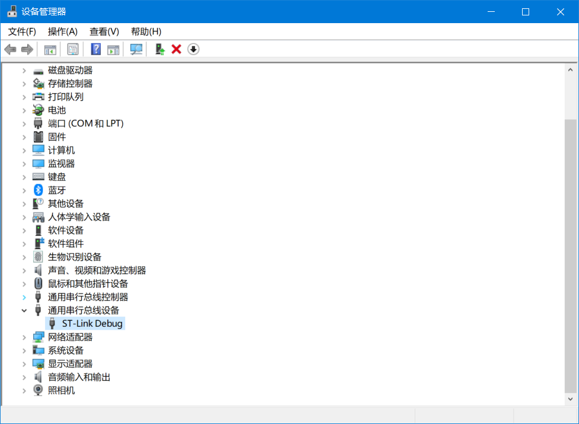


# 搭建环境
## STM32CubeMX
STM32CubeMX是一个配置STM32代码的工具，它把很多东西封装的比较好，硬件抽象层、中间层、示例代码等。由于STM32CubeMX软件是基于JAVA环境运行的，所以需要安装JRE才能使用，建议装Java8

现在ST公司升级和维护的库主要就是STM32CubeMX的HAL库和标准外设库，使用这两种库开发STM32各有各的好处，下面简单描述一下。

STM32CubeMX是一个图形化的工具，也是配置和初始化C代码生成器（STM32 configuration and initialization C code generation），也就是自动生成开发初期关于芯片相关的一些初始化代码。

从上图可以看得出，它包含了STM32所有系列的芯片，包含示例和样本（Examples and demos）、中间组件（Middleware Components）、硬件抽象层（Hardwaree abstraction layer）。


### 创建工程
需要选择“help -> updater settings ->Connection Parameters"设置好网络后，才能下载固件包

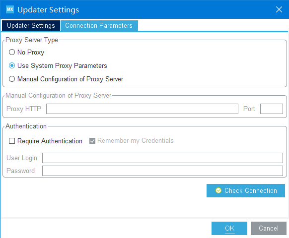

下载就可以了

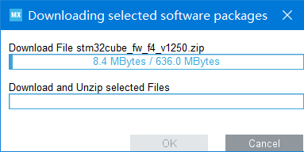

主页面
主页右边可以安装不同芯片的支持包，例如F1系列，F4系列
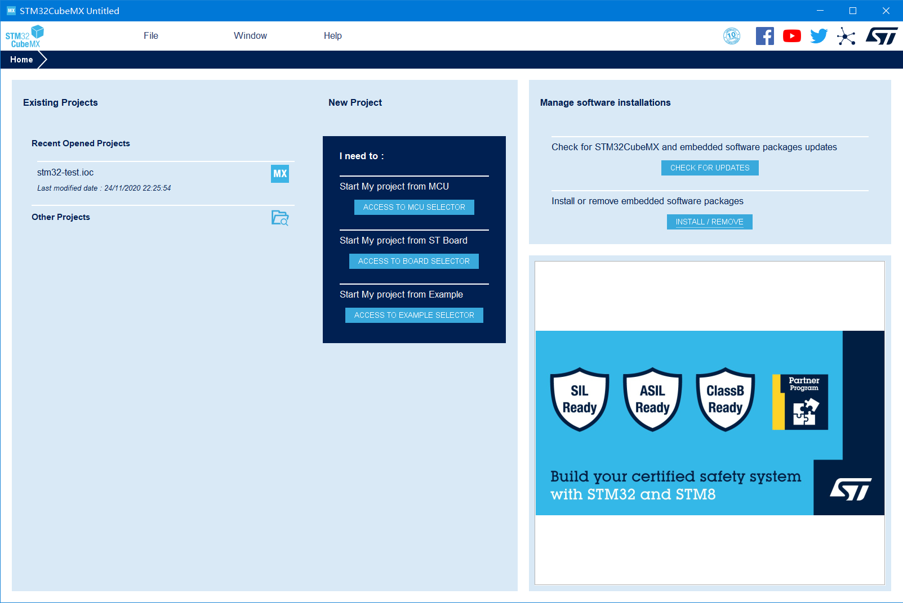

`new project` 新建项目
左上角File..可以新建项目。

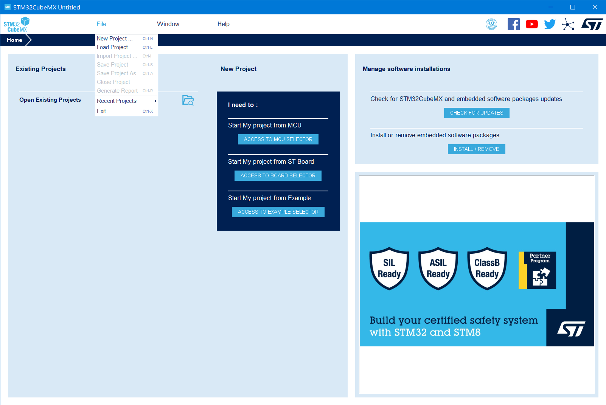

选择好板子，这里也可以看到的开发板的特性 `features` 


开发文档和手册都可以下载
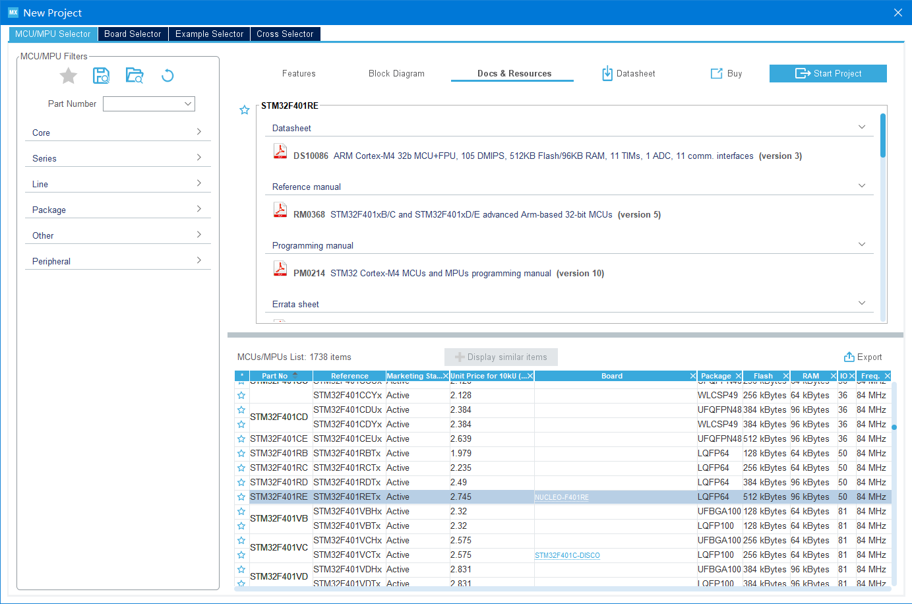

下一步

接口配置
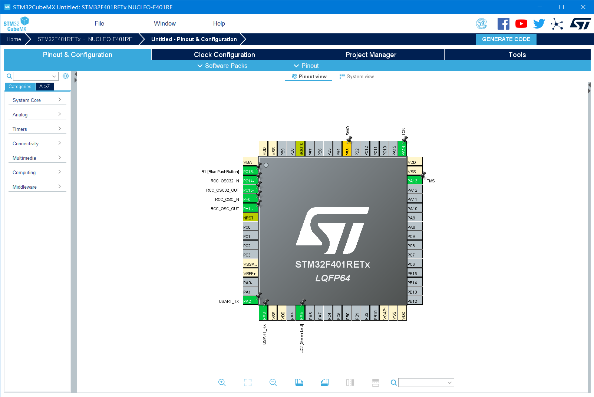


新建项目以后，SYS里选择debug接口，这里选的是SWD，也可以选JTAG
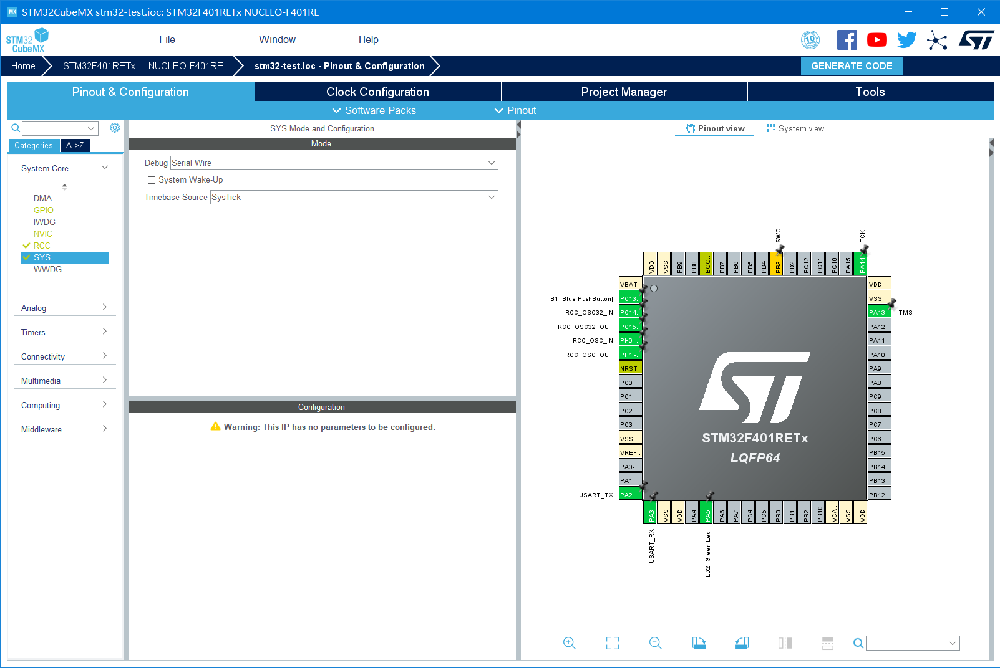

时钟配置
先在RCC里选择高速外部时钟（HSE）和低速外部时钟源（LSE），这里选的都是晶振（因为板子上有这两个晶振）。
然后选择“时钟配置”，先在左边填好外部晶振的频率，然后在右边填上自己想要的主频，Cube会自动帮你配置锁相环。
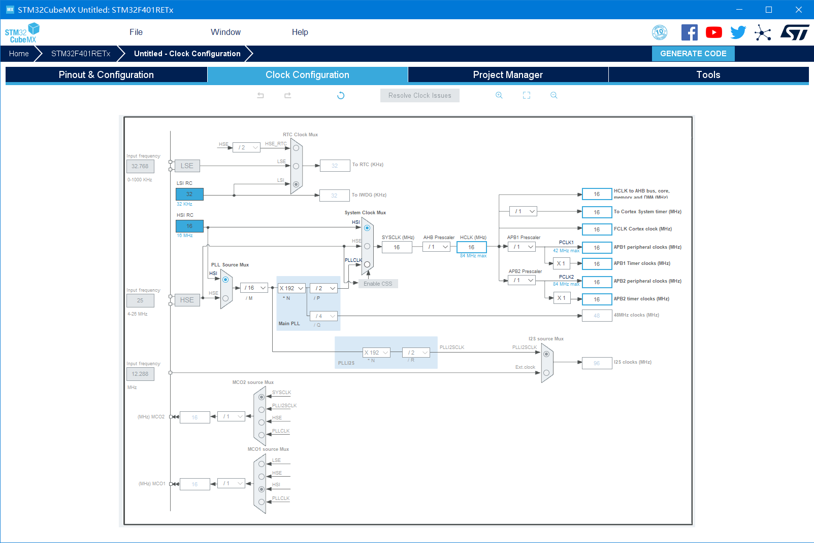

项目管理
Toolchain/IDE选择生成makefile即可。前面的项目结构我选的basic，你也可以选Advanced，后面目录结构就不一样了，VSCode的配置要稍微改一下。
这里要选择 ``makefile`` 输出


工具下载
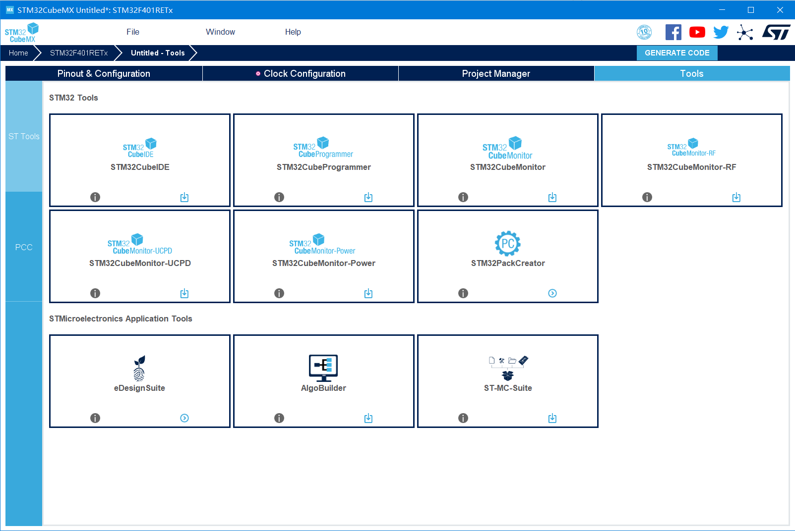


## 配置 vscode

导出后，vscode 打开目录 `stm32-test`
```bash
.
├── Core
│   ├── Inc
│   │   ├── gpio.h
│   │   ├── main.h
│   │   ├── ...
│   └── Src
│       ├── gpio.c
│       ├── main.c
│       ├── ...
├── Drivers
│   ├── CMSIS     
│   │   ├── Device
│   │   └── Include
│   │       ├── cmsis_armcc.h
│   │       ├── ...
│   └── STM32F4xx_HAL_Driver
│       ├── Inc
│       │   ├── Legacy
│       │   │   └── stm32_hal_legacy.h
│       │   ├── stm32f4xx_hal.h
│       │   ├── ...
│       └── Src
│           ├── stm32f4xx_hal.c
│           ├── ...
├── STM32F401RETx_FLASH.ld
├── startup_stm32f401xe.s
└── stm32-test.ioc
└── .mxproject
```

`stm32-test.ioc` 文件和 `.mxproject` 文件是 STM32CubeMX 的工程文件，Driver里是 `STM32` 和 `ARM CMSIS` 的库，最好不要修改

`Core/Inc` 和 `Core/Src` 是供用户修改的源码。

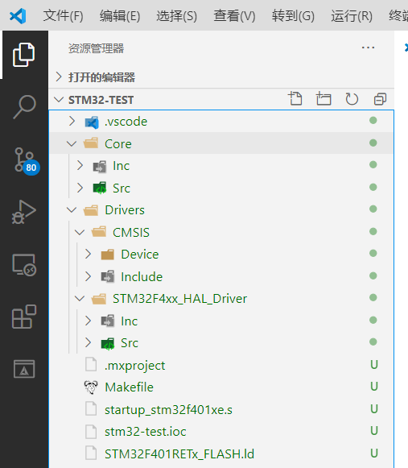


### vscode 插件配置
- `Chinese (Simplified)` : VS Code的语言支持是以插件形式存在的，需要装个中文插件;、

- `C/C++` : 提供代码补全、智能感知和debug功能；（注意，VSCode 可能会推荐你安装C/C++ Intellisense插件来做智能感知 ，但它依赖于GNU Global工具，我们的arm工具链里没有这个，所以不用装）；

- `C/C++ Snippets` : 好用的代码模板小工具。比如说，装好以后，敲个for，就可以自动补全整个for循环代码；

- `ARM` : 提供ARM汇编语言的代码高亮；

- `Cortex-Debug` : 本教程的核心，有了它，才能把ARM工具链和OpenOCD等命令行工具组织到VSCode中，并进行图形化操作。

### vscode 终端选择
文件->首选项->设置，搜索terminal，设置内置终端的Shell为git bash（之前的默认是power shell）。

点击“在settings.json中编辑"，修改为自己安装git bash的路径：
```json
"terminal.integrated.shell.windows": "C:/Program Files/Git/bin/bash.exe",
```
Ctrl+S保存后，按 Ctrl+` （波浪线那个键） 就可以打开终端，就可以看到Bash了：

【推荐】如果你只想在开发STM32的时候用bash，可以只在当前目录下新建一个.vscode文件夹，然后新建一个单独的 `settings.json` ，在里面写上：
```json
{
    "terminal.integrated.shell.windows": "C:/Program Files/Git/bin/bash.exe"
}
```

### vscode 任务配置
在根目录下的 `.vscode` 目录中创建 `tasks.json`
```json
{
    "version": "2.0.0",
    "tasks": [
        {
            "label": "build",
            "type": "shell",
            "command": "make",
            "args": [
                "-j4"
            ]
        },
        {
            "label": "clean",
            "type": "shell",
            "command": "make",
            "args": [
                "clean"
            ]
        }
    ]
}
```

Pressing Ctrl+Shift+B or running Run Build Task from the global Terminal menu show the following picker:

### vscode 运行
```json
{
    // 使用 IntelliSense 了解相关属性。 
    // 悬停以查看现有属性的描述。
    // 欲了解更多信息，请访问: https://go.microsoft.com/fwlink/?linkid=830387
    "version": "0.2.0",
    "configurations": [
        {
            "name": "Cortex Debug",
            "cwd": "${workspaceRoot}",
            "executable": "${workspaceRoot}/build/${workspaceFolderBasename}.elf",
            "request": "launch",
            "type": "cortex-debug",
            "device": "STM32F407VE", //使用J-link GDB Server时必须；其他GBD Server时可选（有可能帮助自动选择SVD文件）。支持的设备见 https://www.segger.com/downloads/supported-devices.php
            "svdFile": "./STM32F407.svd", //svd文件，有这个文件才能查看寄存器的值，每个单片机都不同。可以在以下地址找到 https://github.com/posborne/cmsis-svd
            "servertype": "openocd", //使用的GDB Server
            "configFiles": [
                "${workspaceRoot}/openocd.cfg"
            ],
            "preLaunchTask": "build",
            "armToolchainPath": "C:/Program Files (x86)/GNU Arm Embedded Toolchain/9 2020-q2-update/bin/"
        }
    ]
}
```
- `executable` : 编译出的二进制文件，也就是最终烧录到单片机中的，这里是elf文件。根据芯片的不同，可能产生不同的名称和后缀（例如TI的TM4C123芯片编译出来的名称是"main.axf"）
- `request` : 可以选launch或attach。launch是指启动调试时同时开始执行程序；attcah是指程序已经在运行了，然后开始调试。我没测试过attach。
- `type` : 调试的类型，选cortex-debug，这是我们装的插件。其实也可以填cppdbg之类的，但是那样我们就得自己配置gdb了，配置起来将会非常麻烦。
- `device` : 目标芯片。如果你使用J-LINK GDB Server时必须要设置这个选项。然而我们的GDB Server是openocd，J-Link只用来连接芯片。
- `svdFile` : svd文件的路径。
- `servertype` : 要选择的gdb server。我们用openocd。
- `configFiles` : gdb server的配置文件路径。其实openocd会自动读当前目录下的openocd.cfg文件，这个选项不填也行。但是如果你想把openocd.cfg放在别处，就可以用这个选项指定配置文件的路径。
- `preLaunchTask` : 在启动调试前，预先执行的任务。在这里我们设置为前一篇文章里配置的build任务。这样每次调试前都会先自动编译好
- `armToolchainPath` : 工具链的路径。配置了全局环境变量的情况下好像不设置也行。

# 项目管理编译

## 编译工程
根目录下，得到 `build` 目录
```bash
make
```
执行命令，会生成每个源文件的 `*.o`、`*.d`、`*.lst ` 文件以及工程文件的 `*.bin` (二进制文件)、`*.hex` (十六进制文件)、最终链接得到的 `*.elf` 文件（用于调试）、`*.map`

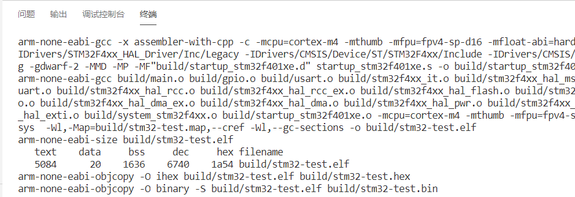

### gcc 编译过程
gcc下编译过程如下图所示：
- `.c` 文件 经过 arm-none-eabi-gcc 编译成 .o文件
- `.s` 文件 经过 arm-none-eabi-as 编译成 .o文件
- `.o` 文件 和 .a文件 经过 arm-none-eabi-ld 链接成 .elf文件
- `.elf` 文件 经过 arm-none-eabi-objcopy 和 arm-none-eabi-objdump 转换成 hex文件/dis文件
- `arm-none-eabi-gdb` 使用 `.elf` 文件进行debug


## 配置openocd
OpenOCD（Open On-Chip Debugger）开源片上调试器，是一款开源软件

终端输入 `openocd`
```bash
$ openocd
Open On-Chip Debugger 0.10.0 (2020-07-29) [https://github.com/sysprogs/openocd]
Licensed under GNU GPL v2
libusb1 09e75e98b4d9ea7909e8837b7a3f00dda4589dc3
For bug reports, read
        http://openocd.org/doc/doxygen/bugs.html
Info : Listening on port 6666 for tcl connections   
Info : Listening on port 4444 for telnet connections
Error: No J-Link device found.
```
说明没有配置好

ST-LINK版本
| 版本 | 配置文件 | ID |
| -- | -- | -- |
| ST-LINK | interface/stlink-v1.cfg| 0483:3744 |
| ST-LINK/V2| interface/stlink-v2.cfg| 0483:3748 |
| ST-LINK/V2-1| interface/stlink-v2-1.cfg| 0483:374b |