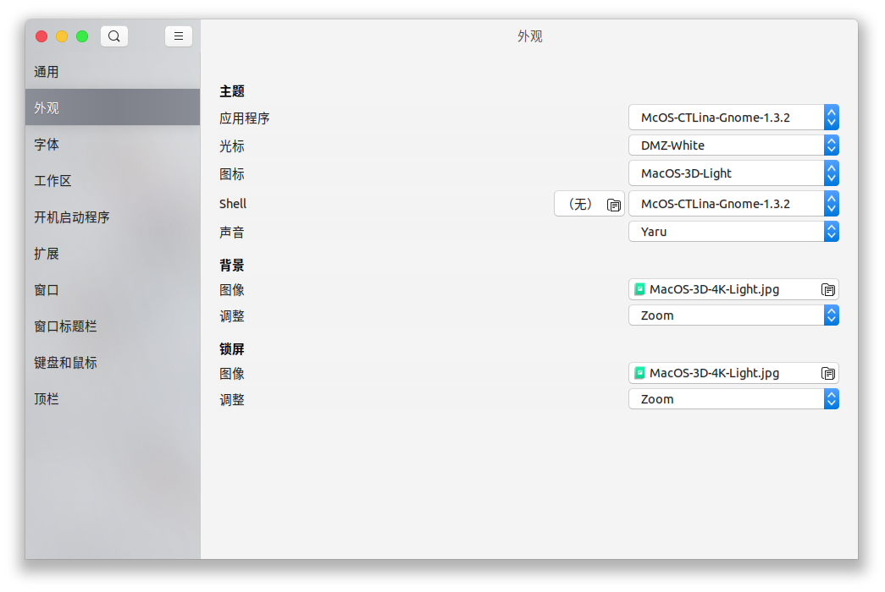

# Ubuntu Mac 化
- [Ubuntu Mac 化](#ubuntu-mac-化)
- [TweakTool](#tweaktool)
  - [安装 TweakTool](#安装-tweaktool)
  - [修改窗口的按钮位置](#修改窗口的按钮位置)
  - [修改Shell](#修改shell)
- [安装主题](#安装主题)
  - [MacOS 主题](#macos-主题)
    - [Big Sur](#big-sur)
    - [Catalina](#catalina)
  - [修改主题样式](#修改主题样式)
- [Dash to Dock](#dash-to-dock)
- [最终效果](#最终效果)


# TweakTool
## 安装 TweakTool
要安装主题，首先要先安装相应的工具 `TweakTool`
```bash
sudo apt update
sudo apt install -y gnome-tweak-tool
```


## 修改窗口的按钮位置

`Window Titlebars` -> `Titlebar Buttons` -> `Placement` -> `Left`


## 修改Shell 

`Appearance` -> `Themes` -> `Shell` 有感叹号无法操作


```bash
sudo apt install -y gnome-shell-extensions
```

在`扩展`中打开`User themes`的选项之后，就可以看到感叹号消失了，这时候就可以修改`Shell`了


> 如果扩展中没有`User themes`选项，则可能需要`reboot`重启设备


# 安装主题
## MacOS 主题
### Big Sur
- [MacOS-3D-Originals-Gtk](https://www.opendesktop.org/p/1410476/)
- [MacOS-3D-Originals-Icons](https://www.opendesktop.org/p/1412504/)
- [macOS Big Sur:Cursors](https://www.opendesktop.org/p/1408466/)
- [MacOS-3D-Originals-Shell](https://www.opendesktop.org/p/1410510/)
- [Cupertino iCons CollectionOriginal](https://www.opendesktop.org/s/Gnome/p/1102582/)
> BigSur主题已经打包到[Release](https://github.com/HenryZhuHR/someTutorials/releases/download/0.0/MacOS-BigSur.tar.gz)中，可以直接下载使用

### Catalina
- [McHigh Sierra](https://www.opendesktop.org/s/Gnome/p/1013714/)
- [McOS-themes](https://www.opendesktop.org/s/Gnome/p/1241688)

## 修改主题样式
上述下载的文件夹复制到对应的系统文件夹
- 主题(themes): `/usr/share/themes`
- 图标(icons): `/usr/share/icons`
- 终端(shell): `/usr/share/themes`
- 背景(background): `/usr/share/backgrounds`

之后就可以修改对应的主题


# Dash to Dock
**Dash to Dock**可以把程序坞变成 MacOS 的样子
```bash
sudo apt install -y chrome-gnome-shell
```

下载 [dash to dock](https://extensions.gnome.org/extension/307/dash-to-dock/)，并且打开右上角的按钮


之后在`优化(TWeak)`中启动`dash to dock`


点击齿轮按钮，可以修改dock


# 最终效果


> **去掉默认密钥环的密码**
> 
> 打开应用程序－>附件－>密码和加密密钥（如果你的没有，在终端中输入 seahorse），切换到密码选项卡，会看到一个密码密钥环（我的密钥环是 login），
右击－>更改密码，然后在“旧密码”中填入系统登录密码，其他不用填，直接确定，并选择“使用不安全的存储器”，这样就可以去掉默认密钥环的密码了。