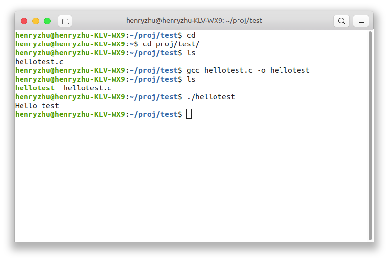
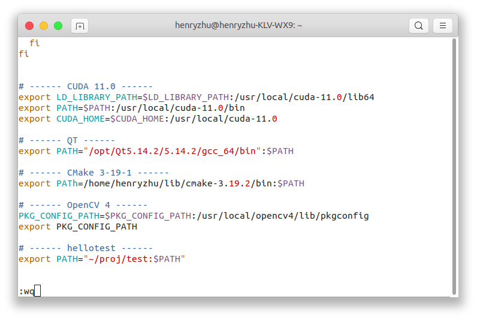
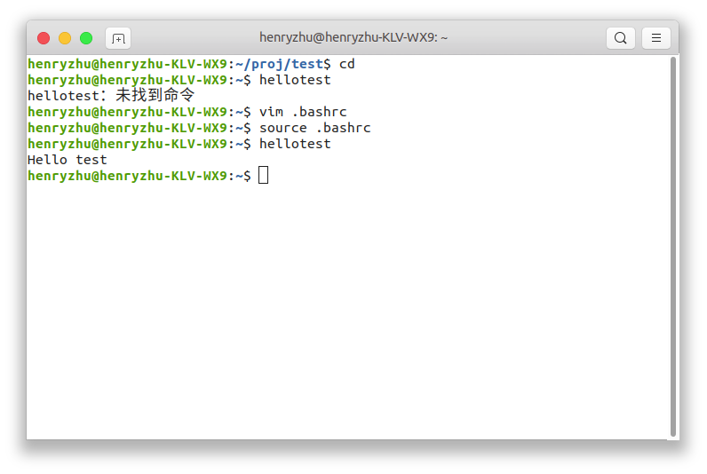

# 目录
- [目录](#目录)
- [常用命令](#常用命令)
  - [文件管理](#文件管理)
    - [ls-显示目录下的内容及属性](#ls-显示目录下的内容及属性)
    - [文件属性](#文件属性)
- [环境变量](#环境变量)
- [软链接](#软链接)
- [安装常用的软件](#安装常用的软件)
- [文件系统](#文件系统)

# 常用命令
可以查询 [Linux命令大全(手册)](https://www.linuxcool.com/)
## 文件管理
### ls-显示目录下的内容及属性
语法格式: 
```bash
ls [options] [dirx]
[options]:
-a 显示所有文件及目录 (. 开头的隐藏文件也会列出)
-l 除文件名称外，亦将文件型态、权限、拥有者、文件大小等资讯详细列出
-r 将文件以相反次序显示(原定依英文字母次序)
-t 将文件依建立时间之先后次序列出
-A 同 -a ，但不列出 "." (目前目录) 及 ".." (父目录)
-F 在列出的文件名称后加一符号；例如可执行档则加 "*", 目录则加 "/"
-R 若目录下有文件，则以下之文件亦皆依序列出
```

```bash
$ ls /usr/local/opencv4/
bin  include  lib  share
```

```bash
$ ls /usr/local/opencv4/ -l
drwxr-xr-x 2 root root  4096 1月   3 17:11 bin
drwxr-xr-x 3 root root  4096 1月   3 17:11 include
drwxr-xr-x 6 root root 12288 1月   3 17:11 lib
drwxr-xr-x 4 root root  4096 1月   3 17:11 share

$ ll /usr/local/opencv4/
总用量 32
drwxr-xr-x  6 root root  4096 1月   3 17:11 ./
drwxr-xr-x 12 root root  4096 1月   5 20:13 ../
drwxr-xr-x  2 root root  4096 1月   3 17:11 bin/
drwxr-xr-x  3 root root  4096 1月   3 17:11 include/
drwxr-xr-x  6 root root 12288 1月   3 17:11 lib/
drwxr-xr-x  4 root root  4096 1月   3 17:11 share/
```

### 文件属性
```bash
$ ls /usr/local/opencv4/ -l
drwxr-xr-x 2 root root  4096 1月   3 17:11 bin
```
`drwxr-xr-x`
|    d     |   rwx    |   r-x    |     r-x      |
| :------: | :------: | :------: | :----------: |
| 文件类型 | 属主权限 | 属组权限 | 其他用户权限 |
- 文件类型
  - 当为 `d` 则是目录
  - 当为 `-` 则是文件；
  - 若是 `l` 则表示为链接文档(link file)；
  - 若是 `b` 则表示为装置文件里面的可供储存的接口设备(可随机存取装置)；
  - 若是 `c` 则表示为装置文件里面的串行端口设备，例如键盘、鼠标(一次性读取装置)。
- 属主权限： **文件的所有者** 拥有该文件的权限
- 属组权限： **所有者的同组用户** 拥有该文件的权限
- 其他用户权限

权限每三个一组 `rwx` ，`r` 可读(read)、 `w` 可写(write)、 `x` 可执行(execute)。位置是固定的，`-` 则表示没有权限，


|     2      |  root  | root  | 4096  | 1月 3 17:11  |  bin   |
| :--------: | :----: | :---: | :---: | :----------: | :----: |
| 硬链接数目 | 用户名 | 组名  | 大小  | 最后修改时间 | 文件名 |


# 环境变量
- 修改用户目录下的 `.bashrc` 文件
- 修改 `/etc/profile` 文件

```bash
export PATH="{path_to_bin}:$PATH"
```

例如，我们现在希望将一个自己编译的程序添加到环境变量中，便于启动

在 `~/proj/test` 目录下编写文件 `hellotest.c`，并且编译 `gcc hellotest.c -o hellotest`，运行 `./hellotest` 输出 `Hello test`


我们现在希望可以在其他目录下也可以启动该程序，这时候会找不到该命令，因为在环境变量中没有找到该命令


编辑用户目录下环境变量配置文件 `~/.bashrc` （或者系统级的环境变量配置文件 `/etc/profile`，该操作对全部用户生效）
```bash
vi ~/.bashrc
```
在文件末尾添加如下内容
```bash
export PATH="~/proj/test:$PATH"
```


激活该配置文件作为系统的环境变量
```bash
source ~/.bashrc
```
之后就可以直接运行我们编译好的可执行文件 `hellotest` 



# 软链接
```bash
sudo rm /usr/bin/python
sudo ln -s /usr/bin/python3 /usr/bin/python
ls -l /usr/bin | grep python
```

# 安装常用的软件
```bash
sudo apt install -y htop
sudo apt install -y vim gedit
sudo apt install -y git
sudo apt install -y gcc g++ cmake


# ------ Python -------------------------------
sudo apt install -y python3
sudo apt install -y python3-pip
pip3 install numpy
# ---------------------------------------------


# ------ SouGouPinYin -------------------------
# https://www.jb51.net/article/186808.htm
sudo apt install -y fcitx-bin
sudo apt install -y fcitx-table
# sudo dpkg -i sogoupinyin_2.3.1.0112_amd64.deb
# sudo apt install -f
# -- settings–>Region&language–>Manage Installed Languages
# -- 更改输入框架为fcitx，然后点击上面的Apply System-Wide应用到全局
# ---------------------------------------------

# https://mirrors.tuna.tsinghua.edu.cn/qt/archive/qt/5.14/5.14.2/qt-opensource-linux-x64-5.14.2.run
# https://wdl1.cache.wps.cn/wps/download/ep/Linux2019/9719/wps-office_11.1.0.9719_amd64.deb
sudo apt autoremove
```


[Desktop Entry]
Type=Application
Version=5.14.2
Name=QtCreator
Comment=QtCreator #鼠标放上去时的文字提示
Icon=/opt/Qt5.14.2/Tools/QtCreator/share/doc/qtcreator/qtcreator-dev/images/logo.png #要显示的图标绝对路径
Exec=/opt/Qt5.14.2/Tools/QtCreator/bin/qtcreator #启动程序
Terminal=false
Categories=Development;IDE;C++; #应用程序在菜单项中的分类，在我的系统中在 应用程序-》系统工具下


# 文件系统

/bin: bin是Binary的缩写。存放系统中最常用的可执行文件（二进制）。

/boot: 这里存放的是linux内核和系统启动文件，包括Grub、lilo启动器程序。

/dev: dev是Device(设备)的缩写。该目录存放的是Linux的外部设备，如硬盘、分区、键盘、鼠标、usb等。

/etc: 这个目录用来存放所有的系统管理所需要的配置文件和子目录，如passwd、hostname等。

/home: 用户的主目录，在Linux中，每个用户都有一个自己的目录，一般该目录名是以用户的账号命名的。

/lib: 存放共享的库文件，包含许多被/bin和/sbin中程序使用的库文件。

/lost+found: 这个目录一般情况下是空的，当系统非法关机后，这里就存放了一些零散文件。

/media: ubuntu系统自动挂载的光驱、usb设备，存放临时读入的文件。

/mnt: 作为被挂载的文件系统得挂载点。

/opt: 作为可选文件和程序的存放目录，主要被第三方开发者用来简易安装和卸载他们的软件。

/proc: 这个目录是一个虚拟的目录，它是系统内存的映射，我们可以通过直接访问这个目录来获取系统信息。这里存放所有标志为文件的进程，比较cpuinfo存放cpu当前工作状态的数据。

/root: 该目录为系统管理员，也称作超级权限者的用户主目录。

/sbin: s就是Super User的意思，这里存放的是系统管理员使用的系统管理程序，如系统管理、目录查询等关键命令文件。

/ srv: 存放系统所提供的服务数据。

/sys: 系统设备和文件层次结构，并向用户程序提供详细的内核数据信息。

/tmp: 这个目录是用来存放一些临时文件的，所有用户对此目录都有读写权限。


/usr: 存放与系统用户有关的文件和目录。