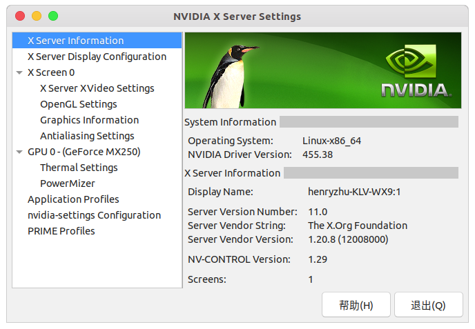

# Nvidia 驱动安装
检查自己的电脑是否有 Nvidia 的独立显卡，可以在 `NVIDA X Server Settings` 中看到自己的显卡信息
```bash
nvidia-settings
```




以及英伟达系统管理接口（NVIDIA System Management Interface, 简称 nvidia-smi）。这是是基于NVIDIA Management Library (NVML) 的命令行管理组件,旨在(intened to )帮助管理和监控NVIDIA GPU设备。  
在训练的时候可以看到信息
```bash
$ nvidia-smi 
Sun Dec 27 16:07:04 2020       
+-----------------------------------------------------------------------------+
| NVIDIA-SMI 455.38       Driver Version: 455.38       CUDA Version: 11.1     |
|-------------------------------+----------------------+----------------------+
| GPU  Name        Persistence-M| Bus-Id        Disp.A | Volatile Uncorr. ECC |
| Fan  Temp  Perf  Pwr:Usage/Cap|         Memory-Usage | GPU-Util  Compute M. |
|                               |                      |               MIG M. |
|===============================+======================+======================|
|   0  GeForce MX250       Off  | 00000000:01:00.0 Off |                  N/A |
| N/A   55C    P0    N/A /  N/A |    644MiB /  2002MiB |      0%      Default |
|                               |                      |                  N/A |
+-------------------------------+----------------------+----------------------+
                                                                               
+-----------------------------------------------------------------------------+
| Processes:                                                                  |
|  GPU   GI   CI        PID   Type   Process name                  GPU Memory |
|        ID   ID                                                   Usage      |
|=============================================================================|
|    0   N/A  N/A       917      G   /usr/lib/xorg/Xorg                 61MiB |
|    0   N/A  N/A      1484      G   /usr/lib/xorg/Xorg                150MiB |
|    0   N/A  N/A      1660      G   /usr/bin/gnome-shell              257MiB |
|    0   N/A  N/A      2072      G   ...gAAAAAAAAA --shared-files       42MiB |
|    0   N/A  N/A   1971566      G   ...AAAAAAAAA= --shared-files      111MiB |
+-----------------------------------------------------------------------------+
```
我们可以看到我们显卡的型号 `GeForce MX250`，显存大小及使用情况 `644MiB /  2002MiB`，驱动版本及CUDA版本

查看 GPU 和推荐的驱动版本
```bash
ubuntu-drivers devices
```

然后进行自动安装
```bash
sudo ubuntu-drivers autoinstall
```

# CUDA 安装
对 gcc 和 g++ 降级
```bash
sudo apt install -y gcc-8
sudo mv /usr/bin/gcc /usr/bin/gcc.bak
sudo rm /usr/bin/gcc
sudo ln -s /usr/bin/gcc-8 /usr/bin/gcc
ls -l /usr/bin/gcc*

sudo apt install -y g++-8
sudo mv /usr/bin/g++ /usr/bin/g++.bak
sudo rm /usr/bin/g++
sudo ln -s /usr/bin/g++-8 /usr/bin/g++
ls -l /usr/bin/g++*
```


安装`CUDA10.1`，配置用户环境变量
```bash
vim ~/.bashrc
```
添加以下内容
```bash
# ------ CUDA 10.1 ------
export LD_LIBRARY_PATH=$LD_LIBRARY_PATH:/usr/local/cuda-10.1/lib64
export PATH=$PATH:/usr/local/cuda-10.1/bin
export CUDA_HOME=$CUDA_HOME:/usr/local/cuda-10.1
```
执行命令使其生效
```bash
source ~/.bashrc
```
验证是否安装成功
```bash
$ nvcc -V
nvcc: NVIDIA (R) Cuda compiler driver
Copyright (c) 2005-2019 NVIDIA Corporation
Built on Sun_Jul_28_19:07:16_PDT_2019
Cuda compilation tools, release 10.1, V10.1.243
```


# cuDNN安装
下载 [cuDNN](https://developer.nvidia.com/zh-cn/cudnn)（需要登录）

选择好自己需要的版本
- tensorflow 有版本要求，可以查看 Tensorflow 的 [GPU 支持](https://tensorflow.google.cn/install/gpu?hl=zh-cn#linux_setup) 和 [GPU 版本对应](https://tensorflow.google.cn/install/source?hl=zh-cn#gpu)
  
- CUDA 10.1 和 cuDNN 7.6


下载解压之后
```bash
tree
.
└── cuda
    ├── include
    │   └── cudnn.h
    ├── lib64
    │   ├── libcudnn.so -> libcudnn.so.7
    │   ├── libcudnn.so.7 -> libcudnn.so.7.6.5
    │   ├── libcudnn.so.7.6.5
    │   └── libcudnn_static.a
    └── NVIDIA_SLA_cuDNN_Support.txt

3 directories, 6 files
```

将解压目录中的 `cuda/include/cudnn.h` 文件复制到 `/usr/local/cuda-10.1/include` 文件夹， `cuda/lib64/` 下所有文件复制到 `/usr/local/cuda-10.1/lib64` 文件夹中
```bash
sudo cp cuda/include/cudnn.h /usr/local/cuda-10.1/include
sudo cp cuda/lib64/* /usr/local/cuda-10.1/lib64
```

并添加读取权限
```bash
sudo chmod a+r /usr/local/cuda-10.1/include/cudnn.h
sudo chmod a+r /usr/local/cuda-10.1/lib64/libcudnn*
```


# 查看其他内容目录
- [顶层 README.md](../../../README.md)
- [Linux README.md](../../linux-README.md)

# 参考
- [Linux安装NVIDIA显卡驱动](https://blog.csdn.net/wf19930209/article/details/81877822)
- [Linux安装CUDA GCC版本不兼容](https://blog.csdn.net/HaoZiHuang/article/details/109544443)