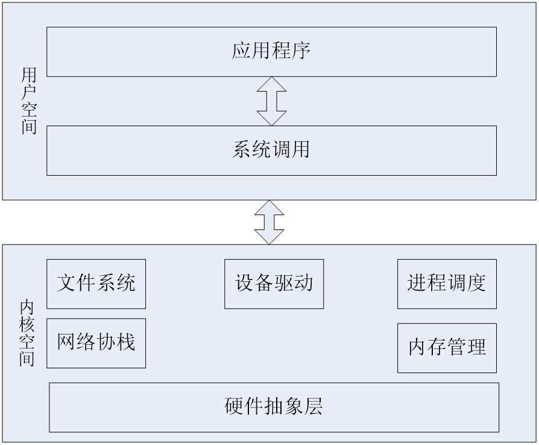
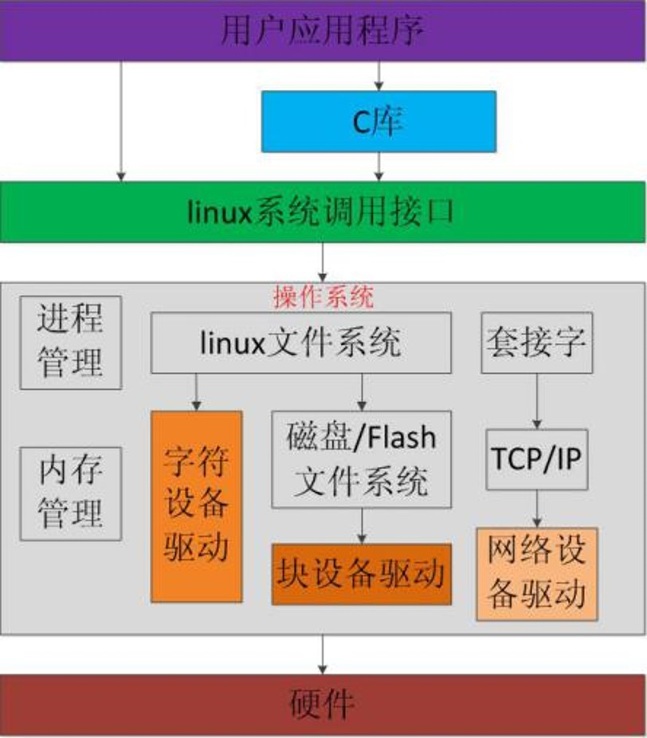

# 目录
- [目录](#目录)
- [设备驱动程序](#设备驱动程序)
  - [Linux操作系统与驱动的关系](#linux操作系统与驱动的关系)
  - [用户态和内核态](#用户态和内核态)
  - [应用程序开发与驱动程序开发的差异](#应用程序开发与驱动程序开发的差异)
  - [GUN C开发驱动程序](#gun-c开发驱动程序)
- [Linux设备分类](#linux设备分类)
  - [驱动程序的功能](#驱动程序的功能)
- [嵌入式Linux驱动基本原理](#嵌入式linux驱动基本原理)

# 设备驱动程序
设备驱动程序（Device Driver），简称驱动程序（Driver），是一个允许**计算机软件**（Computer Software）与**硬件**（Hardware）交互的程序，这种程序建立了一个硬件与硬件，或硬件与软件沟通的界面。

按照硬件设备的具体工作方式读写设备寄存器，完成设备的轮询、中断处理、DMA通信、最终实现设备的功能。

在有操作系统情况下，设备驱动是**硬件与操作系统内核之间的接口**，应按照相应的架构设计设备驱动，才能方便整合到相应的操作系统中。

## Linux操作系统与驱动的关系
**用户空间**包括**应用程序**和**系统调用**两层。
应用程序一般依赖于函数库，而函数库是由系统调用来编写的，所以应用程序间接地依赖于系统调用。

## 用户态和内核态
Linux操作系统分为用户态和内核态。
- **用户态**处理上层的软件工作。
- **内核态**用来管理用户态的程序，完成用户态请求的工作。

从操作系统安全可靠的角度考虑，用户态一般是不能直接操作硬件，读写I/O端口等，这样做不安全，而只有进入内核才能转换到内核态，然后在内核态直接操作硬件。

驱动程序与底层的硬件交互，所以工作在内核态。

## 应用程序开发与驱动程序开发的差异
在Linux上的程序开发一般分为两种：
- 内核及驱动程序开发
- 应用程序开发

这两种开发种类对应Linux的两种状态，分别是内核态和用户态。
- 内核态用来管理用户态的程序，完成用户态请求的工作；
- 用户态处理上层的软件工作。驱动程序与底层的硬件交互，所以工作在内核态。

## GUN C开发驱动程序
GUN C语言最开始起源于一个GUN计划，GUN的意思是“GUN is not UNIX”。GUN计划开始于1984年，这个计划的目的是开发一个类似UNIX并且软件自由的完整操作系统。

直到Linus开发Linux操作系统时，GNU计划已经开发出来了很多高质量的自由软件。其中就包括著名的GCC编译器，GCC编译器能够编译GUN C语言。

Linus考虑到GUN计划的自由和免费，所以选择了GCC编译器来编写内核代码，之后的很多开发者也使用这个编译器，所以直到现在，驱动开发人员也使用GUN C语言来开放驱动程序。

# Linux设备分类
Linux 系统设备分为三大基础类：块设备、字符设备和网络设备。 
- **块设备**：是指可以从设备的任意位置读取一定长度数据的设备，包括：硬盘、磁盘、U盘和SD卡等。 
- **字符型设备**：是指只能一个字节一个字节读写的设备，不能随机读取设备内存中的某一数据，读取数据需要按照先后数据。字符设备是面向流的设备，常见的有：鼠标、键盘、串口、控制台和LED设备等。
- **网络设备**：网络设备访问的 BSD socket接口，如网卡等。

除网络设备外，字符设备与块设备都被映射到Linux文件系统的文件和目录，通过系统调用接口open()、write()、read()等即可访问字符设备和块设备。

块设备比字符设备复杂，在上面首先建立一个磁盘/Flash文件系统，如FAT、EXT3等。

应用程序可以使用Linux系统调用接口编程，或使用C库函数调用，访问底层硬件。

C库函数fopen()、fwrite()、fread()、fclose()分别会调用操作系统的API  open()、write()、read()、close()。

## 驱动程序的功能
- 从应用程序方看，驱动程序应为应用程序提供访问硬件设备的编程接口，主要提供以下功能：
  - 应用程序通过驱动程序安全有效地访问硬件；
  - 驱动程序隐藏底层细节，从而提高应用软件的可移植性和可复用性；
  - 驱动程序文件节点可方便地提供访问权限控制。

- 从驱动开发人员看，驱动程序是直接操控硬件的软件，主要完成以下功能：
    - 初始化和释放设备；
    - 直接读写硬件寄存器来控制硬件；
    - 实现内核与硬件之间的数据交换；
    - 操作设备缓冲区；
    - 操作输入、输出设备，如键盘、打印机等；
    - 实现应用程序与设备之间的数据交换；
    - 检测和处理设备出现的错误。

# 嵌入式Linux驱动基本原理
Linux中的设备大多数是被当做**文件**（称为**设备文件**)来处理。

上层的应用程序需要操作硬件时，只需要获得设备的文件描述符，通过系统调用open()，read()，write()，ioctl()，close()等来操作设备，无需关心硬件细节。

