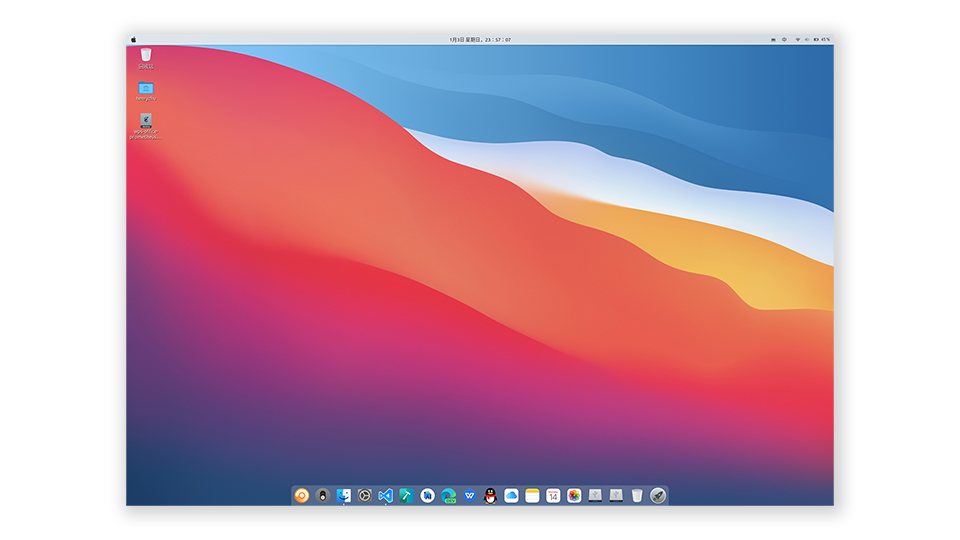
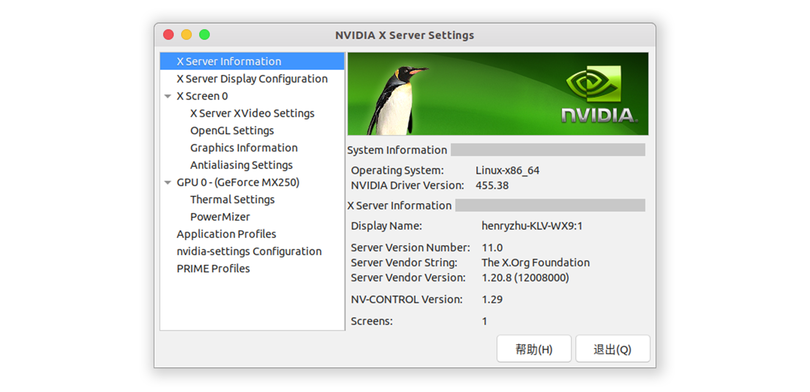

# 目录
- [目录](#目录)
- [Linux 基础](#linux-基础)
  - [环境变量](#环境变量)
  - [软链接](#软链接)
  - [安装常用的软件](#安装常用的软件)
- [系统安装](#系统安装)
  - [双系统方案](#双系统方案)
  - [WSL (Windows Subsystem for Linux)](#wsl-windows-subsystem-for-linux)
- [Ubuntu 软件安装](#ubuntu-软件安装)
  - [Ubuntu 更换软件源！！！](#ubuntu-更换软件源)
  - [Ubuntu 界面 MacOS 化](#ubuntu-界面-macos-化)
  - [Linux 下 Nvidia 安装](#linux-下-nvidia-安装)
  - [Linux 下 OpenCV 源码编译](#linux-下-opencv-源码编译)


# Linux 基础
[Linux 基础](docs/basic/basic.md)

## 环境变量
[环境变量](docs/basic/basic.md#环境变量)
## 软链接
[软链接](docs/basic/basic.md#软链接)
## 安装常用的软件
[安装常用的软件](docs/basic/basic.md#安装常用的软件)

# 系统安装
## 双系统方案
## WSL (Windows Subsystem for Linux)
WSL 是在 Windows 10 上安装适用于 Linux 的 Windows 子系统。可以基本取代虚拟机的方案。
- [如何安装 WSL](docs/install/wsl2/wsl2.md)
- [更新软件源](#ubuntu-更换软件源)


# Ubuntu 软件安装
## Ubuntu 更换软件源！！！
```bash
# 备份软件源配置文件 /etc/apt/sources.list
sudo cp /etc/apt/sources.list /etc/apt/sources.list.bak
# 编辑 /etc/apt/sources.list
sudo vim /etc/apt/sources.list
```

对于 **Ubuntu 20.04 LTS** 版本，将下列内容更换 `/etc/apt/sources.list` 里全部的内容，然后保存
```bash
# 默认注释了源码镜像以提高 apt update 速度，如有需要可自行取消注释
deb https://mirrors.tuna.tsinghua.edu.cn/ubuntu/ focal main restricted universe multiverse
# deb-src https://mirrors.tuna.tsinghua.edu.cn/ubuntu/ focal main restricted universe multiverse
deb https://mirrors.tuna.tsinghua.edu.cn/ubuntu/ focal-updates main restricted universe multiverse
# deb-src https://mirrors.tuna.tsinghua.edu.cn/ubuntu/ focal-updates main restricted universe multiverse
deb https://mirrors.tuna.tsinghua.edu.cn/ubuntu/ focal-backports main restricted universe multiverse
# deb-src https://mirrors.tuna.tsinghua.edu.cn/ubuntu/ focal-backports main restricted universe multiverse
deb https://mirrors.tuna.tsinghua.edu.cn/ubuntu/ focal-security main restricted universe multiverse
# deb-src https://mirrors.tuna.tsinghua.edu.cn/ubuntu/ focal-security main restricted universe multiverse

# 预发布软件源，不建议启用
# deb https://mirrors.tuna.tsinghua.edu.cn/ubuntu/ focal-proposed main restricted universe multiverse
# deb-src https://mirrors.tuna.tsinghua.edu.cn/ubuntu/ focal-proposed main restricted universe multiverse
```

其他发行版本的 Ubuntu 可以在[清华大学开源软件镜像站 Ubuntu 镜像使用帮助](https://mirror.tuna.tsinghua.edu.cn/help/ubuntu/) 查到对应的**软件源配置文件内容**

完成后，保存文件。然后更新软件源
```bash
sudo apt update
```
更新软件
```bash
sudo apt upgrade -y
```

## Ubuntu 界面 MacOS 化
[Ubuntu 界面 MacOS 化](docs/install/desktop-MacOS/desktop-MacOS.md)




## Linux 下 Nvidia 安装
[Linux 下 Nvidia 安装](docs/install/nvidia/nvidia.md)



## Linux 下 OpenCV 源码编译
[Linux 下 OpenCV 源码编译](docs/install/opencv/opencv.md)

如果需要 OpenCV 和 CUDA 联合编译，那需要先安装 CUDA ，参考 [Linux 下 Nvidia 安装](#linux-下-nvidia-安装)

