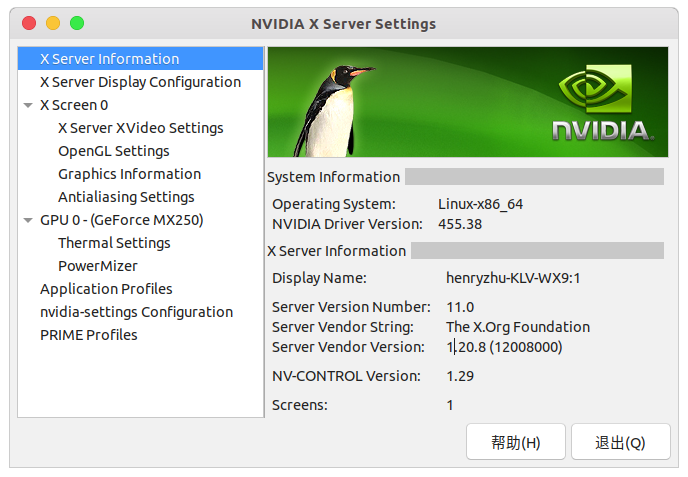
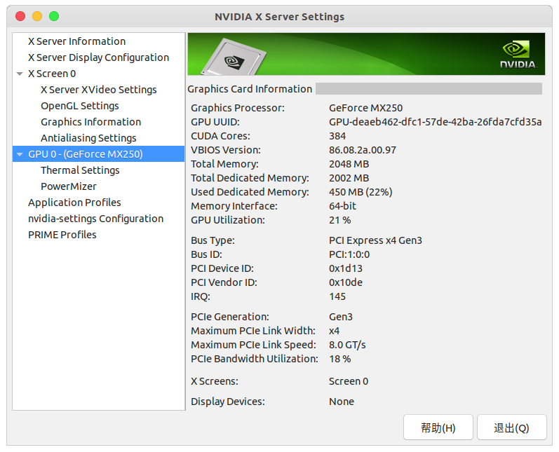
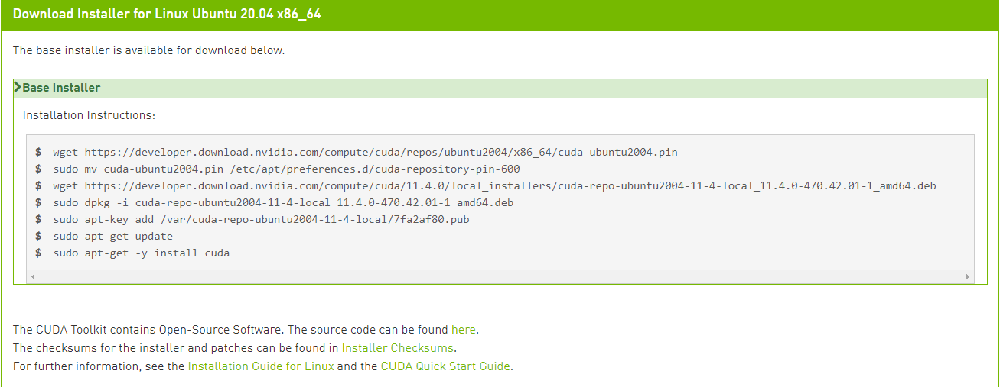
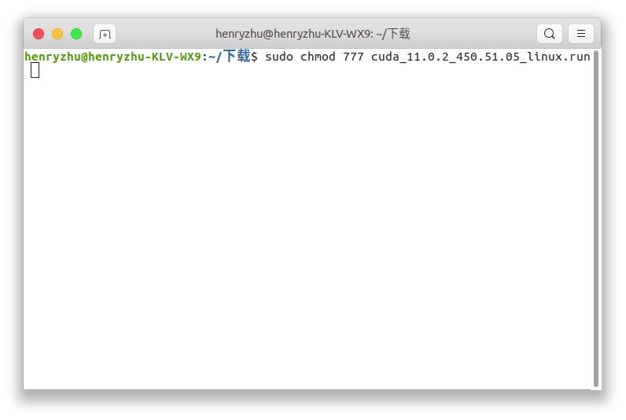
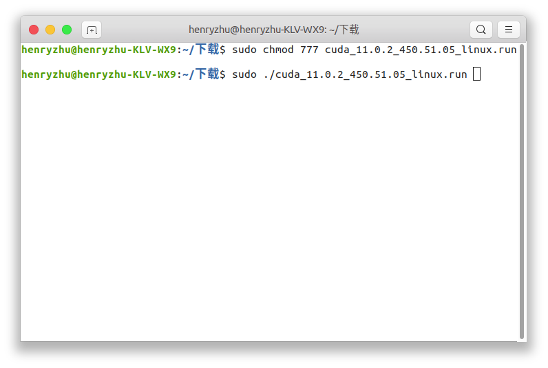
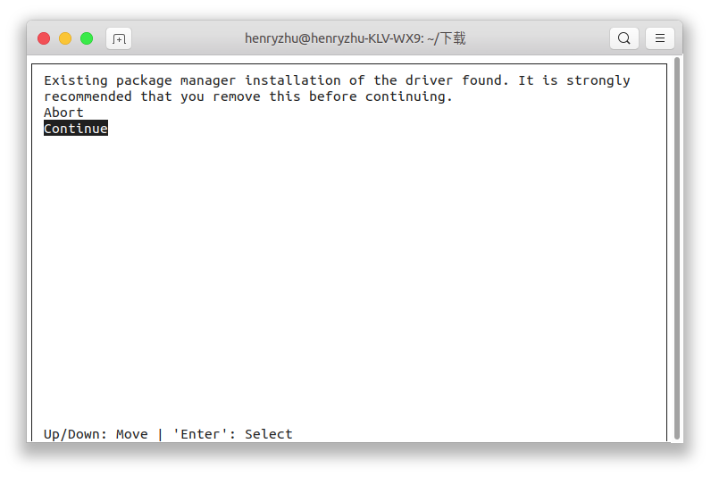
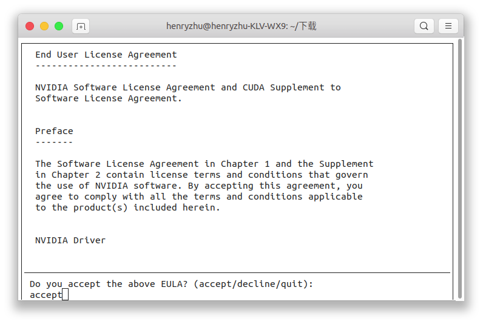
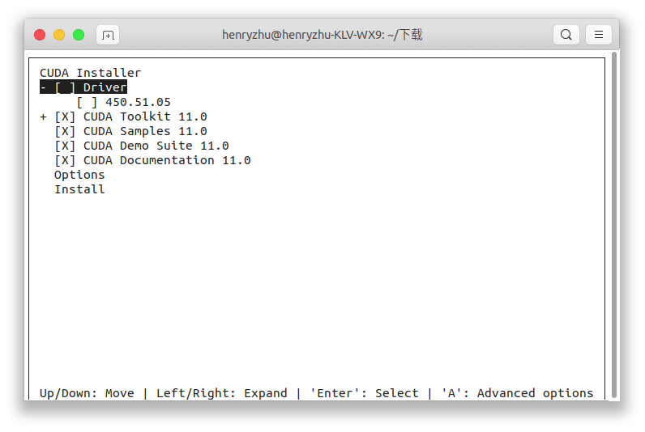
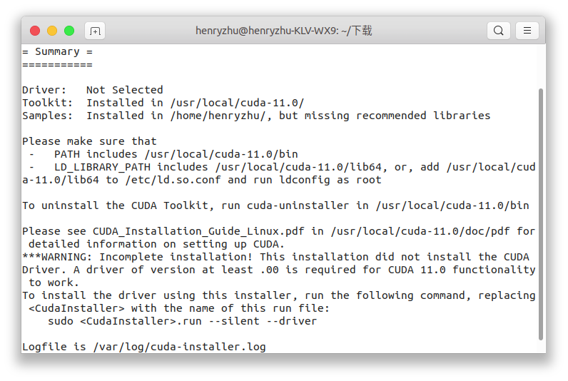

# 目录
> 最后更新于 2021.7.19
- [目录](#目录)
- [Nvidia 驱动安装](#nvidia-驱动安装)
- [CUDA 安装](#cuda-安装)
  - [deb(local)安装方式](#deblocal安装方式)
  - [deb(network)安装方式](#debnetwork安装方式)
  - [runfile(local)安装方式](#runfilelocal安装方式)
  - [配置 CUDA 环境变量](#配置-cuda-环境变量)
  - [卸载 CUDA](#卸载-cuda)
- [cuDNN安装](#cudnn安装)


# Nvidia 驱动安装
检查自己的电脑是否有 Nvidia 的独立显卡，可以在 `NVIDA X Server Settings` 中看到自己的显卡信息
```bash
nvidia-settings
```





以及英伟达系统管理接口（NVIDIA System Management Interface, 简称 nvidia-smi）。这是是基于NVIDIA Management Library (NVML) 的命令行管理组件,旨在(intened to )帮助管理和监控NVIDIA GPU设备。  
可以查看GPU使用情况，`-l`可以实时刷新
```bash
$ nvidia-smi 
Tue Jan  5 20:42:59 2021       
+-----------------------------------------------------------------------------+
| NVIDIA-SMI 455.38       Driver Version: 455.38       CUDA Version: 11.1     |
|-------------------------------+----------------------+----------------------+
| GPU  Name        Persistence-M| Bus-Id        Disp.A | Volatile Uncorr. ECC |
| Fan  Temp  Perf  Pwr:Usage/Cap|         Memory-Usage | GPU-Util  Compute M. |
|                               |                      |               MIG M. |
|===============================+======================+======================|
|   0  GeForce MX250       Off  | 00000000:01:00.0 Off |                  N/A |
| N/A   50C    P3    N/A /  N/A |    447MiB /  2002MiB |      3%      Default |
|                               |                      |                  N/A |
+-------------------------------+----------------------+----------------------+
                                                                               
+-----------------------------------------------------------------------------+
| Processes:                                                                  |
|  GPU   GI   CI        PID   Type   Process name                  GPU Memory |
|        ID   ID                                                   Usage      |
|=============================================================================|
|    0   N/A  N/A      1109      G   /usr/lib/xorg/Xorg                 61MiB |
|    0   N/A  N/A      1656      G   /usr/lib/xorg/Xorg                190MiB |
|    0   N/A  N/A      1830      G   /usr/bin/gnome-shell               55MiB |
|    0   N/A  N/A      3382      G   ...AAAAAAAAA= --shared-files      101MiB |
|    0   N/A  N/A      3734      G   ...gAAAAAAAAA --shared-files       28MiB |
+-----------------------------------------------------------------------------+
```
我们可以看到我们显卡的型号 `GeForce MX250`，显存大小及使用情况 `447MiB /  2002MiB`，驱动版本 `Driver Version: 455.38` 及 CUDA 版本 `CUDA Version: 11.1 `

查看 GPU 和推荐的驱动版本
```bash
ubuntu-drivers devices
```

然后进行自动安装
```bash
sudo ubuntu-drivers autoinstall
```

# CUDA 安装
到[NVIDIA官网](https://developer.nvidia.com/)下载[CUDA toolkit](https://developer.nvidia.com/cuda-toolkit-archive)，如果有需要可以参考阅读[cuda toolkit release notes](https://docs.nvidia.com/cuda/cuda-toolkit-release-notes/index.html)

Ubuntu下有三种安装方式
- [x] [deb(local)安装方式](#deblocal安装方式)
- [x] [deb(network)安装方式](#debnetwork安装方式)
- [x] [runfile(local)安装方式](#runfilelocal安装方式)
> 如果需要安装TensorRT，貌似必须使用[`deb(local)`](#deblocal安装方式)方式安装，这种安装方式非常简单，只需要按照命令即可，并且**强烈推荐这种安装方式**


## deb(local)安装方式
选择好需要安装的[CUDA toolkit](https://developer.nvidia.com/cuda-toolkit-archive)版本，再选择好对应系统、架构、发行版本及其版本、安装方式，安装对应命令即可



例如，`x86_64`架构下的`Ubuntu 20.04`通过`deb(local)`的方式安装`CUDA 11.4`的命令如下
```bash
wget https://developer.download.nvidia.com/compute/cuda/repos/ubuntu2004/x86_64/cuda-ubuntu2004.pin
sudo mv cuda-ubuntu2004.pin /etc/apt/preferences.d/cuda-repository-pin-600
wget https://developer.download.nvidia.com/compute/cuda/11.4.0/local_installers/cuda-repo-ubuntu2004-11-4-local_11.4.0-470.42.01-1_amd64.deb
sudo dpkg -i cuda-repo-ubuntu2004-11-4-local_11.4.0-470.42.01-1_amd64.deb
sudo apt-key add /var/cuda-repo-ubuntu2004-11-4-local/7fa2af80.pub
sudo apt-get update
sudo apt-get -y install cuda
```
## deb(network)安装方式
选择好需要安装的[CUDA toolkit](https://developer.nvidia.com/cuda-toolkit-archive)版本，再选择好对应系统、架构、发行版本及其版本、安装方式，安装对应命令即可

例如，`x86_64`架构下的`Ubuntu 20.04`通过`deb(network)`的方式安装`CUDA 11.4`的命令如下
```bash
wget https://developer.download.nvidia.com/compute/cuda/repos/ubuntu2004/x86_64/cuda-ubuntu2004.pin
sudo mv cuda-ubuntu2004.pin /etc/apt/preferences.d/cuda-repository-pin-600
sudo apt-key adv --fetch-keys https://developer.download.nvidia.com/compute/cuda/repos/ubuntu2004/x86_64/7fa2af80.pub
sudo add-apt-repository "deb https://developer.download.nvidia.com/compute/cuda/repos/ubuntu2004/x86_64/ /"
sudo apt-get update
sudo apt-get -y install cuda
```

## runfile(local)安装方式
选择好需要安装的[CUDA toolkit](https://developer.nvidia.com/cuda-toolkit-archive)版本，再选择好对应系统、架构、发行版本及其版本、安装方式，安装对应命令即可
例如，`x86_64`架构下的`Ubuntu 20.04`通过`runfile(network)`的方式安装`CUDA 11.4`的命令如下
```bash
wget https://developer.download.nvidia.com/compute/cuda/11.4.0/local_installers/cuda_11.4.0_470.42.01_linux.run
sudo sh cuda_11.4.0_470.42.01_linux.run
```
> 下面的配图是安装CUDA 11.0的版本
修改执行权限
```bash
sudo chmod 777 cuda_<cuda_version>_<driver_version>_linux.run
```


执行安装程序
```bash
sudo ./cuda_<cuda_version>_<driver_version>_linux.run
```



选择 `Continue` 



输入 `accept` 确认安装



这里不要勾选 `Drive` ，因为这里安装的驱动可能低于系统自带的驱动，根据 [驱动安装](#nvidia-驱动安装)



安装结束后，出现安装概要



```bash
===========
= Summary =
===========

Driver:   Not Selected
Toolkit:  Installed in /usr/local/cuda-11.0/
Samples:  Installed in /home/henryzhu/, but missing recommended libraries

Please make sure that
 -   PATH includes /usr/local/cuda-11.0/bin
 -   LD_LIBRARY_PATH includes /usr/local/cuda-11.0/lib64, or, add /usr/local/cuda-11.0/lib64 to /etc/ld.so.conf and run ldconfig as root

To uninstall the CUDA Toolkit, run cuda-uninstaller in /usr/local/cuda-11.0/bin

Please see CUDA_Installation_Guide_Linux.pdf in /usr/local/cuda-11.0/doc/pdf for detailed information on setting up CUDA.
***WARNING: Incomplete installation! This installation did not install the CUDA Driver. A driver of version at least .00 is required for CUDA 11.0 functionality to work.
To install the driver using this installer, run the following command, replacing <CudaInstaller> with the name of this run file:
    sudo <CudaInstaller>.run --silent --driver

Logfile is /var/log/cuda-installer.log
```
> 这里的安装版本是CUDA 11.0，请根据自己的CUDA版本进行处理


## 配置 CUDA 环境变量
CUDA环境要求我们
```bash
Please make sure that
 -   PATH includes /usr/local/cuda-11.0/bin
 -   LD_LIBRARY_PATH includes /usr/local/cuda-11.0/lib64, or, add /usr/local/cuda-11.0/lib64 to /etc/ld.so.conf and run ldconfig as root
```

编辑环境变量文件
```bash
vim ~/.bashrc
```
添加以下内容
```bash
# ------ CUDA 11.0 ------
export LD_LIBRARY_PATH=$LD_LIBRARY_PATH:/usr/local/cuda-11.0/lib64
export PATH=$PATH:/usr/local/cuda-11.0/bin
export CUDA_HOME=$CUDA_HOME:/usr/local/cuda-11.0
```
> 这里以 CUDA 11.0 为例，请根据自己安装的CUDA版本进行对应修改`cuda-11.0` 修改为 `cuda-<version>`

执行命令使其生效
```bash
source ~/.bashrc
```
验证是否安装成功
```bash
$ nvcc -V
nvcc: NVIDIA (R) Cuda compiler driver
Copyright (c) 2005-2020 NVIDIA Corporation
Built on Thu_Jun_11_22:26:38_PDT_2020
Cuda compilation tools, release 11.0, V11.0.194
Build cuda_11.0_bu.TC445_37.28540450_0
```
## 卸载 CUDA
```bash
sudo /usr/local/cuda-11.0/bin/cuda-uninstaller
sudo rm -rf /usr/local/cuda-11.0
```

# cuDNN安装
下载 [cuDNN](https://developer.nvidia.com/zh-cn/cudnn)（需要注册NVIDIA账号并登录）


下载解压之后
```bash
$ tree
.
└── cuda
    ├── include
    │   ├── cudnn_adv_infer.h
    │   ├── cudnn_adv_train.h
    │   ├── cudnn_backend.h
    │   ├── cudnn_cnn_infer.h
    │   ├── cudnn_cnn_train.h
    │   ├── cudnn.h
    │   ├── cudnn_ops_infer.h
    │   ├── cudnn_ops_train.h
    │   └── cudnn_version.h
    ├── lib64
    │   ├── ...
    │   ├── libcudnn_ops_train.so.8.0.4
    │   ├── libcudnn.so -> libcudnn.so.8
    │   ├── libcudnn.so.8 -> libcudnn.so.8.0.4
    │   ├── libcudnn.so.8.0.4
    │   └── libcudnn_static.a
    └── NVIDIA_SLA_cuDNN_Support.txt

3 directories, 32 files
```

将解压目录中的 `cuda/include/cudnn.h` 文件复制到 `/usr/local/cuda-11.0/include` 文件夹， `cuda/lib64/` 下所有文件复制到 `/usr/local/cuda-11.0/lib64` 文件夹中
```bash
sudo cp cuda/include/* /usr/local/cuda-11.0/include
sudo cp cuda/lib64/* /usr/local/cuda-11.0/lib64
```

并添加读取权限
```bash
sudo chmod a+r /usr/local/cuda-11.0/include/cudnn*
sudo chmod a+r /usr/local/cuda-11.0/lib64/libcudnn*
```


<!-- # 参考
- [Linux安装NVIDIA显卡驱动](https://blog.csdn.net/wf19930209/article/details/81877822)
- [Linux安装CUDA GCC版本不兼容](https://blog.csdn.net/HaoZiHuang/article/details/109544443) -->