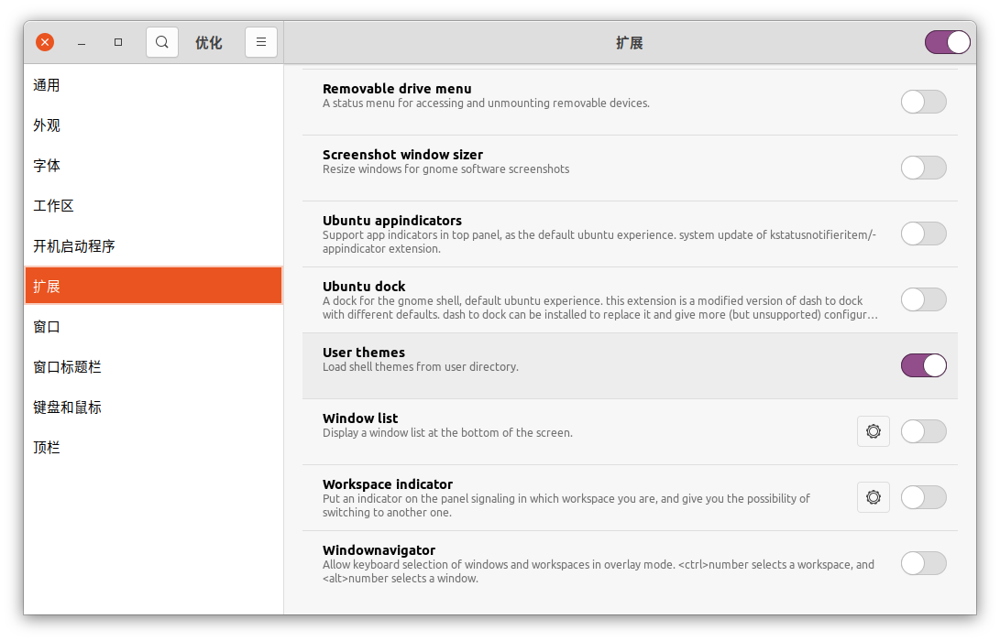
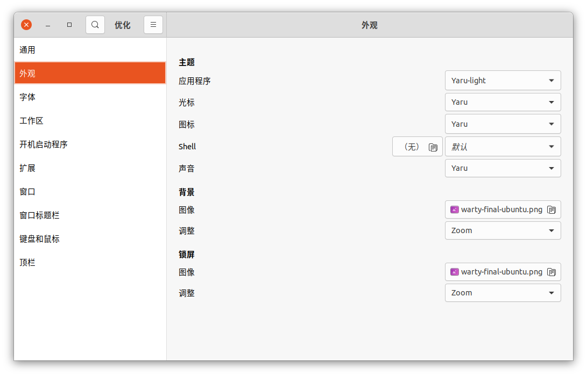
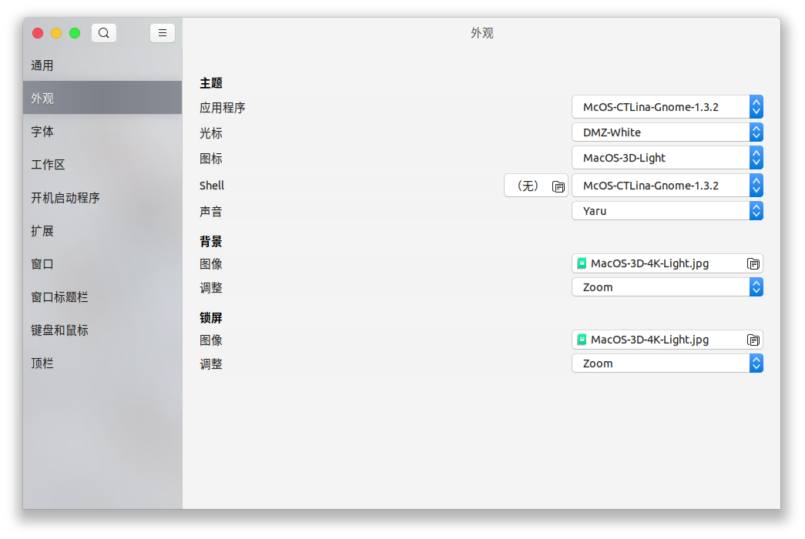
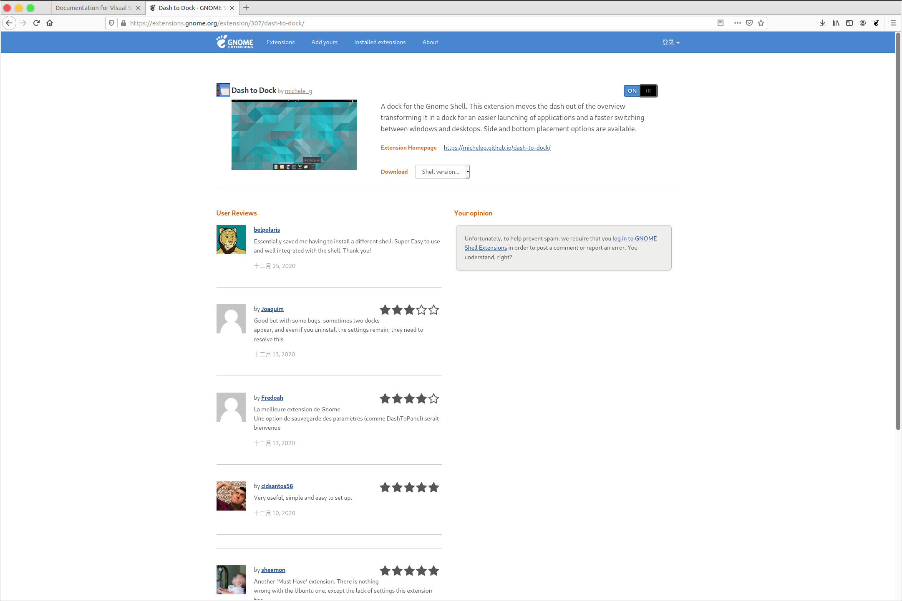

# Ubuntu Mac 化
- [Ubuntu Mac 化](#ubuntu-mac-化)
- [安装 TweakTool](#安装-tweaktool)
- [安装主题](#安装主题)
  - [MacOS 主题](#macos-主题)
    - [Big Sur](#big-sur)
    - [Catalina](#catalina)
  - [安装](#安装)
- [Dash to Dock](#dash-to-dock)


# 安装 TweakTool
要安装主题，首先要先安装相应的工具 `TweakTool`
```bash
sudo apt update
sudo apt install -y gnome-tweak-tool
```


- 修改窗口的按钮位置


感叹号无法操作

```bash
sudo apt install -y gnome-shell-extensions
```

在`扩展`中打开`User themes`的选项之后，就可以看到感叹号消失了，这时候就可以修改终端的命令了



> 如果扩展中没有`User themes`选项，则可能需要重启设备


# 安装主题
## MacOS 主题
### Big Sur
- [MacOS-3D-Originals-Gtk](https://www.opendesktop.org/p/1410476/)
- [MacOS-3D-Originals-Icons](https://www.opendesktop.org/p/1412504/)
- [macOS Big Sur:Cursors](https://www.opendesktop.org/p/1408466/)
- [MacOS-3D-Originals-Shell](https://www.opendesktop.org/p/1410510/)
- [Cupertino iCons CollectionOriginal](https://www.opendesktop.org/s/Gnome/p/1102582/)

### Catalina
- [McHigh Sierra](https://www.opendesktop.org/s/Gnome/p/1013714/)
- [McOS-themes](https://www.opendesktop.org/s/Gnome/p/1241688)

## 安装
上述下载的文件夹复制到对应的系统文件夹
- 主题(themes): `/usr/share/themes`
- 图标(icons): `/usr/share/icons`
- 终端(shell): `/usr/share/themes`
- 背景(background): `/usr/share/backgrounds`

之后就可以修改对应的主题


# Dash to Dock
**Dash to Dock**可以把程序坞变成 MacOS 的样子
```bash
sudo apt install -y chrome-gnome-shell
```

下载 [dash to dock](https://extensions.gnome.org/extension/307/dash-to-dock/)



之后在`优化(TWeak)`中启动`dash to dock`


点击齿轮按钮，可以修改dock