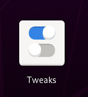
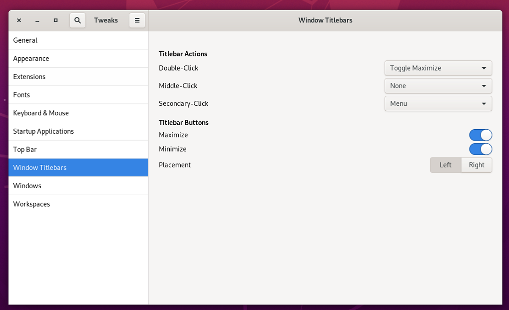
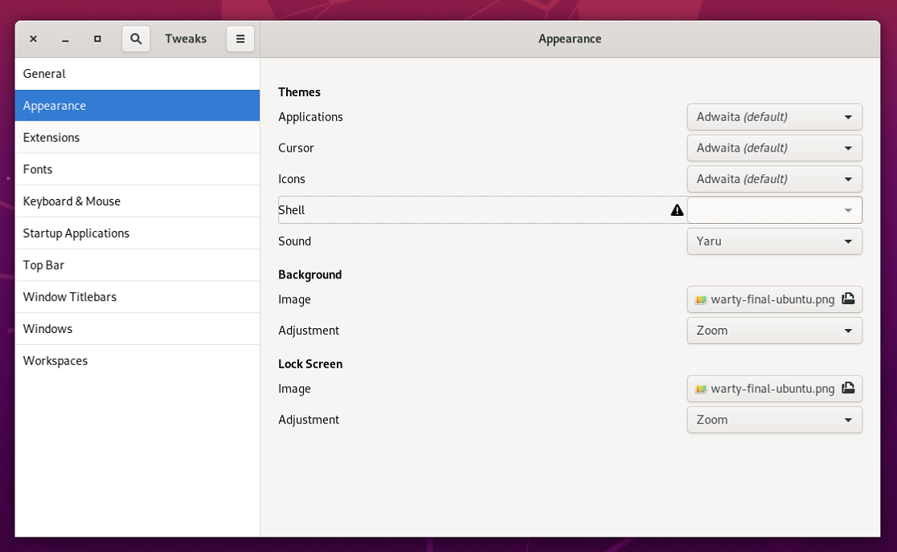

# Ubuntu Mac 化
- [Ubuntu Mac 化](#ubuntu-mac-化)
- [安装 TweakTool](#安装-tweaktool)
- [安装主题](#安装主题)
  - [安装GTK主题](#安装gtk主题)
    - [Big Sur](#big-sur)


# 安装 TweakTool
要安装主题，首先要先安装相应的工具 `TweakTool`
```bash
sudo apt update
sudo apt install -y gnome-tweak-tool
```


- 修改窗口的按钮位置




感叹号无法操作

```bash
sudo apt install -y gnome-shell-extensions
```


# 安装主题
## 安装GTK主题
### Big Sur
- [MacOS-3D-Originals-Gtk](https://www.opendesktop.org/p/1410476/)
- [MacOS-3D-Originals-Icons](https://www.opendesktop.org/p/1412504/)
- [macOS Big Sur:Cursors](https://www.opendesktop.org/p/1408466/)
- [MacOS-3D-Originals-Shell](https://www.opendesktop.org/p/1410510/)


- 这两个文件夹分别是两个主题，把这两个文件夹移动到/usr/share/themes下就可以了。
- 解压后把文件都放到/usr/share/icons目录
- shell （/usr/share/themes）


然后打开前面安装的工具Tweaks（中文下叫“优化”）,在“应用程序”英文是“Applications”这个选项下就可以选择刚刚安装的主题了。这几个截图是我安装主题后的截图。