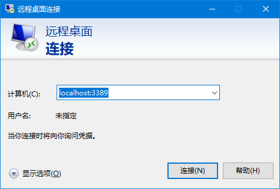

# 文档导航
- [文档导航](#文档导航)
- [安装 WSL2 和 Ubuntu 子系统](#安装-wsl2-和-ubuntu-子系统)
  - [步骤 1 - 启用适用于 Linux 的 Windows 子系统](#步骤-1---启用适用于-linux-的-windows-子系统)
- [Linux安装图形界面](#linux安装图形界面)
  - [安装 Gnome 桌面](#安装-gnome-桌面)
  - [安装 Xrdp](#安装-xrdp)
  - [每次启动前运行的命令](#每次启动前运行的命令)
  - [登录远程桌面](#登录远程桌面)
- [Ubuntu 准备工作](#ubuntu-准备工作)
- [SSH 远程连接](#ssh-远程连接)

# 安装 WSL2 和 Ubuntu 子系统
详细可以查看官方的[适用于 Linux 的 Windows 子系统文档](https://docs.microsoft.com/zh-cn/windows/wsl/)

## 步骤 1 - 启用适用于 Linux 的 Windows 子系统
- 用于 Linux 的 Windows 子系统    

以管理员身份打开 PowerShell 并运行：
```powershell
dism.exe /online /enable-feature /featurename:Microsoft-Windows-Subsystem-Linux /all /norestart
```
- 启用虚拟机功能    

以管理员身份打开 PowerShell 并运行：
```powershell
dism.exe /online /enable-feature /featurename:Microsoft-Windows-Subsystem-Linux /all /norestart
```

> 不熟悉powershell的也可以在Windows下需要打开 `控制面板-程序-启用或关闭 Windows 功能` 中的 `适用于 Linux 的 Windows 子系统`、`虚拟机平台`
> 

**重启计算机**

下载 [适用于 x64 计算机的 WSL2 Linux 内核更新包](https://wslstorestorage.blob.core.windows.net/wslblob/wsl_update_x64.msi)（新版本中好像不是必须的操作了）

到 `Microsoft Store` 中下载需要的Linux发行版本，这里选择[Ubuntu](https://www.microsoft.com/store/productId/9NBLGGH4MSV6)


打开 PowerShell，然后在安装新的 Linux 发行版时运行以下命令，将 WSL 2 设置为默认版本
```bash
wsl --set-default-version 2
```

检查分配给每个已安装的 Linux 分发版的 WSL 版本
```bash
wsl --list --verbose
```

启动 Ubuntu 之后进行短暂的安装

> 推荐[Windows Terminal](https://www.microsoft.com/store/productId/9N0DX20HK701)，Windows Terminal 可以用于启动Ubuntu
> 

# Linux安装图形界面
## 安装 Gnome 桌面
WSL 不支持 systemd 而 Gnome 桌面又是基于 systemd，所以先解决这个问题。（参考：ubuntu-wsl2-systemd-script 的解决方案）
```bash
sudo apt update
sudo apt install git
# Github
git clone --depth 1 https://github.com/HenryZhuHR/ubuntu-wsl2-systemd-script.git
# Gitee
git clone --depth 1 https://gitee.com/HenryZhuHR/ubuntu-wsl2-systemd-script
cd ubuntu-wsl2-systemd-script
bash ubuntu-wsl2-systemd-script.sh
```
重新启动子系统，或者重启电脑也行。

```bash
sudo apt update
sudo apt install -y ubuntu-desktop
```
> 安装过程很漫长


## 安装 Xrdp
```bash
sudo apt install -y xrdp
sudo systemctl status xrdp
sudo adduser xrdp ssl-cert
```

## 每次启动前运行的命令
```bash
sudo systemctl restart xrdp
```

查看一下配置文件中的端口（默认：3389）
```bash
cat /etc/xrdp/xrdp.ini
```

配置防火墙
```bash
sudo ufw allow 3389
```
## 登录远程桌面


# Ubuntu 准备工作
给Ubuntu换源
```bash
# 备份软件源配置文件 /etc/apt/sources.list
sudo cp /etc/apt/sources.list /etc/apt/sources.list.bak
# 编辑 /etc/apt/sources.list
sudo vim /etc/apt/sources.list
```
Ubuntu 20.04 LTS:
```bash
# 默认注释了源码镜像以提高 apt update 速度，如有需要可自行取消注释
deb https://mirrors.tuna.tsinghua.edu.cn/ubuntu/ focal main restricted universe multiverse
# deb-src https://mirrors.tuna.tsinghua.edu.cn/ubuntu/ focal main restricted universe multiverse
deb https://mirrors.tuna.tsinghua.edu.cn/ubuntu/ focal-updates main restricted universe multiverse
# deb-src https://mirrors.tuna.tsinghua.edu.cn/ubuntu/ focal-updates main restricted universe multiverse
deb https://mirrors.tuna.tsinghua.edu.cn/ubuntu/ focal-backports main restricted universe multiverse
# deb-src https://mirrors.tuna.tsinghua.edu.cn/ubuntu/ focal-backports main restricted universe multiverse
deb https://mirrors.tuna.tsinghua.edu.cn/ubuntu/ focal-security main restricted universe multiverse
# deb-src https://mirrors.tuna.tsinghua.edu.cn/ubuntu/ focal-security main restricted universe multiverse

# 预发布软件源，不建议启用
# deb https://mirrors.tuna.tsinghua.edu.cn/ubuntu/ focal-proposed main restricted universe multiverse
# deb-src https://mirrors.tuna.tsinghua.edu.cn/ubuntu/ focal-proposed main restricted universe multiverse
```

其他发行版本的 Ubuntu 可以在[清华大学开源软件镜像站 Ubuntu 镜像使用帮助](https://mirror.tuna.tsinghua.edu.cn/help/ubuntu/) 查到对应的`软件源配置文件内容`


# SSH 远程连接

重装原有SSH
```bash
sudo apt remove openssh-server
sudo apt install openssh-server
```

> 先解释一下WSL的网络，作为子系统的Ubuntu Linux和Windows主系统的IP是一样的。如果在Linux上搭建了Nginx服务器，那么在Windows上的浏览器上输入localhost是可以访问Nginx服务的。如果在Linux上运行netstat -nlp是不会看到任何端口服务的。在Linux上启用端口服务的时候，Windows系统会弹出窗口，询问是否允许相关端口访问。

WSL上的Ubuntu默认安装了openssh-server，也就是ssh服务的软件。但是，这个软件的配置是不完整的，如果启用服务，会报缺失几个密钥文件。为了解决这个问题，我们需要重新安装openssh-server：

重新安装完还不行，因为WSL上的Ubuntu的SSH服务配置默认不允许密码方式登录，我们需要改配置：
更改配置文件
```bash
sudo vim /etc/ssh/sshd_config
```

将以下配置复制到sshd_config配置文件
```bash
Port 2222                   #设置ssh的端口号, 由于22在windows中有别的用处, 尽量不修改系统的端口号
PermitRootLogin yes         # 可以root远程登录
PasswordAuthentication yes  # 允许密码验证登录
AllowUsers ubutnu           # 远程登录时的用户名
```

重启sshd服务
```bash
sudo service ssh --full-restart
```

此时，我们可以在Ubuntu的Bash下连接自己测试，也可以用Windows的PowerShell连接Ubuntu来测试，命令都是一样的

测试连接
```bash
ssh username@localhost:2222 	# username为安装WSL Ubuntu时输入的用户名
```
如果要在其它机器上访问，需要查找本机IP，把localhost换成IP，那么同一子网（wifi、路由器）下的机器也可访问Ubuntu里的服务。
如果在其他机器上连接不成功看是不是Win10本地防火墙的2222端口没有放行，放行端口方法

- 防火墙->高级设置->入站规则->新建规则
- 端口->下一步
- 选择tcp 特定本地端口 2222
- 允许连接, 默认都选上, 下一步填个名字 完成