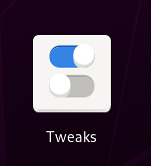

# 文档导航
- [文档导航](#文档导航)
- [安装 WSL2 和 Ubuntu 子系统](#安装-wsl2-和-ubuntu-子系统)
- [Linux安装图形界面](#linux安装图形界面)
  - [准备工作](#准备工作)
  - [安装 Gnome 桌面](#安装-gnome-桌面)
  - [安装 Xrdp](#安装-xrdp)
  - [每次启动前运行的命令](#每次启动前运行的命令)
  - [登录远程桌面](#登录远程桌面)
- [Ubuntu 准备工作](#ubuntu-准备工作)
- [Ubuntu Mac 化](#ubuntu-mac-化)
  - [安装 TweakTool](#安装-tweaktool)
  - [安装主题](#安装主题)
    - [安装GTK主题](#安装gtk主题)
      - [Big Sur](#big-sur)

# 安装 WSL2 和 Ubuntu 子系统
https://docs.microsoft.com/zh-cn/windows/wsl/

# Linux安装图形界面
## 准备工作

WSL 不支持 systemd 而 Gnome 桌面又是基于 systemd，所以先解决这个问题。（参考：https://github.com/DamionGans/ubuntu-wsl2-systemd-script）
```bash
sudo apt update
sudo apt install git
git clone --depth 1 https://github.com/DamionGans/ubuntu-wsl2-systemd-script.git
cd ubuntu-wsl2-systemd-script
bash ubuntu-wsl2-systemd-script.sh
```
重新启动子系统，或者重启电脑也行。


## 安装 Gnome 桌面
```bash
sudo apt update
sudo apt install -y ubuntu-desktop
```
> 安装过程很漫长


## 安装 Xrdp
```bash
sudo apt install -y xrdp
sudo systemctl status xrdp
sudo adduser xrdp ssl-cert
```

## 每次启动前运行的命令
```bash
sudo systemctl restart xrdp
```

查看一下配置文件中的端口（默认：3389）
```bash
cat /etc/xrdp/xrdp.ini
```

配置防火墙
```bash
sudo ufw allow 3389
```
## 登录远程桌面


# Ubuntu 准备工作
```bash
# 备份软件源配置文件 /etc/apt/sources.list
sudo cp /etc/apt/sources.list /etc/apt/sources.list.bak
# 编辑 /etc/apt/sources.list
sudo vim /etc/apt/sources.list
```

Ubuntu 20.04 LTS:
```bash
# 默认注释了源码镜像以提高 apt update 速度，如有需要可自行取消注释
deb https://mirrors.tuna.tsinghua.edu.cn/ubuntu/ focal main restricted universe multiverse
# deb-src https://mirrors.tuna.tsinghua.edu.cn/ubuntu/ focal main restricted universe multiverse
deb https://mirrors.tuna.tsinghua.edu.cn/ubuntu/ focal-updates main restricted universe multiverse
# deb-src https://mirrors.tuna.tsinghua.edu.cn/ubuntu/ focal-updates main restricted universe multiverse
deb https://mirrors.tuna.tsinghua.edu.cn/ubuntu/ focal-backports main restricted universe multiverse
# deb-src https://mirrors.tuna.tsinghua.edu.cn/ubuntu/ focal-backports main restricted universe multiverse
deb https://mirrors.tuna.tsinghua.edu.cn/ubuntu/ focal-security main restricted universe multiverse
# deb-src https://mirrors.tuna.tsinghua.edu.cn/ubuntu/ focal-security main restricted universe multiverse

# 预发布软件源，不建议启用
# deb https://mirrors.tuna.tsinghua.edu.cn/ubuntu/ focal-proposed main restricted universe multiverse
# deb-src https://mirrors.tuna.tsinghua.edu.cn/ubuntu/ focal-proposed main restricted universe multiverse
```

其他发行版本的 Ubuntu 可以在[清华大学开源软件镜像站 Ubuntu 镜像使用帮助](https://mirror.tuna.tsinghua.edu.cn/help/ubuntu/) 查到对应的`软件源配置文件内容`


# Ubuntu Mac 化
## 安装 TweakTool
要安装主题，首先要先安装相应的工具 `TweakTool`
```bash
sudo apt update
sudo apt install -y gnome-tweak-tool
```


- 修改窗口的按钮位置


感叹号无法操作

```bash
sudo apt install -y gnome-shell-extensions
```


## 安装主题
### 安装GTK主题
#### Big Sur
- [MacOS-3D-Originals-Gtk](https://www.opendesktop.org/p/1410476/)
- [MacOS-3D-Originals-Icons](https://www.opendesktop.org/p/1412504/)
- [macOS Big Sur:Cursors](https://www.opendesktop.org/p/1408466/)
- [MacOS-3D-Originals-Shell](https://www.opendesktop.org/p/1410510/)


- 这两个文件夹分别是两个主题，把这两个文件夹移动到/usr/share/themes下就可以了。
- 解压后把文件都放到/usr/share/icons目录
- shell （/usr/share/themes）


然后打开前面安装的工具Tweaks（中文下叫“优化”）,在“应用程序”英文是“Applications”这个选项下就可以选择刚刚安装的主题了。这几个截图是我安装主题后的截图。