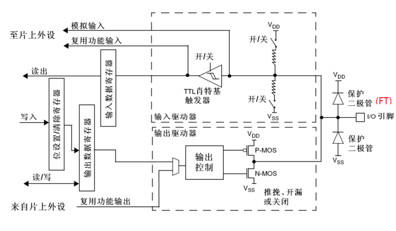

# 导航
- [导航](#导航)
- [GPIO 简介](#gpio-简介)
- [GPIO 基本结构](#gpio-基本结构)
- [GPIO 八种工作方式](#gpio-八种工作方式)
  - [浮空输入](#浮空输入)
  - [上拉输入](#上拉输入)
  - [下拉输入](#下拉输入)
  - [模拟输入](#模拟输入)
  - [开漏输出](#开漏输出)
  - [开漏复用输出](#开漏复用输出)
  - [推挽输出](#推挽输出)
  - [推挽复用输出](#推挽复用输出)
- [HAL库 GPIO函数库](#hal库-gpio函数库)
  - [GPIO 结构体](#gpio-结构体)
  - [GPIO 枚举](#gpio-枚举)
  - [GPIO 函数](#gpio-函数)
    - [初始化和反初始化](#初始化和反初始化)
      - [初始化](#初始化)
      - [反初始化](#反初始化)
    - [I/O 操作函数](#io-操作函数)
      - [HAL_GPIO_ReadPin](#hal_gpio_readpin)
      - [HAL_GPIO_WritePin](#hal_gpio_writepin)
      - [HAL_GPIO_TogglePin](#hal_gpio_togglepin)
      - [HAL_GPIO_LockPin](#hal_gpio_lockpin)
      - [HAL_GPIO_EXTI_IRQHandler](#hal_gpio_exti_irqhandler)
      - [HAL_GPIO_EXTI_Callback](#hal_gpio_exti_callback)
  - [GPIO 常量](#gpio-常量)
    - [管脚定义](#管脚定义)
    - [管脚的输入输出模式定义](#管脚的输入输出模式定义)
    - [最大输出频率定义](#最大输出频率定义)
    - [上拉下拉选择](#上拉下拉选择)


[CSDN 参考资料](https://blog.csdn.net/qq_38410730/article/details/79858906)

# GPIO 简介
- GPIO
- General-purpose input/output
- 通用输入/输出端口

GPIO是STM32可控制的引脚。GPIO的引脚与外部硬件设备连接，可实现与外部通讯、控制外部硬件或者采集外部硬件数据的功能。

包括7个通用目的的输入/输出口（GPIO）组，分别为GPIOA、GPIOB、GPIOC、GPIOD、GPIOE、GPIOF、GPIOG，同时每组GPIO口组有16个GPIO口。通常简略称为PAx、PBx、PCx、PDx、PEx、PFx、PGx，其中x为0-15。

STM32的大部分引脚除了当GPIO使用之外，还可以复用位外设功能引脚（比如串口）


# GPIO 基本结构
每个 GPIO 内部都有一个这样的电路结构

- **保护二极管**：**IO引脚上下两边两个二极管用于防止引脚外部过高或过低的电压输入**。当引脚电压高于VDD时，上方的二极管导通；当引脚电压低于VSS时，下方的二极管导通，防止不正常电压引入芯片导致芯片烧毁。但是尽管如此，还是不能直接外接大功率器件，须加大功率及隔离电路驱动，防止烧坏芯片或者外接器件无法正常工作。
- **P-MOS管和N-MOS管**：**由P-MOS管和N-MOS管组成的单元电路使得GPIO具有“推挽输出”和“开漏输出”的模式**。这里的电路会在下面很详细地分析到。
- **TTL肖特基触发器**：信号经过触发器后，模拟信号转化为0和1的数字信号。但是，**当GPIO引脚作为ADC采集电压的输入通道时**，**用其“模拟输入”功能**，**此时信号不再经过触发器进行TTL电平转换**。ADC外设要采集到的原始的模拟信号。

> 这里需要注意的是，在查看《STM32中文参考手册V10》中的GPIO的表格时，会看到有“FT”一列，这代表着这个GPIO口时兼容3.3V和5V的；如果没有标注“FT”，就代表着不兼容5V。


# GPIO 八种工作方式
GPIO 支持 4 种输入模式
- [ ] [浮空输入](#浮空输入)
- [ ] [上拉输入](#上拉输入)
- [ ] [下拉输入](#下拉输入)
- [ ] [模拟输入](#模拟输入)

4 种输出模式
- [ ] [开漏输出](#开漏输出)
- [ ] [开漏复用输出](#开漏复用输出)
- [ ] [推挽输出](#推挽输出)
- [ ] [推挽复用输出](#推挽复用输出)


同时，GPIO还支持三种最大翻转速度（2MHz、10MHz、50MHz）。

每个I/O口可以自由编程，但 I/O 口寄存器必须按 32 位字被访问。
- GPIO_Mode_AIN 模拟输入
- GPIO_Mode_IN_FLOATING 浮空输入
- GPIO_Mode_IPD 下拉输入
- GPIO_Mode_IPU 上拉输入
- GPIO_Mode_Out_OD 开漏输出
- GPIO_Mode_Out_PP 推挽输出
- GPIO_Mode_AF_OD 复用开漏输出
- GPIO_Mode_AF_PP 复用推挽输出

## 浮空输入


## 上拉输入

## 下拉输入

## 模拟输入

## 开漏输出

## 开漏复用输出

## 推挽输出

## 推挽复用输出

# HAL库 GPIO函数库
## GPIO 结构体
在 `stm32f4xx_hal_gpio.h` 文件内定义了用于初始化 GPIO 的结构体 `GPIO_InitTypeDef` 
```c
/** 
  * @brief GPIO Init structure definition  
  */ 
typedef struct
{
  uint32_t Pin;       /*!< Specifies the GPIO pins to be configured.
                           This parameter can be any value of @ref GPIO_pins_define */

  uint32_t Mode;      /*!< Specifies the operating mode for the selected pins.
                           This parameter can be a value of @ref GPIO_mode_define */

  uint32_t Pull;      /*!< Specifies the Pull-up or Pull-Down activation for the selected pins.
                           This parameter can be a value of @ref GPIO_pull_define */

  uint32_t Speed;     /*!< Specifies the speed for the selected pins.
                           This parameter can be a value of @ref GPIO_speed_define */

  uint32_t Alternate;  /*!< Peripheral to be connected to the selected pins. 
                            This parameter can be a value of @ref GPIO_Alternate_function_selection */
}GPIO_InitTypeDef;
```
## GPIO 枚举
```c
/** 
  * @brief  GPIO Bit SET and Bit RESET enumeration 
  */
typedef enum
{
  GPIO_PIN_RESET = 0,
  GPIO_PIN_SET
}GPIO_PinState;
```
## GPIO 函数
主要有 8 个函数
### 初始化和反初始化
```c
/* Initialization and de-initialization functions *****************************/
void  HAL_GPIO_Init(GPIO_TypeDef  *GPIOx, GPIO_InitTypeDef *GPIO_Init);
void  HAL_GPIO_DeInit(GPIO_TypeDef  *GPIOx, uint32_t GPIO_Pin);
```
#### 初始化
```c
void  HAL_GPIO_Init(GPIO_TypeDef  *GPIOx, GPIO_InitTypeDef *GPIO_Init);
```
- 功能：GPIO 初始化
- 实例：``HAL_GPIO_Init(GPIOC, &GPIO_InitStruct);``


#### 反初始化
```c
void  HAL_GPIO_DeInit(GPIO_TypeDef  *GPIOx, uint32_t GPIO_Pin);
```
- 功能：GPIO 初始化
- 实例：


### I/O 操作函数
```c
/* IO operation functions *****************************************************/
GPIO_PinState HAL_GPIO_ReadPin(GPIO_TypeDef* GPIOx, uint16_t GPIO_Pin);
void HAL_GPIO_WritePin(GPIO_TypeDef* GPIOx, uint16_t GPIO_Pin, GPIO_PinState PinState);
void HAL_GPIO_TogglePin(GPIO_TypeDef* GPIOx, uint16_t GPIO_Pin);
HAL_StatusTypeDef HAL_GPIO_LockPin(GPIO_TypeDef* GPIOx, uint16_t GPIO_Pin);
void HAL_GPIO_EXTI_IRQHandler(uint16_t GPIO_Pin);
void HAL_GPIO_EXTI_Callback(uint16_t GPIO_Pin);
```

#### HAL_GPIO_ReadPin
```c
GPIO_PinState HAL_GPIO_ReadPin(GPIO_TypeDef* GPIOx, uint16_t GPIO_Pin);
```
- 功能：读取引脚的电平状态，返回值为 0 或 1
- 实例：

#### HAL_GPIO_WritePin
```c
void HAL_GPIO_WritePin(GPIO_TypeDef* GPIOx, uint16_t GPIO_Pin, GPIO_PinState PinState);
```
- 功能：写入引脚的电平状态
- 实例：

#### HAL_GPIO_TogglePin
```c
void HAL_GPIO_TogglePin(GPIO_TypeDef* GPIOx, uint16_t GPIO_Pin);
```
- 功能：翻转引脚的电平状态
- 实例：

#### HAL_GPIO_LockPin
```c
HAL_StatusTypeDef HAL_GPIO_LockPin(GPIO_TypeDef* GPIOx, uint16_t GPIO_Pin);
```
- 功能：锁住引脚电平的电平状态。例如，某引脚的当前电平状态为1，当这个引脚电平变化时，保持锁定时的值
- 实例：

#### HAL_GPIO_EXTI_IRQHandler
```c
void HAL_GPIO_EXTI_IRQHandler(uint16_t GPIO_Pin);
```
- 功能：外部中断服务函数，清除中断标志位
- 实例：

#### HAL_GPIO_EXTI_Callback
```c
void HAL_GPIO_EXTI_Callback(uint16_t GPIO_Pin);
```
- 功能：中断回调函数，发生中断时需要执行的响应
- 实例：

## GPIO 常量
### 管脚定义
```c
/** @defgroup GPIO_pins_define GPIO pins define
  * @{
  */
#define GPIO_PIN_0                 ((uint16_t)0x0001)  /* Pin 0 selected    */
#define GPIO_PIN_1                 ((uint16_t)0x0002)  /* Pin 1 selected    */
#define GPIO_PIN_2                 ((uint16_t)0x0004)  /* Pin 2 selected    */
#define GPIO_PIN_3                 ((uint16_t)0x0008)  /* Pin 3 selected    */
#define GPIO_PIN_4                 ((uint16_t)0x0010)  /* Pin 4 selected    */
#define GPIO_PIN_5                 ((uint16_t)0x0020)  /* Pin 5 selected    */
#define GPIO_PIN_6                 ((uint16_t)0x0040)  /* Pin 6 selected    */
#define GPIO_PIN_7                 ((uint16_t)0x0080)  /* Pin 7 selected    */
#define GPIO_PIN_8                 ((uint16_t)0x0100)  /* Pin 8 selected    */
#define GPIO_PIN_9                 ((uint16_t)0x0200)  /* Pin 9 selected    */
#define GPIO_PIN_10                ((uint16_t)0x0400)  /* Pin 10 selected   */
#define GPIO_PIN_11                ((uint16_t)0x0800)  /* Pin 11 selected   */
#define GPIO_PIN_12                ((uint16_t)0x1000)  /* Pin 12 selected   */
#define GPIO_PIN_13                ((uint16_t)0x2000)  /* Pin 13 selected   */
#define GPIO_PIN_14                ((uint16_t)0x4000)  /* Pin 14 selected   */
#define GPIO_PIN_15                ((uint16_t)0x8000)  /* Pin 15 selected   */
#define GPIO_PIN_All               ((uint16_t)0xFFFF)  /* All pins selected */

#define GPIO_PIN_MASK              0x0000FFFFU /* PIN mask for assert test */
/**
  * @}
  */
```
### 管脚的输入输出模式定义

```c
GPIO_InitStruct.Mode = GPIO_MODE_AF_PP;  /*设置引脚的输出类型为推挽输出*/
```

```c
/** @defgroup GPIO_mode_define GPIO mode define
  * @brief GPIO Configuration Mode 
  *        Elements values convention: 0xX0yz00YZ
  *           - X  : GPIO mode or EXTI Mode
  *           - y  : External IT or Event trigger detection 
  *           - z  : IO configuration on External IT or Event
  *           - Y  : Output type (Push Pull or Open Drain)
  *           - Z  : IO Direction mode (Input, Output, Alternate or Analog)
  * @{
  */ 
#define  GPIO_MODE_INPUT              0x00000000U   /*!< Input Floating Mode                */
#define  GPIO_MODE_OUTPUT_PP          0x00000001U   /*!< Output Push Pull Mode              */
#define  GPIO_MODE_OUTPUT_OD          0x00000011U   /*!< Output Open Drain Mode             */
#define  GPIO_MODE_AF_PP              0x00000002U   /*!< Alternate Function Push Pull Mode  */
#define  GPIO_MODE_AF_OD              0x00000012U   /*!< Alternate Function Open Drain Mode */

#define  GPIO_MODE_ANALOG             0x00000003U   /*!< Analog Mode  */
    
#define  GPIO_MODE_IT_RISING          0x10110000U   /*!< External Interrupt Mode with Rising edge trigger detection          */
#define  GPIO_MODE_IT_FALLING         0x10210000U   /*!< External Interrupt Mode with Falling edge trigger detection         */
#define  GPIO_MODE_IT_RISING_FALLING  0x10310000U   /*!< External Interrupt Mode with Rising/Falling edge trigger detection  */
 
#define  GPIO_MODE_EVT_RISING         0x10120000U   /*!< External Event Mode with Rising edge trigger detection               */
#define  GPIO_MODE_EVT_FALLING        0x10220000U   /*!< External Event Mode with Falling edge trigger detection              */
#define  GPIO_MODE_EVT_RISING_FALLING 0x10320000U   /*!< External Event Mode with Rising/Falling edge trigger detection       */
/**
  * @}
  */
```


### 最大输出频率定义
```c
/** @defgroup GPIO_speed_define  GPIO speed define
  * @brief GPIO Output Maximum frequency
  * @{
  */
#define  GPIO_SPEED_FREQ_LOW         0x00000000U  /*!< IO works at 2 MHz, please refer to the product datasheet */
#define  GPIO_SPEED_FREQ_MEDIUM      0x00000001U  /*!< range 12,5 MHz to 50 MHz, please refer to the product datasheet */
#define  GPIO_SPEED_FREQ_HIGH        0x00000002U  /*!< range 25 MHz to 100 MHz, please refer to the product datasheet  */
#define  GPIO_SPEED_FREQ_VERY_HIGH   0x00000003U  /*!< range 50 MHz to 200 MHz, please refer to the product datasheet  */
/**
  * @}
  */
```
GPIO 最大输出频率 (GPIO Output Maximum frequency)

### 上拉下拉选择
```c
 /** @defgroup GPIO_pull_define GPIO pull define
   * @brief GPIO Pull-Up or Pull-Down Activation
   * @{
   */  
#define  GPIO_NOPULL        0x00000000U   /*!< No Pull-up or Pull-down activation  */
#define  GPIO_PULLUP        0x00000001U   /*!< Pull-up activation                  */
#define  GPIO_PULLDOWN      0x00000002U   /*!< Pull-down activation                */
/**
  * @}
  */
```
上拉